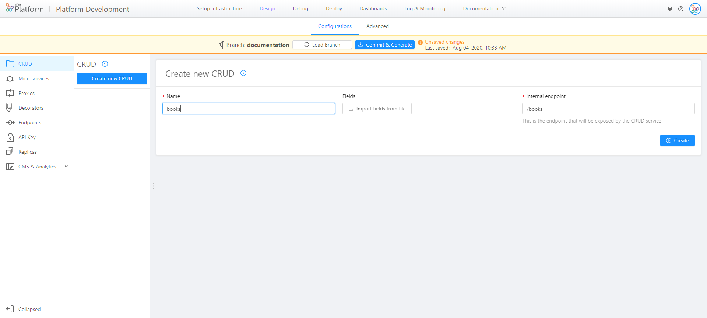
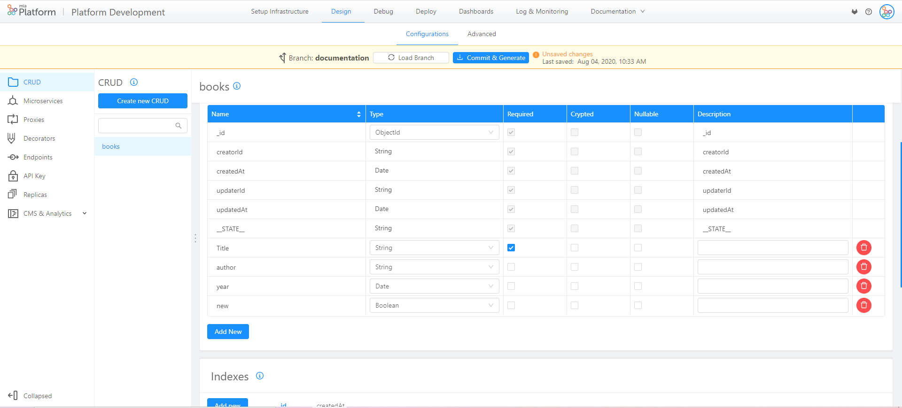
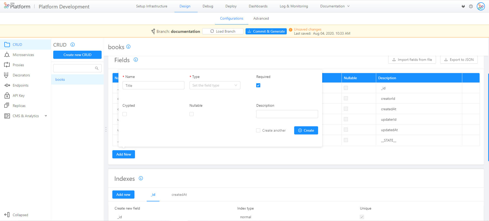
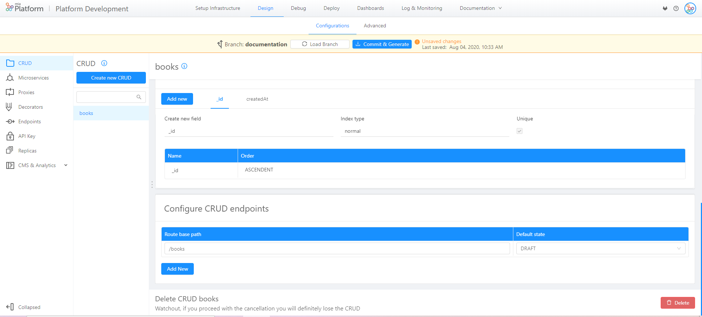
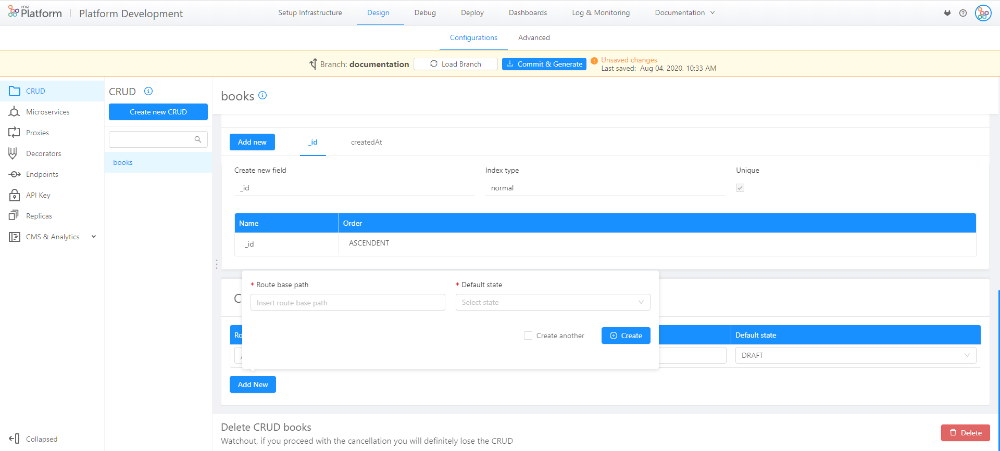
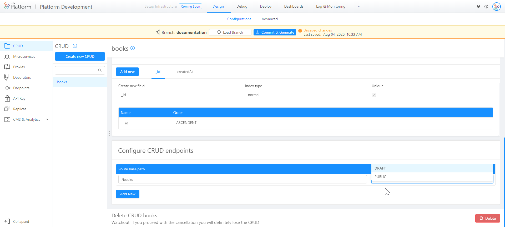
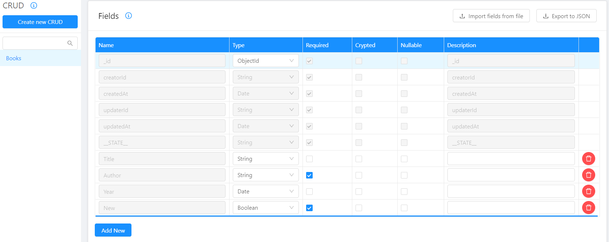
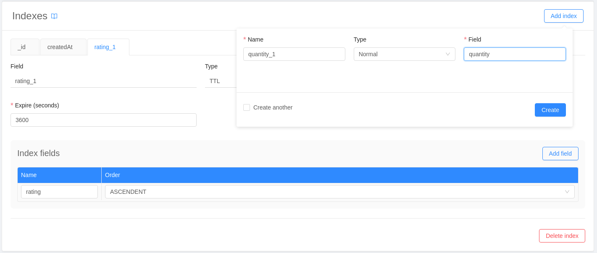
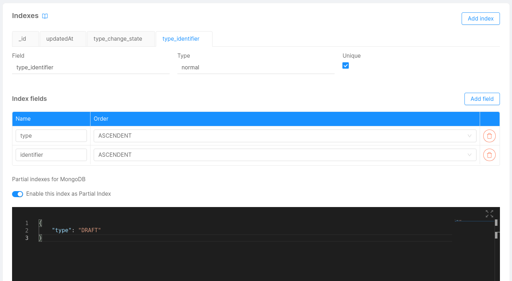

## What is a CRUD?

A CRUD is a service that allows you to interact with persistently stored data and modify it by using four main functions:

* **Create**
* **Read**
* **Update**
* **Delete**

These functions combined define the acronym **CRUD** and are described in detail [here](/runtime_suite/crud-service/10_overview_and_usage.md#crud-endpoints).  
In this section, you will understand how to configure your first [CRUD Service](/runtime_suite/crud-service/10_overview_and_usage.md) collections through user interface by creating and managing one or more CRUDs without worrying about setting up any database on your own.

:::caution
If the MongoDB CRUD section in your project is disabled because the `crud-service` had not been added during project creation, you can autonomously add it to your branch by creating it from the Marketplace. Visit its [documentation](/runtime_suite/crud-service/20_configuration.md) to learn how to do so.
:::

To manage your CRUDs, Mia-Platform's Console offers a specific section, **MongoDB CRUD**, in the **Design** area of your project.

## Create a new CRUD

In order to create a new CRUD, open the dedicated section, select **Create new CRUD** and fill in the following information:

* **Name**: the name of the CRUD that will be used for data storage (we recommend using `snake_case` as naming convention). In our case, we will name the collection “books”;
* **Internal endpoint**: this is the first endpoint that will be exposed by the [CRUD Service](/runtime_suite/crud-service/10_overview_and_usage.md). The console will prefill it but you can change it according to your preference.



Once you have entered all required fields, press the **Create** button on the right and you will see your newly created CRUD.

As soon as you push **Create**, a new page ("books" in our example) is created and you can enter a short and optional description of your collection: default description will be “Collection of books”.

### Fields

In the section **Fields**, you can enter the properties of your collection.
By default, there are fields that can not be changed, such as: `_id`, `creatorId`, `createdAt`, `updaterId`, `updatedAt`, `_STATE_`.  
These fields are internally required; you can use them to perform queries or to create [indexes](#indexes).  

:::info
[Here](/runtime_suite/crud-service/10_overview_and_usage.md#predefined-collection-properties) you can find a detailed description of the default fields.
:::

You can add new fields by selecting **Add new** and fill in the blank form with the value you need.





You can add the fields you need and select the appropriate properties:

* **name** (we recommend using `camelCase` naming convention); in our case we will insert "title", "author", "year", "new", etc.
* **type**:
  * **String** if it is a classic text string
  * **Number** if it is a number
  * **Date** if it is a date. The date must be a string **compliant with ISO-8601 standard** with the following format: *YYYY-MM-DDTHH:mm:ss.sssZ*
  * **Boolean** if it can only be `true` or `false`
  * **Geopoint** if you want to save a specific place coordinates
  * **Object** if you want to insert an object.
  * **Array of** if you want to save as an ordered set of properties. Array items must be of the same type. Currently, accepted types are:
    * **String**
    * **Number**
    * **Object**
  * **ObjectId** if you want to save a unique reference to another CRUD that uses an objectId as primary key.

* If you select **required** the property is mandatory.
* If you select **nullable** you can make the value *null*.
* In the **description** field you can enter a short optional description.


### Create nested CRUDs

Fields of type `Object` and `Array of Object` can be used to create nested CRUDs. You just need to add a field of type `Object` or `Array of Object` and click on the edit button to configure it through the lateral drawer: use the JSON Schema Editor to define its properties.

`Object` and `Array of Object` support both a custom JSON Schema.  
It can be used to specify the schema of the object for the former and the schema of each item of the array for the latter.

The following options are supported:  

* `properties`: must be a valid 'properties' field of a json schema of type *object*.
* `required`: array of name properties that are required. It's the **required** field of a JSON schema of type *object*.
* `additionalProperties`: boolean, `true` if the object can have additional properties.

:::caution
When configuring the JSON schema of a field of type `Object` you can also add the `type` option to the schema, but the only accepted value for this option is `object`.
:::

#### Valid schema example

```json
{ 
    "properties": {
        "address": {
            "title": "user address",
            "type": "string"
        },
        "groups": {
            "default": [ "users" ],
            "items": { "type": "string" },
            "title": "groups of the user",
            "type": "array"
        },
        "name": {
            "examples": ["Jane"],
            "title": "The user name",
            "type": "string"
        },
        "phone": {
            "title": "mobile number of user",
            "type": "integer"
        }
    },
    "additionalProperties": false,
    "required": ["address", "groups", "name", "phone"]
}
```

#### Schema validation

The schema specified in *properties* (for both of them) **cannot** have the following operators:

* `oneOf`
* `anyOf`
* `allOf`
* `if`
* `$ref`

The JSON Schema Editor validates the JSON schema that you provide as input and gives feedback if some errors are made.  
In particular, it checks if your input follows JSON rules and if it is a valid json schema as defined before.  

:::caution
Adding the previously listed operators (like `oneOf`, for example) in the input schema will not make the validation fail.  
Remember to avoid using them.
:::

You can also create nested CRUDs by importing a JSON file, check this [section](#how-to-create-the-fields-of-your-crud-by-importing-a-json) to understand how.

### CRUD Service exposed routes

The [CRUD Service](/runtime_suite/crud-service/10_overview_and_usage.md) will handle your data model and expose its API to the services within your project, without the need to expose the CRUD to the outside world, by using the specified CRUD endpoint routes in the dedicated card in CRUD detail view.  
This is particularly helpful when you want one of your microservices to maintain a specific state and, to do so, you need to persistently store some data. Since this data has the only purpose of describing the state of your microservice, it is preferable to avoid exposing it to the outside world (it can also be confidential data, that you want to keep private).  
Therefore, our CRUD Service will handle this situation for you, by making your microservices interact with your CRUDs internal routes without the need to define an external endpoint route that will unnecessarily expose your CRUD.

Otherwise, if you want the CRUD to be accessible from the outside, you can create a new CRUD-type Endpoint in the [**Design Endpoint section**](/development_suite/api-console/api-design/endpoints.md). By doing so, you will be able to view your CRUD API Documentation in Mia-Platform [Documentation Portal](/console/project-configuration/documentation-portal.md), where you can also interact with your CRUD and test the calls to it.

:::info
To take in deeper how to use API exposed by the CRUD Service check out the [CRUD Endpoints Documentation](/runtime_suite/crud-service/10_overview_and_usage.md#crud-endpoints).
:::

Beyond the first route, automatically exposed when creating the CRUD, you can always **add new routes** and **modify existing ones**.
In each CRUD's detail page you can view all the internal routes associated with your CRUD and edit them.  
The definition of multiple internal routes can be useful when you want to gather different documents based on their `__STATE__` property. For example, one internal route can gather all documents in `DRAFT` state, another one the ones in `PUBLIC` state.  
:::info
For an in depth description of the `__STATE__` field, follow this [link](/runtime_suite/crud-service/10_overview_and_usage.md#__state__-management).  
:::
In our case we will see the first internal endpoint with a **route base path** equal to "/books". The _default state_ (used on document creation) is set to _DRAFT_ by default.



To create a new endpoint click on the `Add new` button in the card and fill in **Route base path** and the **Default state** property for the new endpoint.

Please note that these endpoints must be unique through all the configured CRUD, the Console will check for you that this constraint is satisfied when creating or editing any CRUD route in your project. In case this happens you will be warned with an error message.



You can always change the default state of an existing route by simply clicking on the field default state. The two possible values are _DRAFT_ or _PUBLIC_.



You can delete a route but you must always leave at least one endpoint exposed by the [CRUD Service](/runtime_suite/crud-service/10_overview_and_usage.md), otherwise the CRUD won't be accessible by anyone, neither the services in your project.

### How to create the fields of your CRUD by importing a JSON

If you want, you can upload your fields from file, selecting **Import fields from File**.
Remember that the file must be a JSON with the following directions:

* Enter the property `name` in camelCase
* Add properties with their `types` spelling as follow:
  * `string`
  * `Date`
  * `number`
  * `boolean`
  * `GeoPoint`
  * `RawObject`
  * `Array_string`
  * `Array_number`
  * `Array_RawObject`
* `required` must be `false` or `true`
* `nullable` must be `false` or `true`

`RawObject` and `Array_RawObject` support both a custom JSON Schema that is explained [here](#create-nested-cruds).  
To correctly import it, add a property *schema* to the field that contains the custom JSON Schema.  

This is an example of a field of type `RawObject` where is specified the schema object the properties of the object (*properties*), the required properties (`somethingNumber`) and if object could accept additional properties (in this example it is set to false):

```json
{
  "name": "fieldObject",
  "type": "RawObject",
  "schema": {
    "properties": {
      "somethingArrayObject": {
        "type": "array",
        "items": {
          "type": "object",
          "properties": {
            "anotherNumber": { "type": "number" }
          },
        }
      },
      "somethingNumber": {
        "type": "number"
      },
      "somethingObject": {
        "type": "object",
        "properties": {
          "childNumber": {
            "type": "number"
          }
        },
        "additionalProperties": true
      }
    },
    "required": [
      "somethingNumber"
    ],
    "additionalProperties": false,
  },
  "required": false
}
```

The following is an example of `Array_RawObject` (*Array* of *RawObject*) with the JSON schema of the object items.  

```json
{
  "name": "fieldArrayOfObjects",
  "type": "Array_RawObject",
  "schema": {
      "properties": {
        "name": {
          "type": "string"
        },
        "nestedArr": {
          "type": "array",
          "items": {
            "type": "number"
          }
        }
    },
    "required": [
      "name"
    ],
    "additionalProperties": false,
  },
  "required": false
}
```

Here, *schema* refers to the object of each item (which are of type `RawObject`). It's NOT the schema of the array itself.  
So, each item of the array must follows the following rules:

* *name* property must be a string ad it is required
* *nestedArr* property must be an array of numbers
* additional properties are allowed

Here's an example of the file to upload.

```json
{
  "name": "updatedAt",
  "type": "Date",
  "required": true,
  "nullable": false,
  "description": "updatedAt"
},
{
  "name": "__STATE__",
  "type": "string",
  "required": true,
  "nullable": false,
  "description": "__STATE__"
},
{
  "name": "PublicationDate",
  "type": "number",
  "required": true,
  "nullable": true
},
{
  "name": "new",
  "type": "boolean",
  "required": true,
  "nullable": false
},
{
  "name": "location",
  "type": "GeoPoint",
  "required": false,
  "nullable": false
},
{
  "name": "Writer",
  "type": "RawObject",
  "schema": {
    "properties": {
      ...
    },
    "required": ["fieldname1"],
    "additionalProperties": true
  },
  "required": false,
  "nullable": false
},
{
  "name": "editors",
  "type": "Array_string",
  "required": false,
  "nullable": true
},
{
  "name": "editions",
  "type": "Array_number",
  "required": false,
  "nullable": false
},
{
  "name":"shops",
  "type":"Array_RawObject",
  "schema": {
    "properties": {
      ...
    },
    "required": ["fieldname1"],
    "additionalProperties": true
  },
  "required": true,
  "nullable": true,
  "description":"where to find the books"
}
```

Once you imported the JSON from files, it automatically appears in the table under the default fields.

If you want to delete a row, select red trash symbol on the right of the the table.



:::warning
The collection **has not yet been saved** it is necessary to continue the process described below
:::

### Indexes

You can configure the indexes, a data structure designed to improve search (query) data, by avoiding to scan every document inside of a collection.  

After selecting a MongoDB CRUD, to create a new index select **Add index** in the "Indexes" section.

Once you named your index, you can choose among 4 types:

* **Normal**
* **Geo**
* **Hash**
* **TTL**

:::info
If you want to know more about what indexes are, how you can use them and what type of index suits your needs, please consult the [crud service documentation](/runtime_suite/crud-service/10_overview_and_usage.md#indexes).
:::

You can also choose whether to make the index unique by ticking the correspondent checkbox.



#### Partial Indexes

From version 6.0.1 of the CRUD Service, it is possible to configure an index as a _partial index_. A partial index, as explained in details in the dedicated [MongoDB documentation page](https://www.mongodb.com/docs/manual/core/index-partial/), is an index defined by a conditional expression. In order to create a partial index in the console, it is necessary to activate the "_Enable this index as Partial Index_" toggle button included in the _Indexes_ card, then write the filter expression inside the JSON editor that will show up, as shown in the image below.



This filter expression should be a JSON with the definition that accepts the documents based on filter conditions. This JSON will be included in the collection's configuration as a string and used by Mongo when starting the CRUD Service. Its content should be identical to the value of the property _partialFilterExpression_ as explained in the official MongoDB documentation. 

Note that any field included in the filter expression is used only during the filtering operation and are unrelated to those included in the index table.

The expression in the screenshot will index only documents where `type` is equal to "_DRAFT_", but you can use comparison expressions and various operations, as explained in the MongoDB documentation. E.g., the following filter expression will index only those documents where the property _age_ is lower than 21:

```
{
  "age": { "$lt": 21 }
}
```
