## Overview

The Flow Manager Visualizer helps you graphically visualize your [flow manager](/runtime_suite/flow-manager-service/10_overview.md) service configuration in a simple fashion.

By selecting the _Flow Manager_ menu in the Design Area you will be presented with the list of `flow-manager` services that are currently configured in your project.

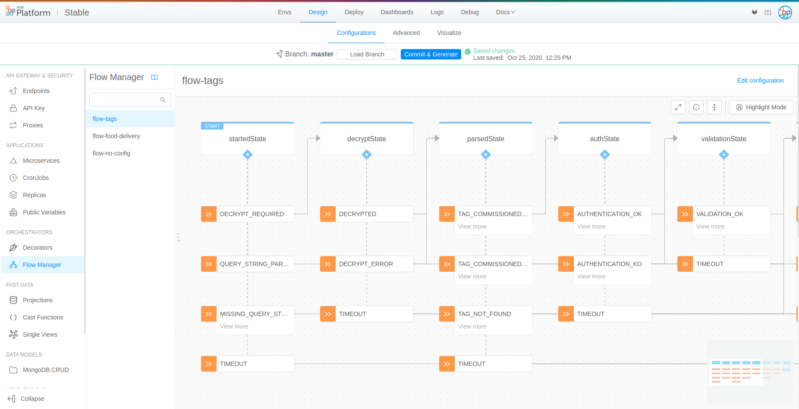

In the visualizer you can move through your flow states, see the commands that are triggered upon a state change and view the events that may cause a state transition.

## Component description

### States

States are represented by cards with a colored border on top. 
A state can be an initial state (marked as _START_) or final state (marked as _FINAL_).

When a state transition finishes, the `flow-manager` state might issue a command through a channel. This behavior is represented by the small _thunder icon_ below the card. Clicking on it will display more information concerning which command is issued.

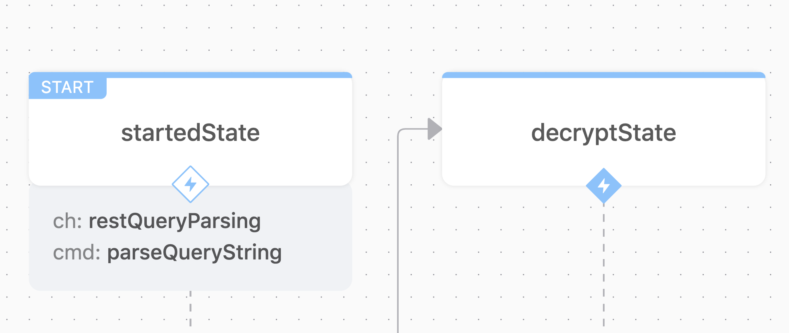

:::info
If the state has no _thunder icon_, it means that no command is triggered.
:::

#### Business States

When working on a Flow Manager service you might desire to collapse many states under a single Business State that identifies the business logic that many single steps of the saga represent. When using custom businessStates a different color is applied to each state to help the user clearly visualize states that share the same Business State.

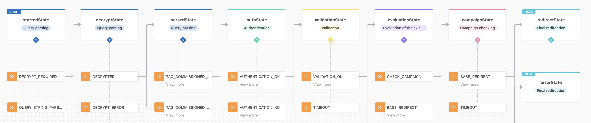

### Events

An event is represented by the small card with an _arrow icon_ on its left, all events are displayed below the state where they may cause a state transition.

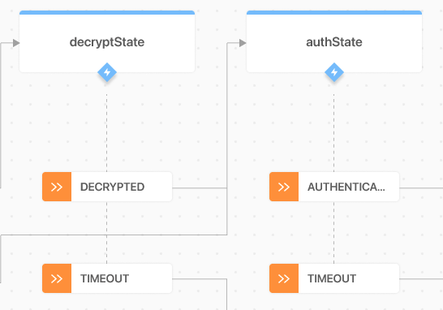

From the displayed example, imagine the `flow-manager` service current state for a specific saga is the `decryptState`, there are two different events that may cause a state transition: 

- `DECRYPTED` event will lead us to the `authState`;
- `TIMEOUT` event will lead us to another state (e.g. a specific state where a timeout error is handled).

In order to simplify the flow visualization, the events that lead to the same state are aggregated together by default and clicking on 'view more', it is possible to expand the view and visualize all of them.

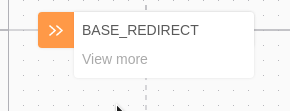

## Collapse/Expand Mode

The default visual setting about the aggregated events and the closed channel panels of the states can be easily switched on/off using the button "Collapse/Expand All", also in highlight mode.

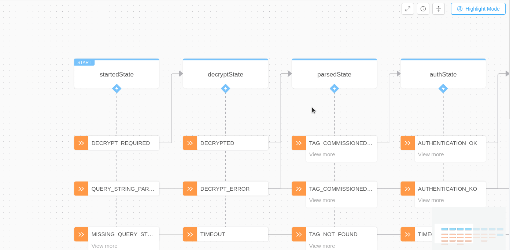

## Highlights

Flow manager state machine can be complex and hard to grasp even when visualized.  
For this reason, a highlight mode can be enabled by user: by clicking on the top-right button shown below, it is possible to enter the highlight mode with the aim to colour specific paths in order to clearly follow a specific data flow.
In particular, when highlight mode is activated:
- with one click on an event, it is possible to highlight where the event will lead; then, by repeating the click on the event, the specific highlight is turned off;
- with one click on a state, it is possible to highlight all the events that may bring the saga to that state; then, by repeating the click on the state, the specific highlight is turned off.

:::info
User can reset all the highlights that have been progressively turned on by clicking on the top-right button, and consequently exiting the highlight mode.
:::

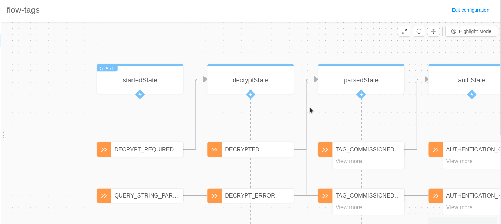

## Button Panel

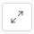 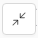 Activate/Deactivate Fullscreen Mode 

 Open the legend

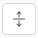 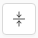 Switch in expand/collapse mode 

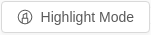 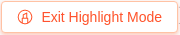 Activate/Deactivate Highlight Mode
