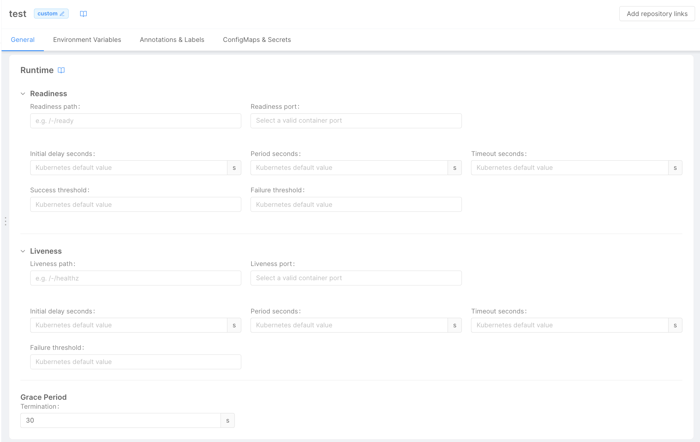

The _Runtime Card_ contains settings that will be used at Runtime by the underlying cluster to manage the micro-service status.

## Liveness & Readiness Probes

In a micro-service, two different kind of probes can be exposed:

* **Readiness**: tells the cluster orchestrator when a micro-service can accept traffic; 
* **Liveness**: tells the cluster orchestrator if a micro-service is up-and-running.

To learn more about probes, please refer to the [Kubernetes official API documentation](https://kubernetes.io/docs/tasks/configure-pod-container/configure-liveness-readiness-startup-probes/#configure-probes).

The _Runtime Card_ enables the developer to manage the following fields for each probe:

- **Path**: represents the endpoint of the microservice that will be used to check the probe. If no value is provided:
  - for Readiness Probe, `/-/ready/` will be used;
  - for Liveness Probe `/-/healthz/` will be used.

  If probes are available on different endpoints, a different endpoint can be provided with the field and that route will be used.  
- **Port**: defines the container port where the probe is exposed, from the list of ports defined in the [Container Port](/development_suite/api-console/api-design/microservice-container-ports.md) section. If no value is provided, the default port of the micro-service will be used   
- **Initial delay seconds**: defines the number of seconds that need to pass after the container has started before the probe is invoked for the first time.
- **Period seconds**: tells how often the probe needs to be invoked (Kubernetes default is 10 seconds, while the minimum value allowed is 1).
- **Timeout seconds**: controls the probe timeout in seconds (Kubernetes default is 1 second, while the minimum value allowed is 1).
- **Success threshold**: the minimum consecutive succeeded responses from the probe to consider it successful (Kubernetes default value is 1, while the minimum value allowed is 1).
  :::warning
  For livenessProbe this parameter has a fixed value of 1
  :::
- **Failure threshold**: the minimum consecutive failed response from the probe to consider it failed. (Kubernetes default value is 3, while the minimum value allowed is 1).

## Termination Grace Period

When a micro-service is shut down, Kubernetes allows the definition of a grace period to wait before the service gets forcibly closed: technically, it's the time waited between sending a `SIG_TERM` and a `SIG_KILL`. 

This field allows to choose the termination period of a micro-service, which is by default of 30 seconds, like the Kubernetes default value.
