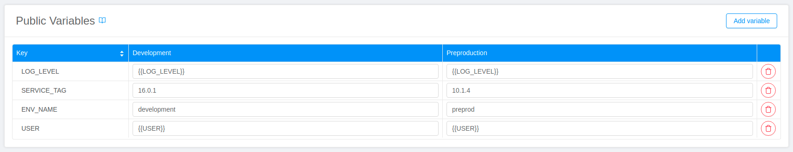
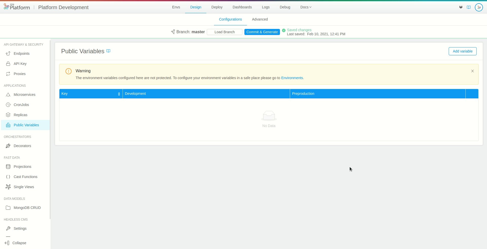
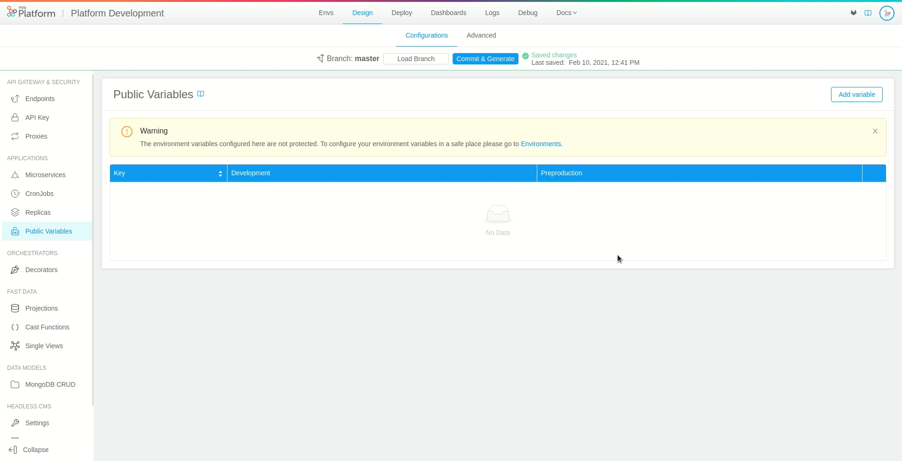
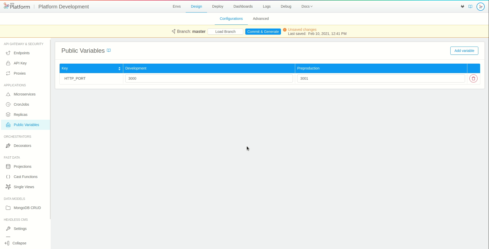

## What is a public variable

In this section, you can find guidelines on how to create and manage Public Variables using the Console.

:::info
Public variables section allows to define configurations at the **branch level**.
:::

**Public variables** are environment variables that can assume a specific value for each project runtime environment. They provide users with a powerful way to create branch level configurations, without requiring special permissions on the deployment environment or being restricted to a single configuration per project.




Typical examples of public variables include either the level of logging chosen for a project, the version of the services to be deployed, URLs used by custom services to contact external services that may be different across environments, etc.

This type of variables ensures a greater level of accessibility compared to project-level configurations, which are tightly coupled with a kubernetes confidential environment, and usually require special access privileges.

:::warning
Public variables **should not contain sensitive information**. 

As the name suggest, these variables save their content in an open environment. In order to configure environment variables either presenting confidential information or requiring a conditional access policy, please refer to the [**Environments**](/console/project-configuration/manage-environment-variables/index.md) section.
:::

## Create a new public variable

In order to create a new public variable, open the dedicated section, select **Add variable** and fill in the following information:

* **Key**: the name of the public variable that will be used for storing the desired content. We recommend using `SNAKE_CASE` and capital letters as naming convention. In our case, we will set the key as “TEST_VAR” <br/>
(Please note that using lowercase letters and starting a word with a digit is not permitted).

* **Environments**: for each runtime environment of the project (e.g. test, pre-production, production) a new form field should appear respectively. These fields allow you to set the value of the public variable in that specific environment (Environments fields are not required, those not filled will be automatically initialized with an empty string).



Once you have entered all the required fields, press the **Add** button on the right, and you will see your newly created variable.

By selecting the **Create Another** checkbox, you can keep the popover opened to create more variables.



### Inheritance with Env variables

When generating a public variable, it might occur that the chosen name overlaps with other variables already existing in the project configuration. In particular, project level variables set in the [Environments](/console/project-configuration/manage-environment-variables/index.md) section are taken into consideration, since they share the same scope and purpose. 

In this case, there exists a precise hierarchy to establish which value should be considered. In the deployment pipeline public variables are mounted after Env variables, hence their value will take the precedence over a project level configuration in case of overlaps.

:::warning
Naming a public variable as a project-level variable will have the effect of completely overwrite its values.
:::

### Where public variables are saved

Public variables are saved inside your project Configuration repository on the git provider. They are stored on the path `/variables/ENV_ID.env` where ENV_ID is the envId of your environment. There is one .env file for each environment.  

:::note
For on premise installations the folder where are stored the `.env` files of the Public Variables may differ based on the configuration of your installation.
The name of the folder is defined by the **publicVariablesFolderName** configuration in the Helm Chart. The default value is **variables**.
:::

Public variables are saved by the Console with their values enclosed in single quotes. Thanks to that, it is possible to use multiline public variables.

:::warning
The use of a single quote character `'` inside of a public variable is not allowed. If you need that character, you might escape it using a backslash character `\` before it (e.g. `value-with-single-quote\'`).
:::

Based on you project configuration, the variables inside the .env file will be saved either with a `MIA_` prefix or not.

You can choose about having or not the prefix: you can set the property `useMiaPrefixEnvs` of the field `deploy` of your project to either `true` to save env vars with prefix or `false` to save only the env var name.
If you are not authorized to do it, please ask to your Mia Platform referent.

## ReadOnly public variables

In the public variables section, you will not only be able to see and edit the configurations you previously created, but it will be possible to see some variables displayed in `readOnly` mode, which cannot be updated, deleted or overwritten. It will not be possible to create new variables with the same `key` as well. 

These additional variables have the same characteristics of Public Variables, but rather than being created by the user, are inherited from other Console configurations you may have previously generated. 

For instance, invariant topic maps or any other public variable created during the setup of a fast data projection will be shown preceded by the prefix `FAST_DATA_`.

## How to use a public variable

Once you have configured a public variable in the design section, the variable content will be stored in the project configuration, ready to be used from any microservice or cronjob. 

Please note that public variables will assume different values depending on the environment selected for deployment.

:::info
Since public variables follow the project configuration lifecycle, their content will be **publicly available** on the project repository.

In particular, a *variables* folder will be created, including a specific *.env* file for each project environment. Each file will store the variables content for that particular environment.

As a result, public variables are **versioned**, granting users the ability to track their changes over time. 
:::

### Interpolating a public variable

Similarly to other environment variables, public variables should be interpolated in order to access their values. 

In order to interpolate your configurations, you need to represent the variable key enclosed by double curly brackets, i.e. `{{PUBLIC_VARIABLE_TO_INTERPOLATE}}`.

### How to use a public variable in a microservice

In order to use a public variable in a microservice, you first need to create a new public variable. In our case, we will name our public variable `HTTP_PORT`. 

Move to the microservice section. Inside the microservice card, you can select or create an environment variable (For further details on how to create a new environment variable check out the [dedicated section](/development_suite/api-console/api-design/services.md#environment-variable-configuration)). 

In order to use the public variable, it will be sufficient to interpolate the environment variable values with the previously created public variable key. In our example, we will create a new variable called `SELECTED_PORT` and will set `{{HTTP_PORT}}` as its value.



:::info
By interpolating the variable values with a public variable key will have the effect of taking the value of the corresponding selected environment.
:::

#### How to use a public variable in a configMap configuration

Public variables can also be used inside microservices' configmap configurations.

Inside the microservice card, you can select or create a new configuration of type configmap (You can learn how to create a configmap configuration from the [microservices section](/development_suite/api-console/api-design/services.md#configmaps)). 

Once you have created a configmap, create or select a configuration file.

Also in this case, you can use a public variable by including an interpolated key inside the configuration file. You just need to create an object, add a new field and set the interpolated value.

Following the previous example, we will have:
```
{
  "myHttpPort": {{HTTP_PORT}}
}
```

### How to use a public variable in a cronjob

In order to use a public variable from a cronjob, you first need to create a new public variable. In our case, we will name our public variable `HTTP_PORT`. 

Move to the cronjob section. Inside the cronjob card, you will be able to edit a configuration file, named in our case `configuration/test.cronjob.yml`. 

Inside the file, move to `spec.jobTemplate.spec.template.containers` and, if it does not exist, create a `env` field. By adding variables to this section, they will be available inside the selected cronjob. Each variable needs to include a **name** and a **value** fields.

In our example, the variable will assume the following form: 

```
- name: SELECTED_PORT
  value: '{{HTTP_PORT}}'
```

In this way, the interpolated form `{{HTTP_PORT}}` will receive the public variable value corresponding to the selected environment.

The final output file will be structured similarly to the following example:
```
apiVersion: batch/v1
kind: CronJob
metadata:
  name: test
  annotations:
    mia-platform.eu/deployment-date: '{{RELEASE_DATE}}'
    mia-platform.eu/commit-author: '{{AUTHOR_EMAIL}}'
    mia-platform.eu/commit-sha: '{{COMMIT_SHA}}'
    mia-platform.eu/version: 7.1.0
  labels:
    app: test
    app.kubernetes.io/name: test
    app.kubernetes.io/component: cronjob
    app.kubernetes.io/part-of: platform-development
    app.kubernetes.io/managed-by: mia-platform
    mia-platform.eu/stage: '{{STAGE_TO_DEPLOY}}'
spec:
  concurrencyPolicy: Forbid
  successfulJobsHistoryLimit: 3
  failedJobsHistoryLimit: 1
  schedule: '* * * * *'
  jobTemplate:
    spec:
      backoffLimit: 1
      template:
        metadata:
          name: test
          labels:
            app: test
            app.kubernetes.io/name: test
            app.kubernetes.io/component: cronjob
            app.kubernetes.io/part-of: platform-development
            app.kubernetes.io/managed-by: mia-platform
            mia-platform.eu/stage: '{{STAGE_TO_DEPLOY}}'
        spec:
          containers:
            - name: test
              image: test-docker
              env:
              - name: SELECTED_PORT
                value: '{{HTTP_PORT}}'
          restartPolicy: Never
```

## How to enable my project to use Public Variables

If you are using the Mia-Platform PaaS, then your project is already enabled to use it.

If you have an On-Premise installation instead, some checks here below described may be needed.

### You are using a mirror of the Mia-Platform Pipelines

In this case, the Public Variables feature should be already enabled since the pipelines are up to date with the Mia-Platform ones.  

### You are using your own custom Pipelines

In this case, please look at the documentation [here](/development_suite/deploy/pipeline-configuration.md) to know how to read public variables.
