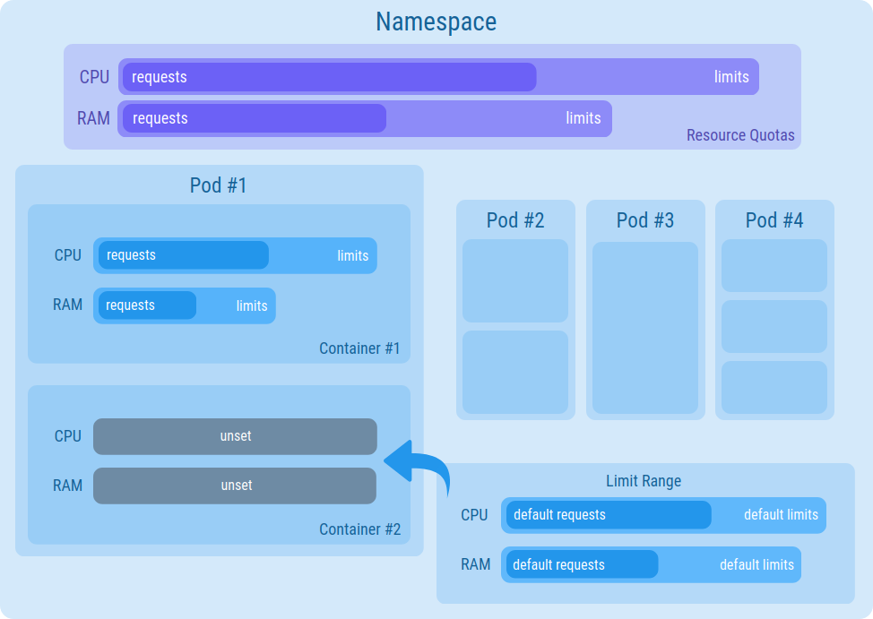

## Background

### What are Limit Ranges?

**Limit Ranges** are Kubernetes objects defined at **namespace level**, that can be leveraged to simplify resource control over Containers and Pods.
Besides restricting resource allocation, they provide the possibility to define **default values** for **CPU/Memory** `requests` and `limits`, to be applied to all the Containers whose `resources` field was left undefined.

Click [here](https://kubernetes.io/docs/concepts/policy/limit-range/) to read the official documentation about Limit Ranges.

### What are Resource Quotas?

**Resource Quotas** are a Kubernetes tool to constrain aggregate resource consumption per **namespace**.
Their main purpose is to assign a portion of resources to each namespace, thus preventing environments from consuming more than their fair share.

Click [here](https://kubernetes.io/docs/concepts/policy/resource-quotas/) to read the official documentation about Resource Quotas.



---

## How to choose ranges and quotas

When creating a new project, default configurations of both Limit Ranges and Resource Quotas are provided.
The values chosen for the default objects were selected after running analysis over existing environments.

### Limit Ranges

```YAML
apiVersion: v1
kind: LimitRange
metadata:
  name: default-limit-range
spec:
  limits:
  - default:
      memory: 300Mi
      cpu: 300m
    defaultRequest:
      memory: 150Mi
      cpu: 100m
    type: Container
```

The snippet above shows the default `LimitRange` configuration. Requests and limits are slightly above the average resources needed by Containers in our environments, thus they should be enough for any new Container.
Nevertheless, they may happen to be significantly higher than the resources needed by your services, and you may end up **wasting resources**.
Thus, it is **highly recommended** to define proper `requests` and `limits` for each Container included in every Pod and tune your `LimitRange` accordingly.

:::info
You can follow [this tutorial](/getting-started/tutorials/set-requests-limits-of-a-microservice.mdx) on how to set `requests` and `limits` of a microservice, and leverage the results to find more suitable defaults for your custom `LimitRange`.
:::

### Resource Quotas

```YAML
apiVersion: v1
kind: ResourceQuota
metadata:
  name: default-resource-quota
spec:
  hard:
    requests:
      cpu: "1"
      memory: 1Gi
    limits:
      cpu: "3"
      memory: 2Gi
```

The default `ResourceQuota` configuration file is illustrated above. Although they are still the result of analysis over existing environments, in this case the default values are **very strict** and may not be suitable for your namespace.
The reason behind this choice is to **encourage tuning the values** according to the environment needs.

:::warning
Not setting the `ResourceQuota` specs to proper values may lead to errors and slowdowns. Use the defaults at your own risk!
:::

There are no best practices on how to tune Resource Quotas. There may be multiple suitable policies for a project, depending on how many resources were assigned to the project, how many and which environments it requires, and so on.

An example[^1] may be a project that was assigned 32GiB RAM and 16 cores of a multitenant cluster. Let's say this project needs 3 environments: **development**, **preproduction**, and **production**.
A possible policy would be:

* 18GiB RAM and 8 cores for the **production** environment, to constrain it as little as possible;
* 10GiB RAM and 4 cores for the **preproduction** environment;
* 2GiB RAM and 2 cores for the **development** environment (assuming it is just for testing purposes);
* 2GiB RAM and 2 cores in reserve for future allocation.

As shown in the example above, it is **highly recommended** to define different quotas depending on the environment.
This way, you can ensure proper distribution of resources among all the namespaces of the project, while avoiding provisioning issues.

---
For the time being, to edit your `LimitRange` and `ResourceQuota`, you will need to access the files in the *Configurations* repository of your project.
The defaults are located in each environment directory, inside the `configurations` folder.

:::caution
To avoid errors, remember to tune the values **BEFORE** releasing the project.
:::

[^1]: Adapted from the Kubernetes documentation (link [here](https://kubernetes.io/docs/concepts/policy/resource-quotas/)).
