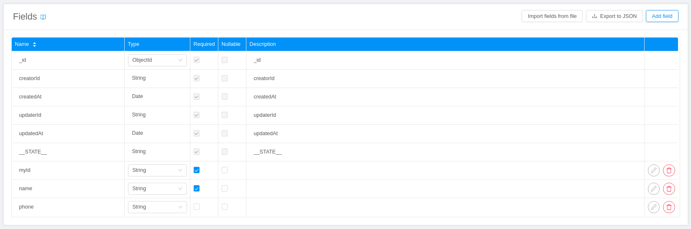
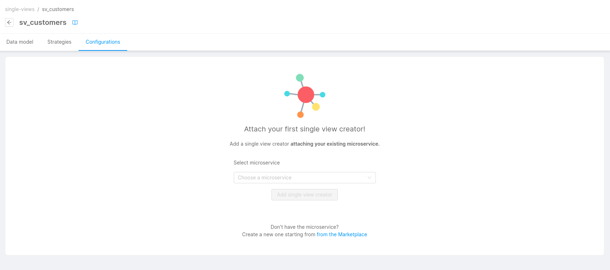
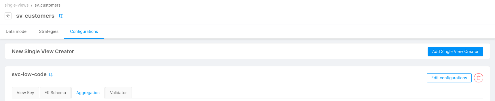
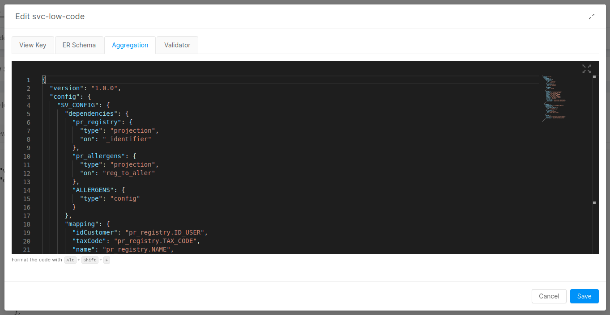
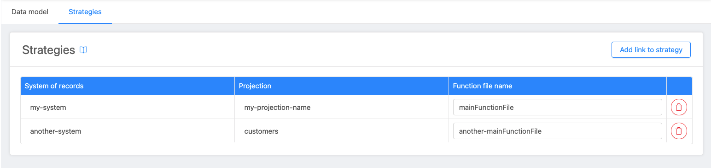

In this document we guide you through the configuration of [Single Views](/fast_data/the_basics.md#single-view-sv) directly in the Console.

## Create the Single View

Click on the Single Views voice of the left menu, which opens the Single View page, and click the button to create a new Single View.  

Fill the modal with the name of the Single View, that is going to be the name of the collection.

Once created, you will be redirected to the Single View detail page.  

## Single View Data Model

Single views collections are created on the CRUD Service, so we add all the [default fields](/runtime_suite/crud-service/10_overview_and_usage.md#predefined-collection-properties) and indexes required for the CRUD collections in creation.

To define the custom fields, indexes and internal endpoints of your single view collection, add them in the respective card.



The type fields supported are the same of the collection you can create in the [MongoDB CRUD section](/development_suite/api-console/api-design/crud_advanced.md#create-a-new-crud). To know more about indexes [click here](/runtime_suite/crud-service/10_overview_and_usage.md#indexes).

## Create the Single View Creator service

You need to create a **Single View Creator** to update or delete a Single View when a [Projection Changes](/fast_data/inputs_and_outputs.md#projection-change) event occurs.

A Single View can be updated by many Single View Creator. Each Single View Creator should be linked to one System of Records through Projection Changes.

```shell
system_1
 _______________     __________________________
| projection_1 |---> |projection_change type A |  ----> single_view_creator_1  
| projection_2 |---> |_________________________|                      \ 
|______________|                                                       \update
                                                                         ________________
                                                                        | single_view_A |
                                                                        |_______________|
system_2                                                                /
 _______________     __________________________                        / update
| projection_3 |---> |projection_change type B |  ----> single_view_creator_2  
| projection_4 |---> |_________________________|
|______________|

```

To associate the Single View with the service, add a service in the `Configurations` tab in the Single View detail page. You can attach more than one service to the Single View.

In this tab you can also edit the main Config Map Configurations of the associated Services, but only if they're `Single View Creator Low Code` Services. 

Nonetheless, you will find in all associated Services a link to the microservice page to edit its details, including the edit and creation of your own Config Map Configurations.

If you have no Single View Creator linked yet, a placeholder will be shown to invite you to link one.



If you already have Single View Creator services linked, you can add more by clicking on the dedicated button.



:::info
In the [Marketplace](/marketplace/overview_marketplace.md), you can find a template and two plugins that can help you in configuring all the **Single View Creator** services that you need. You can find more information [here](/fast_data/configuration/single_view_creator.md).
:::

Once a Single View Creator is linked, if it's configured as Low Code, then its [Low Code configuration](/fast_data/configuration/single_view_creator.md) files are shown in a dedicated card. Click on the Edit button to edit them.



Any changes to the Low Code JSON configurations will be validated to ensure that they are syntactically correct. 

:::warning
These validations are not a substitute of Unit Tests. They validate only that configurations match a JSON schema.     
Check the [How to test Low Code configurations](#how-to-test-low-code-configurations) paragraph for further information about unit testing.
:::

Click on Save to save the configuration, otherwise click on Cancel to discard changes.

:::note
When you save the Low Code configuration, the related Single View Creator config maps are updated locally with the changes. No automatic commit is going to be made. To persist the changes on Git, like for any other changes on the Console, you need to [Save the branch configuration](/development_suite/api-console/api-design/overview.md#how-to-save-your-configuration). 
:::

## Link projections to the Single View

In the detail page of the Single View, click on the `Strategies` tab.



Here it's shown a table in which you have to specify the all projections that will be read to get the data that the Single View needs (remember that a Single View is an aggregation of data from different projections).

To link a strategy to your Single View, once you entered the [`Strategies`](/fast_data/configuration/strategies.md) tab, you can click on the `Add link to strategy` button, which will let you select:

1. A System and a Projection from said system
2. Whether the strategy type is `low code` or `manual`
3. The main strategy function file name

You can link a strategy as low code only if the system it belongs to is low code as well. If you choose to link the strategy as low code, instead of its main function file name, the `__automatic__` marker will be used.

:::warning
Once you have linked some strategies to a Single View Creator in low code mode, if you try to change the Real-Time Updater making it manual, you will not be allowed to save.
:::

If you choose to use manual strategies, each listed manual projection must be linked to a file without the extension `.js` which is the entry point of your **strategy function**.

Notice that the strategy file must be placed directly inside the directory with the name of the system of records, placing it inside a subfolder of this directory is not supported.

Example:

```txt
configurations/
    |-- fast-data-files
        |-- strategies/
              |-- my-system/
                    |-- myStrategyForProjection1.js
                    |-- someFunctions.js
```

Where `myStrategyForProjection1.js` is the file that exports the strategy function, and internally it uses some functions imported from the `someFunctions.js` file.

So, you have to set `myStrategyForProjection1` as **main function file** for the projection associated.

In the table, you have the option to turn a manual strategy into a low code strategy. Note that this is only possible if the system the projection belongs to is low code too.

## How to consume the Single View

You can expose the Single View through the crud-service without writing any code, or you can always create a custom service to access to MongoDB if you have special needs.

You could [check here](/development_suite/api-console/api-design/endpoints.md) how to expose an endpoint of the CRUD service outside your project through the Console.

[Click here](/runtime_suite/crud-service/10_overview_and_usage.md) if you want the usage documentation for the CRUD.

## How to delete a Single View

To delete a Single View just click on the `Delete` button in the Single View detail page.

:::warning
You **cannot** delete a Single View if it has any endpoint associated, you will have to delete them first.
Deleting a Single View does **not** delete the microservice associated.
:::

## How to test Low Code configurations

In order to test Low Code configurations with unit tests we recommend cloning the [Fast Data Low Code Test Template repository](https://github.com/mia-platform/fast-data-low-code-test-template) from Mia-Platform GitHub.

This repository contains some configurations, such as the aggregation and ER Schema, and a suite of related unit tests. After cloning it, you must update the existing configurations to match your use case and run the tests to see if the configurations produce the expected results for the aggregation and the validator.

Once you've finished with the configuration you can compile the updated files with the `compile-config` npm script to get the configuration files that can then be directly uploaded or copied inside your Low Code service.

## Single View Patch

The Aggregation is not the only way possible to update Single Views, there is also an alternative called `SV Patch`. With this operation, the Single View Creator performs a Mongo update starting from the update of a single Projection, without regenerating the whole Single View.

This kind of operation is strongly recommended when a field of a Projection that is in common with a vast portion of Single Views, is updated.
Let's see an example:

Supposing we have a Projection that maps every country to a unique code, like:

```json
{
   "ITALY": 0001,
   "FRANCE": 0002,
   ...
}
```

And we have a Single View with personal data for a lot of people, including the code of the country in which they live, like:

```json
{
   "name": "mario",
   "surname": "rossi",
   "address": "foo",
   "countryCode": 0001,
   ...
}
```

It could happen that the code corresponding to `Italy` has to be updated.
This scenario brings to a problem: The Single View Creator will have to re-generate every Single View, for all the users with the obsolete `countryCode`; this operation is extremely heavy and time demanding, it could potentially block the updates of other Single Views.

To prevent this problem, a new infrastructure has been designed:


The Idea is to configure a second Single View Creator with the sole purpose of performing SV-Patch operations.
This second service will consume pr-update messages from the Real-Time Updater which will be generated only for specific projections.

To understand how to configure both services click on them: [Real-Time Updater](/fast_data/configuration/realtime_updater.md#single-view-patch) and [Single View Creator](/fast_data/configuration/single_view_creator.md#single-view-patch). 

## Technical limitation

In your custom files (e.g. `fast-data-files`) you can import only the node modules present in the following list:

- [lodash.get](https://github.com/lodash/lodash/tree/4.4.2-npm-packages/lodash.get)
- [mongodb](https://github.com/mongodb/mongo/tree/r3.6.0)
- [ramda](https://github.com/ramda/ramda/tree/v0.27.1)

:::caution
It is used the node version 14.
:::
