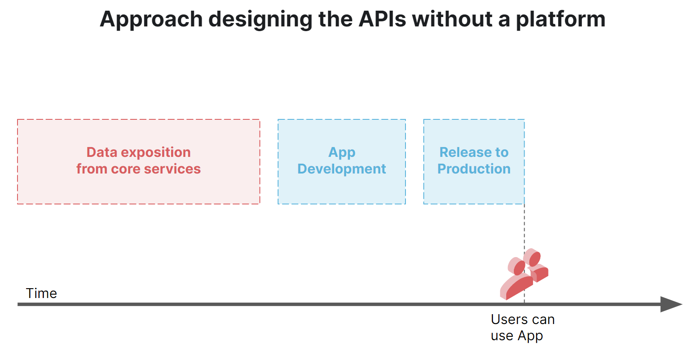
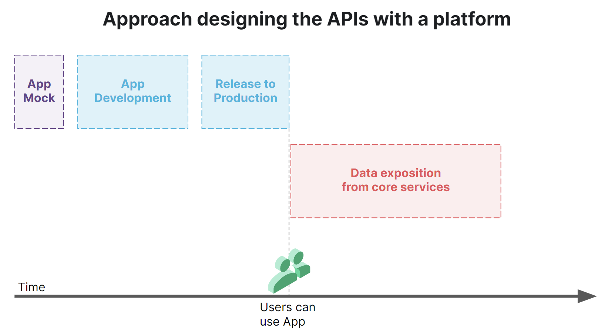

API is the acronym for *Application Programming Interface*. In recent years the RESTful API have become the main method to decouple the server part from the client side of an application software. A RESTful API uses verbs HTTP protocol (POST, GET, PUT, DELETE) to manage a data model also called a resource.

In detail:

- POST: create a resource;
- GET: read a resource or a list of resources;
- PUT: update a resource;
- DELETE: delete a resource.

## REST API ##

REST is an **architectural style for distributed systems**, which allows exposing resources through one or more HTTP / HTTPS routes. The term REST stands for REpresentational State Transfer, and it was created by Roy Fielding.

To be considered RESTful, an API must respect the following characteristics:

- Client-server architecture;
- Stateless;
- Cacheability;
- Layered system;
- Uniform interface.

This cheat sheet summarizes the principles and guidelines for the design of the REST API.

## The importance of designing APIs

Designing the API first and then implementing it is not against Agile principles.
On the contrary, it allows speeding up the development, because it decouples the backend from the frontend. It also helps to parallelize developments and, as a consequence, also to incrementally release features. Initially, the UI will be interfaced with API implementations still in Draft. After a first evaluation of the API's ergonomics aside of the UI, the API will evolve and the final server-side logic will be implemented.

Below you can find two images that represent two different approaches in API design: the first one shows the approach without a Platform, the second one shows the approach using a Platform.





As you can see, by adopting a platform users can start using the application much earlier. 

Following the second approach, you can see how to design an API and then agree a contract between frontend and backend. You can proceed in parallel by first providing mock data to the user interface, and then implement the server part, without changing the API. This approach has the advantage that the first versions of the API will be used and then receive feedback from who is implementing the client side of the application. Thanks to these feedbacks, the APIs will be improved at a lower cost than making them change once all the server logic has been completed.

However, it is desirable to evolve the APIs as the user interface evolves. The Backend-for-Frontend pattern is basic to make life easier at the frontend and to allow for performing and useful APIs.

## Guidelines

There are best practices to design RESTFul APIs that have been consolidated over the years, thanks to a rich Open Source community. Below there are some good tips on API design. You can find more
details on the [Guidelines of Zalando](http://zalando.github.io/restful-api-guidelines).

Here you can find some useful tips on how to call and format routes, query parameters, and model properties. In the next paragraphs we will see in detail how to design an API with Mia-Platform.

### Nomenclature and Formatting

The first time an API is defined, you may think of creating a dedicated service to call to perform each action.

Let's take an example: we want to make a game on superheroes, and the first thing we want to do is to manage the profile of a superhero. For example, to read all the heroes we might want to write:

```
/getAllHeroes
```

Going on with the other actions, we might also add:

```
/addNewHero
/updateHero
/deleteHero
/deleteAllHeroes
/evolveHero
/evolveAllHeroes
```

And it is not finished here: there would be many end-points similar to these. All of these end-points would contain redundant actions.
As the system evolves, further endpoints would emerge and system maintenance would reach critical levels.

What's wrong with this approach?

**URLs should only contain resources (names) and not actions or verbs!**. For example, the path `/addNewHero` contains the *addNew* action and the resource called *Hero*.

So, what would be the correct way?

`/heroes` would be a good example: it does not contain actions, but only the name.

The next question is: how to tell the server to perform actions on heroes? HTTP verbs come into play here.

The resources always use the **plural** and if we want to access only one resource we can pass the ID in the URL.
For example:

- the GET method on path `/heroes` returns the list of all heroes;
- the GET method on path `/heroes/100` returns the hero whose ID is 100;
- the DELETE method on path `/heroes/100` deletes the hero whose ID is 100;
- the POST method on path `/heroes` creates a new hero and returns the detail of the new hero created.

With this simple device the APIs are more concise and consistent!

:::tip
The API describes resources, so the only place where actions should appear is in HTTP methods.
In URLs, use only the names. Instead of thinking about actions (verbs), it is often useful to think about putting a message
in a mailbox: for example, instead of putting the verb delete in the URL, consider sending a message to
delete a hero from the server-side deletion box.
:::

### Routes

When writing a new route, follow these best practices:

- Names in English;
- Names in the plural;
- Names in lower case;
- Separation of words by dash '-'.

### Query parameters and data models

Here are some guidelines for query parameters and data models:

- Names in English;
- Names in 'camelCase' format.

:::warning
URLs must contain only resources (names) and not actions or verbs!
:::

### Versioning

The versioning of the REST APIs is done by inserting the version in the path. 

Example of a versioned API path: `host/projects/v1/project-apis`.

There are several debates on versioning or not versioning the APIs. Both approaches have pros and cons:

- Not versioning the APIs allows to guarantee a continuity of service to all the clients that consume them, and no changes to the end-points are required;
- Versioning the APIs allows you to introduce break changes without impacting on existing clients.

:::tip
We suggest versioning only major versions that lead to changes in the breakdown of the service. Also, we suggest having no more than 2 versions supported in production: one version for current use, and one for discontinued use.
:::

### Data Model

Here you can find an example of REST calls for a resource called `vehicle`. The data model is exchanged in the body of HTTP messages and is serialized using the [JSON format](http://www.json.org/).

| Method     | Path               | Request               | Response              | Description                                             |
|------------|------------------- |-----------------------|-----------------------|---------------------------------------------------------|
| **GET**    | host/vehicles/     | Empty Body            | Array of JSON Objects | List of all vehicles. Filters through query parameters.              |
| **POST**   | host/vehicles/     | JSON Object           | JSON Object           | Create a new vehicle.                                                 |
| **PUT**    | host/vehicles/{id} | JSON Object           | JSON Object           | Complete editing of the vehicle with id = {id}.                              |
| **PUT**    | host/vehicles/bulk | Array of JSON Objects | Array of JSON Objects | Complete editing of all the vehicles included in the array.                  |
| **PATCH**  | host/vehicles/{id} | JSON Object           | JSON Object           | Partial editing of the vehicle with id = {id}.                              |
| **PATCH**  | host/vehicles/bulk | Array of JSON Objects | Array of JSON Objects | Partial editing of all the vehicles included in the array.                  |
| **DELETE** | host/vehicles/{id} | Empty Body            | Empty Body            | Delete of the vehicle with id = {id}.                                  |

## Answer Results

The outcome of a call is communicated via HTTP status code: for further information see [RFC 2616](https://www.ietf.org/rfc/rfc2616.txt). The body contains the data model in the case of 2xx or, in other cases, a message that describes in particular the status code returned.

Below you can find a brief cheat sheet of HTTP status codes:

**2xx**

Success; usually 200, 201 (new document created), 204 for empty body.

**3xx**

Redirected.

**4xx**

Application error; 400 incorrect syntax, 401 required user authentication, 403 request not allowed (possible even with authenticated user), 404 resource not found, 422 semantically incorrect.

**5xx**

Server error; in this case there is an unexpected situation, not manageable at the backend level or intentionally unmanaged.
