# Mia-Platform Backoffice Microfrontend Tutorial

Welcome to this tutorial on the Mia-Platform Backoffice. In this module, we'll delve into how to integrate two microfrontends: one in Angular and the other in React, into your backoffice. After the integration, we'll demonstrate how to add their pages to the menu, building upon what was learned in the [Backoffice Basics Tutorial](/getting-started/tutorials/backoffice/basics.mdx).

## What We Will Build

In this tutorial, we will create Backoffice pages using the microfrontends:

- Create a new Backoffice page using an [Angular microfrontend](#angular-microfrontend).
- Create a new Backoffice page using a [React microfrontend](#react-microfrontend).

## Prerequisites

Before starting this tutorial, we need to be familiar with the concepts of the [Mia-Platform Backoffice](/business_suite/backoffice/10_overview.md) and have completed:
* The [Backoffice Tutorial Basics](/getting-started/tutorials/backoffice/basics.mdx).
* The [Backoffice Tutorial Templates](/getting-started/tutorials/backoffice/templates.mdx).

## Angular Microfrontend

### Create a new Angular Microfrontend

To create a new Angular microfrontend, we will use the `micro-lc Angular 14 Template` provided by the Mia-Platform Marketplace.

In the `Microservice` section of the Mia-Platform Console, click on `Create a Microservice`, then select `From Marketplace` and search for `micro-lc Angular 14 Template`.

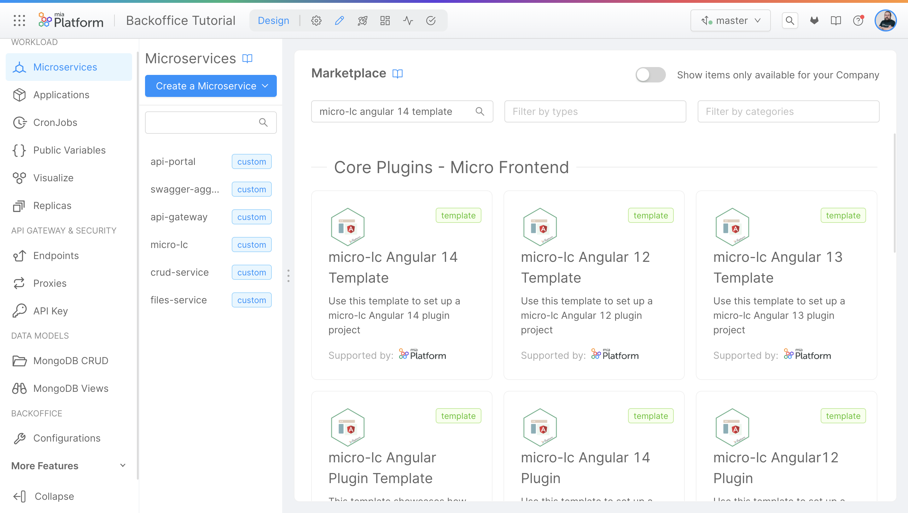

Install the microservice and expose it using an Endpoint.

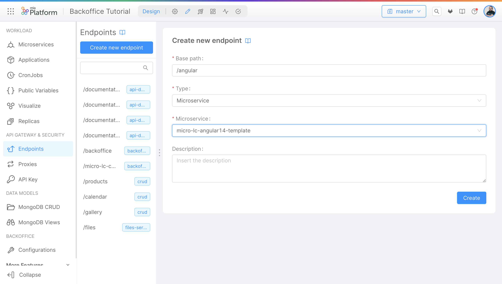

### Create a new Backoffice Page using the Angular Microfrontend

To create a new Backoffice page using the Angular microfrontend, we will use the `Backoffice Configuration`. In the `Pages` section, create a new page by clicking on the `Create New Page` button.

In the first wizard step, choose the `Page type`. In this case, select the `Micro-Frontend` option.
Provide an `id` for the page. For this example, we will use `angular`, then provide a `Page rendering route`, using `./angular`.

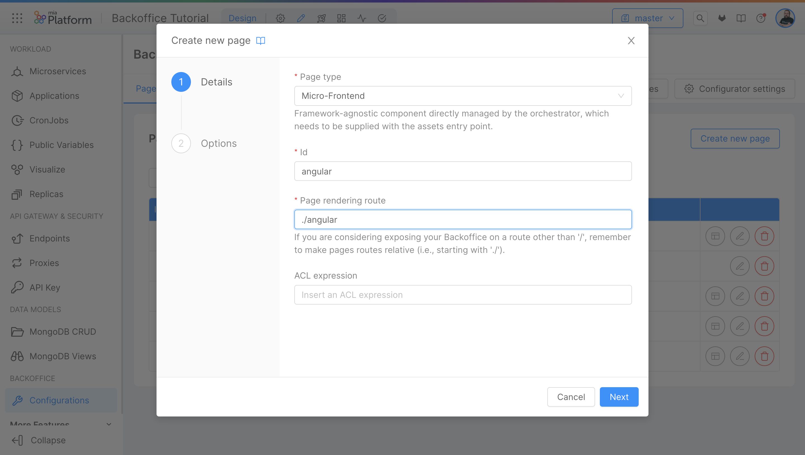

In the second wizard step, provide an `HTML` entrypoint. Use `{{your_address}}/angular` (the same address created in the endpoint step) and make sure that the `Inject base` field is flagged.
Click on the `Save` button, and you will be redirected to the Backoffice page.

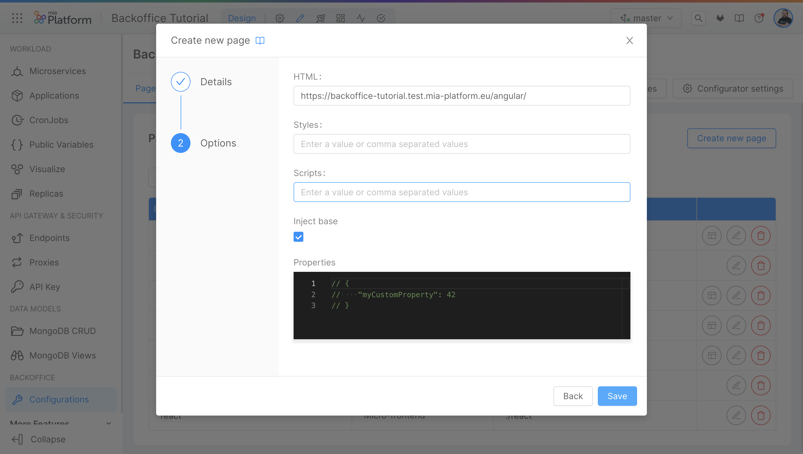

The last step is to add the `zone.js` library to our `index.html`. Inside the Backoffice Configuration, navigate to the `Webserver Configuration` tab and click on the `Entry Point` button on the left panel.
Add the `zone.js` library to the `head` section, after the `<title>` tag in the `index.html` file.

```html
    <script
        nonce="**CSP_NONCE**"
        src="https://cdn.jsdelivr.net/npm/zone.js@0.13.0/dist/zone.min.js"
    ></script>
```
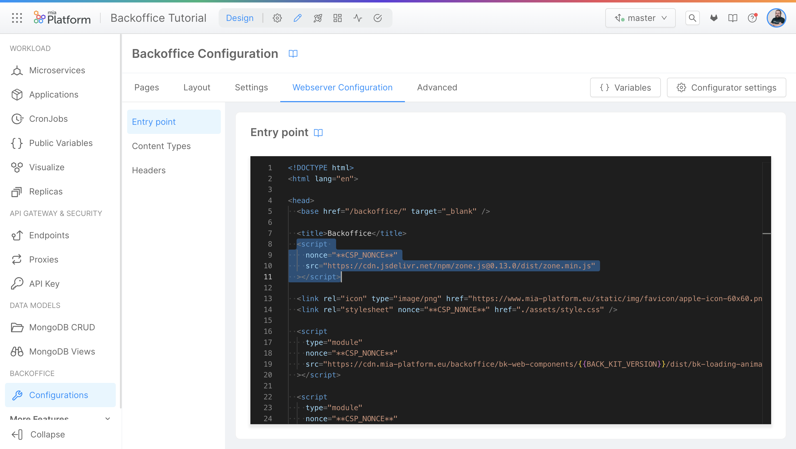

### Add a new menu item to the Backoffice Menu

Now we can connect the page to the menu. To do that, return to the `Layout` tab and click on the `Layout` button on the left panel.

In the right panel, click on `Edit Property` under the `Menu Items` section. Then click on the `Add Item` button and provide a `Label` and a `Id` for the menu item.

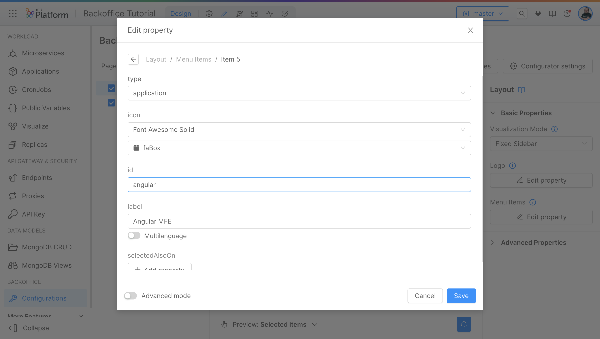

Now save the configuration and deploy. Check the [Save and Deploy](#save-and-deploy) section for more information.

The output of the Angular page should look similar to the following:

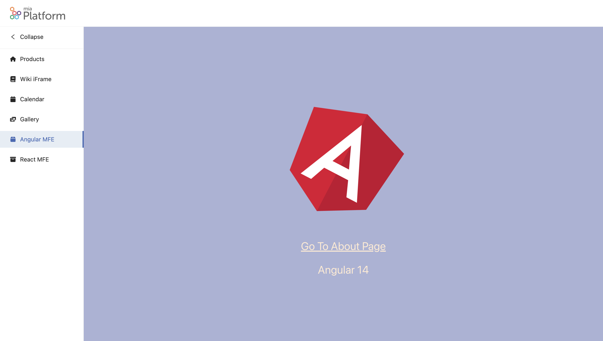

## React Microfrontend

### Create a new React Microfrontend

To create a new React microfrontend, we will use the `micro-lc React Template` provided by the Mia-Platform Marketplace.

In the `Microservice` section of the Mia-Platform Console, click on `Create a Microservice`, then select `From Marketplace` and search for `micro-lc React Template`.

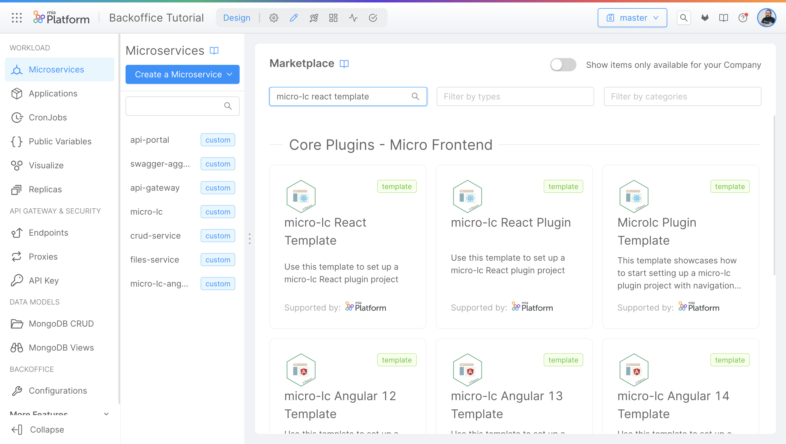

Install the microservice and expose it using an Endpoint.

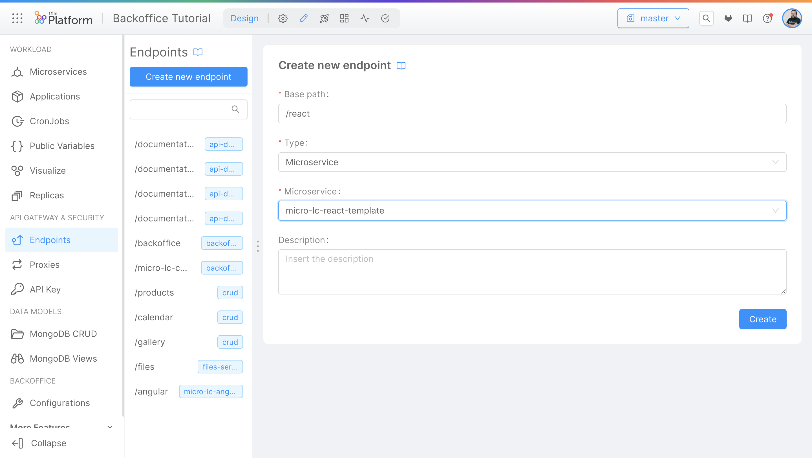

### Create a new Backoffice Page using the React Microfrontend

Now we can create a new Backoffice page using the React microfrontend. This process is the same as with the Angular microfrontend. Use the `Backoffice Configuration`, in the `Pages` section, create a new page by clicking on the `Create New Page` button.

In the first wizard step, choose the `Page type`. In this case, select the `Micro-Frontend` option.
Provide an `id` for the page. For this example, we will use `react`, then provide a `Page rendering route`, using `./react`.

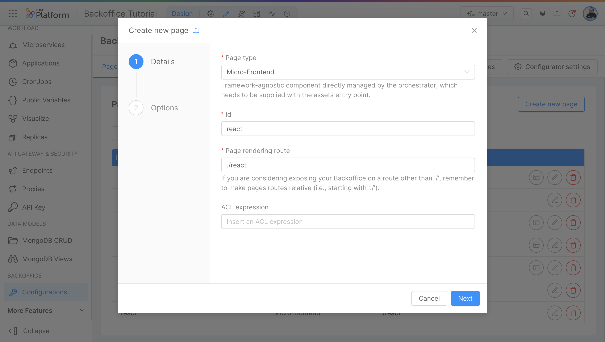

In the second wizard step, provide an `HTML` entrypoint. Use `{{your_address}}/react` (the same address created in the endpoint step) and make sure that the `Inject base` field is flagged.
Click on the `Save` button and you will be redirected to the Backoffice page.


### Add a new menu item to the Backoffice Menu

Now we can connect the page to the menu. To do that, return to the `Layout` tab and click on the `Layout` button on the left panel.

In the right panel, click on `Edit Property` under the `Menu Items` section. Then click on the `Add Item` button and provide a `Label` and a `Id` for the menu item.

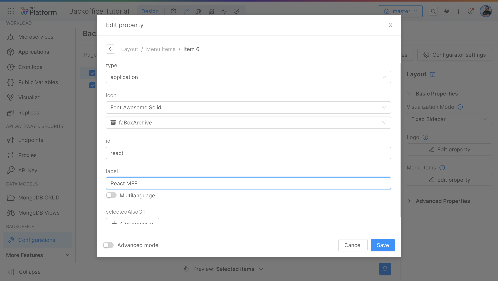

Now save the configuration and deploy. Check the [Save and Deploy](#save-and-deploy) section for more information.

The output of the React page should look similar to the following:

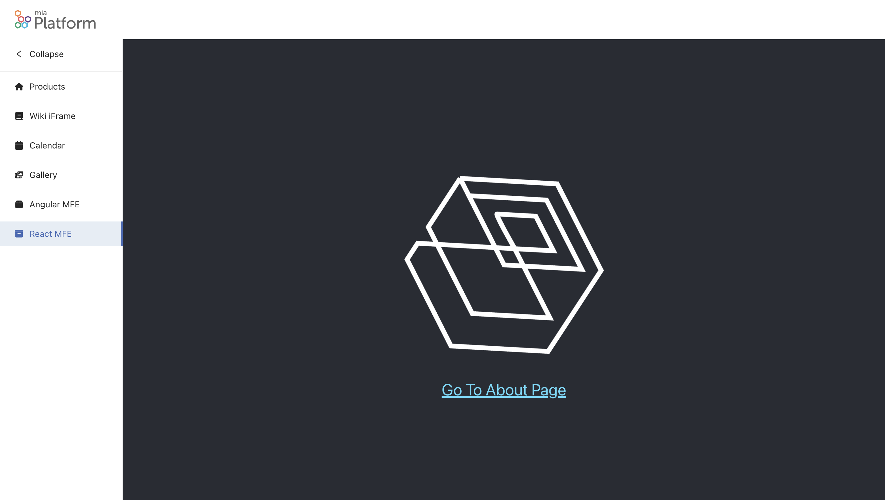

## Backoffice Tutorials

In this tutorial, we learned how to create new Backoffice Pages using Microfrontends.

Also, make sure to check out:
* The [Backoffice Templates Tutorial](/getting-started/tutorials/backoffice/templates.mdx) where we explain how to configure other types of pages using the Backoffice Page Composer and an iFrame Page.
* The [Backoffice Basics Tutorial ](/getting-started/tutorials/backoffice/basics.mdx) where we demonstrate how to create a new Backoffice and how to create a new Backoffice Page using the Backoffice Table Template.
