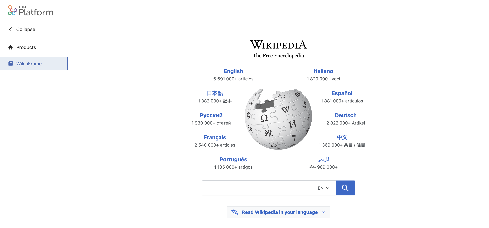
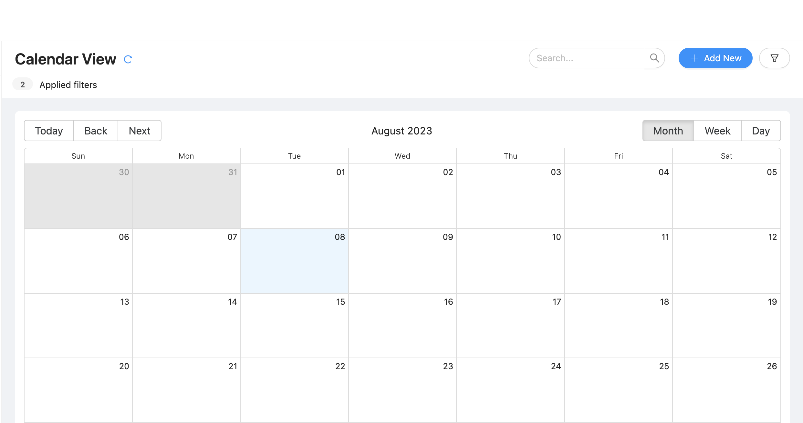
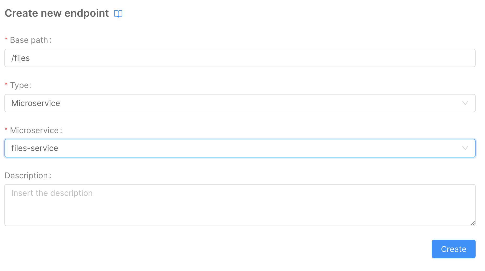
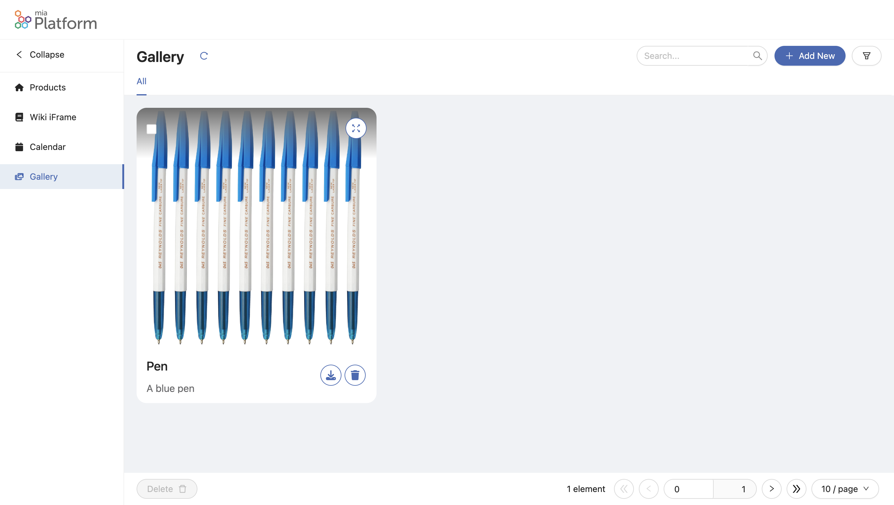
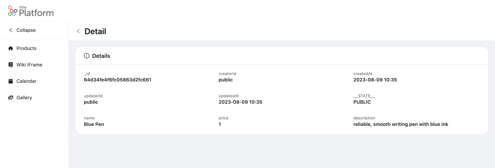
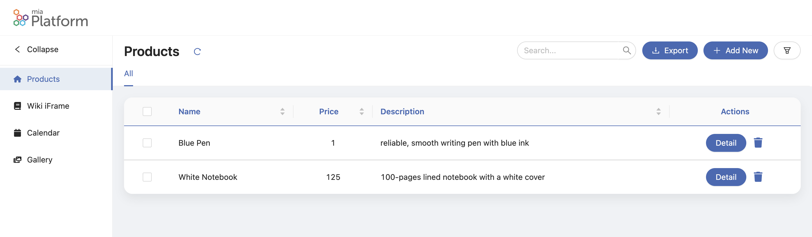

# Mia-Platform Backoffice Templates Tutorial

In this tutorial, we will explore the world of ready-to-use page templates within the Mia-Platform Backoffice. These templates serve as potent tools, enabling us to craft intricate pages with ease. Leveraging the insights gained from the [Backoffice Basics Tutorial](/getting-started/tutorials/backoffice/basics.mdx), we will delve into harnessing the full potential of these templates to enhance the efficiency and effectiveness of our page implementation. Get ready to uncover an innovative approach that accelerates the creation process.


## What We Will Build

In this tutorial, we'll guide you through the process of creating Backoffice pages using various Backoffice templates. We'll cover the following templates:

- [Setup an iFrame Page](#setup-an-iframe-page)
- [Setup a Calendar View Page](#setup-a-calendar-view-page)
- [Setup a Picture Gallery Page](#setup-a-picture-gallery-page)
- [Setup a Show Info/Details Page](#setup-show-infodetails-page)

Each of these templates offers unique capabilities, and we'll walk you through the steps to implement them effectively.

## Prerequisites

Before diving into this tutorial, it's essential to have a grasp of the fundamental concepts of the [Mia-Platform Backoffice](/business_suite/backoffice/10_overview.md) and to have completed the [Backoffice Tutorial Basics](/getting-started/tutorials/backoffice/basics.mdx). This foundational knowledge will ensure a smoother understanding of the upcoming content.


## Setup an iFrame Page

To create a new Backoffice page using the Backoffice iFrame, follow these steps:

1. Access the Backoffice Configuration and navigate to the **Pages** tab.
2. Click on the **Create New Page** button.

In the first step of the wizard, select the **Page type** as an iFrame. Provide an appropriate **id** for the page (e.g., "wiki"). Set the **Page rendering route** to "./wiki".


In the second step of the wizard, provide the **URL (iFrame source)**. For example, you can use "https://www.wikipedia.org/". After filling in the necessary details, click the **Save** button to create the page.


To integrate the new page into the menu, navigate to the **Layout** tab and click on the **Layout** button in the left panel.

1. Click on the **Add Item** button.
2. Click on the **Edit** option next to the new menu item in the list.


In the modal that appears, make the following changes:
* Change the **id** to "wiki".
* Update the **label** to "Wiki iFrame".
* Choose an appropriate icon set and icon for the menu item.


Once the configurations are set, you can save the changes and proceed to [save the configuration and deploy](#save-and-deploy).

Upon completion, the new iFrame page will be accessible. Here's an example of how the page might appear:



## Setup a Calendar View Page

To create a new Backoffice page using the Backoffice Calendar View Template, follow these steps:

### Setting Up the CRUD Collection

Before creating a new Backoffice page using the Calendar View Template, you need to set up a CRUD collection named "calendar" as the data source. You can follow the same procedure outlined in the [Backoffice Tutorial Basics](/getting-started/tutorials/backoffice/basics.mdx#create-crud-to-read-and-write-table-data) tutorial. Define the following data schema for the collection:

* **title**: Type - string, Required - true
* **startDate**: Type - Date, Required - true
* **endDate**: Type - Date, Required - true

For this example, we'll omit the default fields generated by the CRUD collection. Here's the JSON schema representing the specific fields:

```json
[
  {
    "name": "title",
    "type": "string",
    "required": true,
    "nullable": false,
    "sensitivityValue": 0,
    "encryptionEnabled": false,
    "encryptionSearchable": false
  },
  {
    "name": "startDate",
    "type": "Date",
    "required": true,
    "nullable": false,
    "sensitivityValue": 0,
    "encryptionEnabled": false,
    "encryptionSearchable": false
  },
  {
    "name": "endDate",
    "type": "Date",
    "required": true,
    "nullable": false,
    "sensitivityValue": 0,
    "encryptionEnabled": false,
    "encryptionSearchable": false
  }
]
```

Now you can expose the CRUD data using an endpoint named "calendar".

### Setup the Calendar View Page

To create a new Backoffice page using the Backoffice Calendar View Template, follow these steps:

1. Open the Backoffice Configuration and navigate to the `Pages` tab.
2. Click on the `Create New Page` button.

In the first step of the wizard:

- Choose the `Page type` as `Compose`.
- Provide an `id` for the page, such as `calendar`.
- Set the `Page rendering route` to `./calendar`.


In the second step of the wizard:

- Choose the `Calendar View` template.


In the `Pages` tab within the `Backoffice` section:

- Locate the `Calendar` page that was previously created.
- Click on the `Compose` button (placed on the left of the "Edit" button) to open the page composer.


Navigate to the `Connectors & Adapter` section:

- Click on the `CRUD Client`.
- Select the endpoint `/v2/calendar`.
- Click on the `Generate Schema` button.


Now return to the `Layout` tab. Here you can:

- View the preview of the `Calendar View` page.
- Personalize the page title and the tab label, as previously learned in the [Backoffice Tutorial Basics](/getting-started/tutorials/backoffice/basics.mdx#personalize-the-page). For example, use `Calendar View` as the page title and `Calendar` as the tab label.

If you wish to remove the `Export` button from the page:

- Click on the `Export` button in the preview (highlighting the button in the left panel).
- Uncheck the `Export`checkbox on the left sidebar to remove the export functionality.


Before proceeding, connect the page to the menu using the same steps explained in the [Backoffice Tutorial Basics](/getting-started/tutorials/backoffice/basics.mdx#connect-the-page-to-the-menu). Use `calendar` as the `id` and `Calendar` as the `label`.

To test the new page, save the configuration and deploy the changes by following the [save and deploy process](#save-and-deploy).

Below is the result:



## Setup a Picture Gallery Page

### Setup the CRUD Collection

Before creating a new Backoffice page using the Backoffice Picture Gallery Template, you need to set up a CRUD collection named `gallery` as a data source. Follow the same procedure outlined in the [Backoffice Tutorial Basics](/getting-started/tutorials/backoffice/basics.mdx#create-crud-to-read-and-write-table-data) to create this collection. Here's the required data schema:

- `file`: Represents a `RawObject` and is `required`.
- `title`: Represents a `string` and is `required`.
- `description`: Represents a `string` and is `required`.

Please note that in this example, we've excluded the default fields that are automatically generated by the CRUD collection. Below is the JSON schema for the specific fields:


```json
[
  {
    "name": "file",
    "type": "RawObject",
    "required": true,
    "nullable": false,
    "sensitivityValue": 0,
    "encryptionEnabled": false,
    "encryptionSearchable": false
  },
  {
    "name": "title",
    "type": "string",
    "required": true,
    "nullable": false,
    "sensitivityValue": 0,
    "encryptionEnabled": false,
    "encryptionSearchable": false
  },
  {
    "name": "description",
    "type": "string",
    "required": true,
    "nullable": false,
    "sensitivityValue": 0,
    "encryptionEnabled": false,
    "encryptionSearchable": false
  }
]
```

Now, let's expose the CRUD data using an endpoint called `gallery`.

The `File Service` can support various file storage services, such as `AWS S3` and `Google Cloud Storage`. However, in this example, we'll use `MongoDB` as the file storage service.

To achieve this, we need to create a new CRUD collection called `files` to store the files. Follow the same procedure outlined in the [Backoffice Tutorial Basics](/getting-started/tutorials/backoffice/basics.mdx#create-crud-to-read-and-write-table-data) to create this collection. Here's the required data schema:

- `name`: Represents a `string` and is `required`.
- `file`: Represents a `string` and is `required`.
- `size`: Represents a `number` and is `required`.
- `location`: Represents a `string` and is `required`.

Just like in the previous examples, we've excluded the default fields that are automatically generated by the CRUD collection. Below is the JSON schema for the specific fields:


```json
[
  {
    "name": "name",
    "type": "string",
    "required": true,
    "nullable": false,
    "sensitivityValue": 0,
    "encryptionEnabled": false,
    "encryptionSearchable": false
  },
  {
    "name": "file",
    "type": "string",
    "required": true,
    "nullable": false,
    "sensitivityValue": 0,
    "encryptionEnabled": false,
    "encryptionSearchable": false
  },
  {
    "name": "size",
    "type": "number",
    "required": true,
    "nullable": false,
    "sensitivityValue": 0,
    "encryptionEnabled": false,
    "encryptionSearchable": false
  },
  {
    "name": "location",
    "type": "string",
    "required": true,
    "nullable": false,
    "sensitivityValue": 0,
    "encryptionEnabled": false,
    "encryptionSearchable": false
  }
]
```

In this scenario, exposing the CRUD data using an endpoint is not required. Hence, we can skip this step.

### Setup the File Service

To set up a new file service microservice, follow these steps:

1. Navigate to the `Microservices` section in the Console.
2. Click on `Create a Microservice` from `Marketplace`.
3. Choose the `File Service` from the list of available microservices.


Configure the following environment variables:

* `CRUD_URL`: Set this to the name of the CRUD collection. For this instance, use `http://crud-service/files/`.
* `CONFIG_FILE_PATH`: Set this to the path of the configuration file. In this case, use `/configurations/config.json`.
* `PATH_PREFIX`: Set this to the path prefix of the file service. Here, use `/files/`.

:::danger
To avoid any build error you have to remove any other environment variables except for `LOG_LEVEL`, `HTTP_PORT`, `CRUD_URL`, `CONFIG_FILE_PATH`, `PATH_PREFIX`, and `HEADERS_TO_PROXY`.
:::


On the same page, configure a `ConfigMap` for the configuration file:

* `Name`: `configurations`
* `Runtime Mount Path`: `/configurations/`


Click the `Add File` button to create a new file named `config.json`.


Save the file by clicking the `Create` button. Then, add the content of the configuration file:


```json
{
  "type": "mongodb",
  "options": {
    "url": "{{MONGODB_URL}}",
    "bucketName": "filesbucket"
  }
}
```


Next, we need to expose this microservice using an endpoint called `files`. To do this:

1. Navigate to the `Endpoints` section in the Console.
2. Click on the `Create a new Endpoint` button.
3. Create a new microservice endpoint with the following details:
- `Base path`: `/files`;
- `Type`: `Microservice`;
- `Microservice`: `files-service`.



### Configure the Gallery Page

To create a new Backoffice page using the Backoffice Picture Gallery Template, follow these steps:

1. In the Backoffice Configuration, go to the `Pages` tab and click on the `Create New Page` button.
2. In the first wizard step, choose the `Page type`: `Compose`.
3. Provide an `id` for the page, e.g., `gallery`.
4. Set the `Page rendering route` to `./gallery`.


5. In the second wizard step, choose the `Picture Gallery` template.


In the `Pages` tab within the `Backoffice` section, you will see the newly created `Gallery` page. Click on the `Compose` button to open the page composer.

Configure the page as follows:
- Update the `Page Title` to `Gallery`.
- Update the tab Label to `All` using the same steps from the [Backoffice Tutorial Basics](/getting-started/tutorials/backoffice/basics.mdx#personalize-the-page).
- Remove the `Export` button from the page using the steps from the Setup the Calendar View Page section of this tutorial.

In the `Connectors & Adapter` tab, configure the Gallery connector:
- In the left panel, click on `CRUD Client`.
- Select the `/v2/gallery` CRUD collection endpoint.
- Click on `Generate schema`.


As in previous steps, keep only the `file`, `title`, and `description` fields.
Refer to the [Backoffice Tutorial Basics](/getting-started/tutorials/backoffice/basics.mdx#crud-connector) for detailed instructions on configuring the `Gallery` connector.


Next, configure the file service connector:
- In the left panel, click on `File Service Client`.
- Use the `/files` URL in the `File Service base path` field.

Now, proceed to configure the layout page. In the `Layout` tab:
1. Click on `Main` in the left panel.
2. Click on the `Gallery` button.
3. In the right panel, edit the basic properties of the `Gallery` component:
- `Thumbnail source`: type `string` and value `file.location`;
- `Title source`: type `string` and value `title`;
- `Subtitle source`: type `string` and value `description`.

Finally, configure the `Data Schema` for the `Form Modal` component:
1. In the left panel, under `Main`, click on `Form Modal`.
2. In the right panel, enable `Use custom value`.
3. Add the following JSON schema:


```json
{
  "type": "object",
  "required": [],
  "properties": {
    "_id": {
      "formOptions": {
        "hiddenOnInsert": true,
        "readOnlyOnUpdate": true
      },
      "type": "string"
    },
    "file": {
      "type": "object",
      "required": [],
      "additionalProperties": true,
      "format": "file"
    },
    "title": {
      "type": "string"
    },
    "description": {
      "type": "string"
    }
  }
}
```

Now we can create a new menu item for the `Gallery` page. To do that, follow the same steps used in the [Backoffice Tutorial Basics](/getting-started/tutorials/backoffice/basics.mdx#add-menu-item) using the `Gallery` page id.

After that, save the configuration and deploy. Refer to the [Console Handbook](/getting-started/handbooks/project/usage.md) for more information about the deploy command.

The output of the Gallery page should be similar to the following:




## Setup Show Info/Details Page

To create a new Backoffice page using the Backoffice Show Info/Details Template, follow these steps:

1. In the Backoffice Configuration, go to the `Pages` tab and click on the `Create New Page` button.
2. In the first wizard step, choose the `Page type`: `Compose`.
3. Provide an `id` for the page, e.g., `detail`.
4. Set the `Page rendering route` to `./detail`.


5. In the second wizard step, choose the `Show Info/Details` template.


In the `Pages` tab within the `Backoffice` section, you will see the newly created `detail` page. Click on the `Compose` button to open the page composer.

Configure the page as follows:
- Update the `Page Title` to `Detail` using the same steps from the [Backoffice Tutorial Basics](/getting-started/tutorials/backoffice/basics.mdx#personalize-the-page).


In the `Connectors & Adapter` tab, configure the Detail connector:
1. In the left panel, click on `CRUD Client`.
2. Select the `/v2/products` CRUD collection endpoint.
3. Click on `Generate schema`. In this case, we want to leave all the fields, so we don't need to edit the schema.


Next, configure the `URL Parameters Adapter`:
1. In the left panel, click on `URL Parameters Adapter`.
2. Modify the URL Mask by clicking on the `Edit Property`.
3. Use the following URL Mask: `/detail/:id` with `string` as the type.


After saving the configuration and deploying (refer to the [Console Handbook](/getting-started/handbooks/project/usage.md) for more information), you will see the `Detail` page in the Backoffice menu.
To navigate to the `Detail` page, use the URL `/backoffice/detail/{{id}}`, where `{{id}}` is the `_id` of the product you want to see the details for.

Here's how the `Detail` page looks:




### Connect the Detail Page with the Products Page

To connect the `Detail` page with the `Products` page, follow these steps:

1. Ensure the `Products` page is configured as done in the [Backoffice Tutorial Basics](/getting-started/tutorials/backoffice/basics.mdx).
2. In the `Pages` tab, click on the `Compose` button for the `Products` page.
3. In the left panel, click on `Main` and then click on the `Table` button.
4. In the right panel, open the `Advanced Properties` and click on the `Edit Property` under the label `Custom Actions`.
5. In the modal that opens, select `array` as Type.
6. Click on the `Add Item` button to add a new item.
7. In the new item, click on the `Edit` icon and configure as follows:


```json
{
  "tag": "bk-button",
  "properties": {
    "content": "Detail",
    "action": {
      "type": "push",
      "config": {
        "url": "./detail/{{args.[1]._id}}"
      }
    }
  }
}
```

Now we can save the configuration and deploy. Refer to the [Console Handbook](/getting-started/handbooks/project/usage.md) for more information about the deploy command.

Now you can navigate to the `Products` page. Here's the output:



Clicking on the `Detail` button in one of the rows of the table will redirect you to the `Detail` page.

## Backoffice Tutorials

In this tutorial, we learned how to create new Backoffice Pages using the Backoffice Compose Template or an iFrame.

Also, make sure to check out:
- The [Backoffice Microfrontends Tutorial](/getting-started/tutorials/backoffice/microfrontends.mdx), where you can learn how to configure a Microfrontend with Angular or React and how to use it in the Backoffice.
- The [Backoffice Basics Tutorial](/getting-started/tutorials/backoffice/basics.mdx), which covers how to create a new Backoffice and how to create a new Backoffice Page using the Backoffice Table Template.
