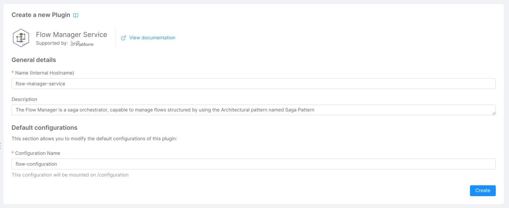
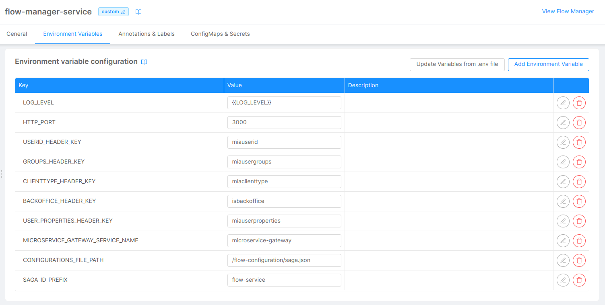
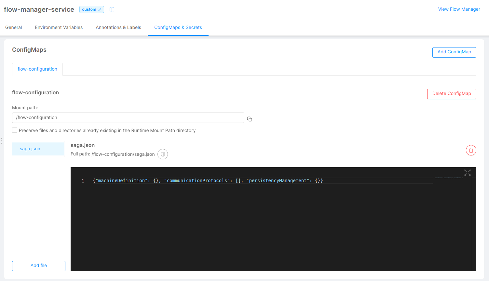
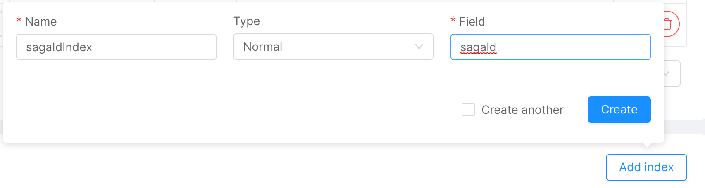
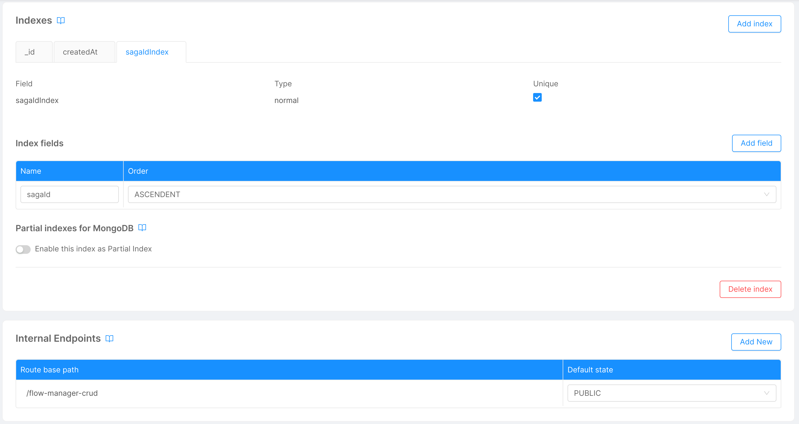
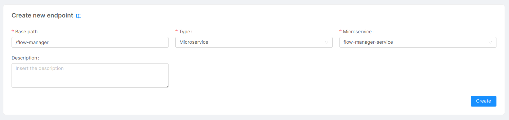
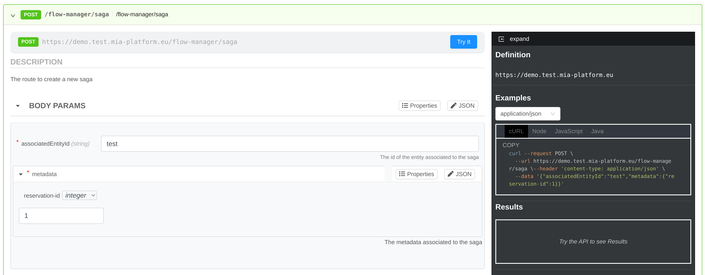

In this tutorial we will see how to create and expose a [**Flow Manager**](/runtime_suite/flow-manager-service/10_overview.md) service. The Flow Manager is a **saga orchestrator**, capable to manage flows structured by leveraging the Architectural pattern named [**Saga Pattern**](https://blog.mia-platform.eu/en/saga-pattern-how-to-manage-distributed-transactions-with-microservices) using, in particular, the **Command/Orchestration** approach.

Since it can help you to govern the interaction to complete various tasks and to guarantee data consistency, Flow Manager can simplify your work when you want to model **complex flows** involving the interaction of **several services**.

## What We Will Build

In this tutorial, you will configure a system handling the **workflow** of a reservation process orchestrated by the Flow Manager service using **Kafka** message broker for communication.
In particular, you will:
  - Define a finite state machine representing a simple saga;
  - Define business states and business events;
  - Define commands and events;
  - Configure Flow Manager to use a Kafka broker for communication;
  - Configure a CRUD service for persistency;
  - Interact with the Flow Manager service.

## Prerequisites  
  
Before starting this tutorial, you need to be familiar with the concepts of Command/Orchestration approach and Kafka (including producers and consumers).
For the technical part of this tutorial, an up-and-running Kafka cluster is required.
Also Javascript and Mia-Platform dev libraries knowledge is needed if you want to implement external services interacting with Flow Manager using the Mia-Platform [Flow Manager Client](/runtime_suite_libraries/flow-manager-client/overview.md).

You can apply the configurations in this tutorial in a new branch on the Console. To see how to create a new branch please see [here](/getting-started/handbooks/project/usage.md#create-a-new-branch).

The project you want to use to reproduce the steps includes a [swagger-aggregator](/runtime_suite/swagger-aggregator/10_overview.md), an [api-portal](/runtime_suite/api-portal/10_overview.md), an [api-gateway](/runtime_suite/api-gateway/10_overview.md) and a [crud-service](/runtime_suite/crud-service/10_overview_and_usage.md)

## Create Flow Manager Microservice

To create a Flow Manager microservice follow these steps:

1. Open the _Design_ section of the Console.
1. On the left panel, in the _Workload_ group, click on _Microservices_ section.
1. Click on _Create a Microservice_ and then click on _From Marketplace_.
1. In the _Marketplace_ view search **Flow Manager Service** and click on the _Flow Manager Service_ plugin.

  <div style={{display: 'flex', justifyContent: 'center'}}>
    <div style={{display: 'flex', width: '600px'}}> 

  
    
    </div>
  </div>

1. In _General Details_ enter:
    - **Name**: `flow-manager-service`
    - **Description**: You can choose a description or leave the default.
    - **Configuration Name**: `flow-configuration`

  <div style={{display: 'flex', justifyContent: 'center'}}>
    <div style={{display: 'flex', width: '600px'}}> 

  
    
    </div>
  </div>

1. Click _Create_. The Flow Manager microservice will be created.

### Edit Environment Variables

We need to update some Environment Variables of the Flow Manager microservice.

1. In the _Microservices_ section click on the _flow-manager-service_ microservice.
1. Click on _Environment Variables_ on top.
1. In _Environment variable configuration_ edit the following environment variables with the specified values:
    - **CONFIGURATIONS_FILE_PATH**: `/flow-configuration/saga.json`
    - **SAGA_ID_PREFIX**: `flow-service`

    <div style={{display: 'flex', justifyContent: 'center'}}>
      <div style={{display: 'flex', width: '600px'}}> 

      
        
      </div>
    </div>

1. In the _Microservices_ section click on the _flow-manager-service_ microservice.
1. Click on _ConfigMaps & Secrets_ on top.
1. Set `/flow-configuration` as _Mount path_.

  <div style={{display: 'flex', justifyContent: 'center'}}>
    <div style={{display: 'flex', width: '600px'}}> 

  
    
    </div>
  </div>

In the _flow configuration_ ConfigMap, we can see the **saga.json** file that is provided to the service. It containts three properties (`machineDefinition`, `communicationProtocols` and `persistencyManagement`), that are, at the moment, set as empty object. We are going to modify their values in order to configure our flow manager.

## Define a Finite State Machine
We can start modelling our saga as a finite state machine, by configuring the `machineDefinition` property. This property contains the list of possible states and events that compose the saga.

### Define states

This property contains the list of possible states that form the saga. We will define a different state for each possible status of a general **reservation application**. A reservation can be created by users, it should be validated and finally it can be confirmed or rejected depending on constraints.
Our example flow is composed of four states:
- **reservationCreated**: a state representing that a reservation request has been placed on our application. This state will be the starting point of our flow.
- **reservationValidated**: a state representing that a reservation request has been validated.
- **reservationConfirmed**: a state representing a successful reservation. This state will be one of the final states of our flow.
- **reservationFailed**: a state representing a failed reservation. This state will be one of the final states of our flow.

You will need to modify the _saga.json_ file with the following highlighted configuration. You can do it directly in the editor in the _flow configuration_ ConfigMap.

```json {3-25}
{
  "machineDefinition": {
    "initialState": "reservationCreated",
    "states": [
      {
        "id": "reservationCreated",
        "description": "A new reservation has been created in our application",
        "isFinal": false
      },
      {
        "id": "reservationValidated",
        "description": "The reservation has been validated",
        "isFinal": false
      },
      {
        "id": "reservationConfirmed",
        "description": "The reservation is confirmed successfully",
        "isFinal": true
      },
      {
        "id": "reservationFailed",
        "description": "The reservation can not be made",
        "isFinal": true
      }
    ]
  }, 
  "communicationProtocols": [], 
  "persistencyManagement": {}
}

```

Note that we added the following properties:
- `initialState` valued with the id of the starting state of our saga.
- `states` valued with the list of all states of our saga along with a description and specifying if the state is a final one.

You can find more details about these properties in the configuration chapter of the Flow Manager [dedicated](/runtime_suite/flow-manager-service/30_configuration.md#states-of-the-machine) page.

To view a visual diagram of the saga:

1. In the _Microservices_ section click on the _flow-manager-service_ microservice.
1. Click on _View Flow Manager_ on the top right.

<div style={{display: 'flex', justifyContent: 'center'}}>
  <div style={{display: 'flex', width: '600px'}}> 


  
  </div>
</div>

:::tip
You can use the _Edit Configuration_ button to rapidly move from the visualizer back to our configuration

<div style={{display: 'flex', justifyContent: 'center'}}>
  <div style={{display: 'flex', width: '600px'}}> 


  
  </div>
</div>
:::

### Define events

In this step we continue extending the `machineDefinition` property.

We can define events to represent state transitions in our saga. We need events that link each states in a way that is meaningful for the saga. For example, a newly created reservation may either be moved forward in the flow or be rejected depending on validation constraints, either case is a valid change of state of the flow.

Our example saga will contain four events:
- **validationOK**: an event representing that a validation logic on the reservation data has completed successfully.
- **validationKO**: an event representing that a validation logic on the reservation data resulted in its refusal or the check logic failed with an error.
- **checkOK**: an event representing that a check logic on the reservation has been confirmed successfully.
- **checkKO**: an event representing that a check logic on the reservation resulted in its refusal or the check logic failed with an error.

You will need to modify the _saga.json_ file as highlighted in the following code block, by:
- adding, in the `reservationCreated` state object, the `outgoingTransitions` property, containing a list composed of:
  - `inputEvent` valued with the validation event names we chose;
  - `targetState` valued with the next state expected based on the chosen event;
- doing the same in the `reservationValidated` state object;
- adding a comma `,` after the `isFinal` property when needed to make the json valid.

```json {8,9-18,23-33}
{
  "machineDefinition": {
    "initialState": "reservationCreated",
    "states": [
      {
        "id": "reservationCreated",
        "description": "A new reservation has been created in our application",
        "isFinal": false,
        "outgoingTransitions": [
          {
            "inputEvent": "validationOK",
            "targetState": "reservationValidated"
          },
          {
            "inputEvent": "validationKO",
            "targetState": "reservationFailed"
          }
        ]
      },
      {
        "id": "reservationValidated",
        "description": "The reservation has been validated",
        "isFinal": false,
        "outgoingTransitions": [
          {
            "inputEvent": "checkOK",
            "targetState": "reservationConfirmed"
          },
          {
            "inputEvent": "checkKO",
            "targetState": "reservationFailed"
          }
        ]
      },
      {
        "id": "reservationConfirmed",
        "description": "The reservation is confirmed successfully",
        "isFinal": true
      },
      {
        "id": "reservationFailed",
        "description": "The reservation can not be made",
        "isFinal": true
      }
    ]
  }, 
  "communicationProtocols": [], 
  "persistencyManagement": {}
}

```

You can reopen the visual view of the Flow Manager saga by clicking _View Flow Manager_ again.

<div style={{display: 'flex', justifyContent: 'center'}}>
  <div style={{display: 'flex', width: '600px'}}> 


  
  </div>
</div>

:::tip
You can use the highlight mode to show states and events related only to selected paths 
:::

We can easily see that possible state transitions are:
- From `reservationCreated` to `reservationValidated` with the `validationOK` event.
- From `reservationCreated` to `reservationFailed` with the `validationKO` event.
- From `reservationValidated` to `reservationConfirmed` with the `checkOK` event.
- From `reservationValidated` to `reservationFailed` with the `checkKO` event.

### Define business states

In this step we continue extending the `machineDefinition` property.

We can define business states to group states from a business point of view.

In our simple saga we might decide to group the `reservationCreated` and `reservationValidated` states together and see them as reservations that are _"in progress"_.

You will need to modify the _saga.json_ file with the following highlighted configuration.

```json {9,25,40,41,46,47,49-63}
{
  "machineDefinition": {
    "initialState": "reservationCreated",
    "states": [
      {
        "id": "reservationCreated",
        "description": "A new reservation has been created in our application",
        "isFinal": false,
        "businessStateId": 0,
        "outgoingTransitions": [
          {
            "inputEvent": "validationOK",
            "targetState": "reservationValidated"
          },
          {
            "inputEvent": "validationKO",
            "targetState": "reservationFailed"
          }
        ]
      },
      {
        "id": "reservationValidated",
        "description": "The reservation has been validated",
        "isFinal": false,
        "businessStateId": 0,
        "outgoingTransitions": [
          {
            "inputEvent": "checkOK",
            "targetState": "reservationConfirmed"
          },
          {
            "inputEvent": "checkKO",
            "targetState": "reservationFailed"
          }
        ]
      },
      {
        "id": "reservationConfirmed",
        "description": "The reservation is confirmed successfully",
        "isFinal": true,
        "businessStateId": 1
      },
      {
        "id": "reservationFailed",
        "description": "The reservation can not be made",
        "isFinal": true,
        "businessStateId": 2
      }
    ],
    "businessStates": [
      {
        "id": 0,
        "description": "The reservation is in progress"
      },
      {
        "id": 1,
        "description": "The reservation is confirmed"
      },
      {
        "id": 2,
        "description": "The reservation can not be confirmed"
      }
    ]
  }, 
  "communicationProtocols": [], 
  "persistencyManagement": {}
}

```

Note that we made the following changes:
- added `businessStates` object containing the list of _business states_ as an id and description.
- added `businessStateId`, in each state object, valued with the id of the related business state.
- added a comma `,` when needed to make the json valid.

You can reopen the visual view of the Flow Manager saga by clicking _View Flow Manager_ again. The business states will have distinct colors.

<div style={{display: 'flex', justifyContent: 'center'}}>
  <div style={{display: 'flex', width: '600px'}}> 


  
  </div>
</div>

### Define business events

In this step we continue extending the `machineDefinition` property.

We can define business events to describe transitions between business states. They are the counterpart of _events_ but on business states instead of states.

You will need to modify the _saga.json_ file with the following highlighted configuration.

```json {17,18,30,31,35,36,66-76}
{
  "machineDefinition": {
    "initialState": "reservationCreated",
    "states": [
      {
        "id": "reservationCreated",
        "description": "A new reservation has been created in our application",
        "isFinal": false,
        "businessStateId": 0,
        "outgoingTransitions": [
          {
            "inputEvent": "validationOK",
            "targetState": "reservationValidated"
          },
          {
            "inputEvent": "validationKO",
            "targetState": "reservationFailed",
            "businessEventId": 1
          }
        ]
      },
      {
        "id": "reservationValidated",
        "description": "The reservation has been validated",
        "isFinal": false,
        "businessStateId": 0,
        "outgoingTransitions": [
          {
            "inputEvent": "checkOK",
            "targetState": "reservationConfirmed",
            "businessEventId": 0
          },
          {
            "inputEvent": "checkKO",
            "targetState": "reservationFailed",
            "businessEventId": 1
          }
        ]
      },
      {
        "id": "reservationConfirmed",
        "description": "The reservation is confirmed successfully",
        "isFinal": true,
        "businessStateId": 1
      },
      {
        "id": "reservationFailed",
        "description": "The reservation can not be made",
        "isFinal": true,
        "businessStateId": 2
      }
    ],
    "businessStates": [
      {
        "id": 0,
        "description": "The reservation is in progress"
      },
      {
        "id": 1,
        "description": "The reservation is confirmed"
      },
      {
        "id": 2,
        "description": "The reservation can not be confirmed"
      }
    ],
    "businessEvents": [
      {
        "id": 0,
        "description": "Reservation confirmed"
      },
      {
        "id": 1,
        "description": "Reservation not confirmed"
      }
    ]
  }, 
  "communicationProtocols": [], 
  "persistencyManagement": {}
}

```

Note that we made the following changes:
- added `businessEvents` object containing the list of _business events_ as an id and description.
- added `businessEventId` in the event objects linking states in distinct business states; it is valued with the id of the related business event.
- added a comma `,` when needed to make the json valid.

### Define commands

In this step we continue extending the `machineDefinition` property.

We can define commands as representation of external service executions. Commands are responsible for **starting the communication with other actors of the saga**, which in turn will respond by firing events. In our saga a reservation must be validated to check for wrong input submitted by users and also checked if it can be confirmed or not depending on business constraints. For example, in a book reservation application we might check for the book existence and then if there are any available copies of the book.

We will define two commands:
- **validateReservation**: a command representing the execution of a validation logic on the reservation data
- **checkReservation**: a command representing the execution of a check logic on the reservation, deciding if it can be confirmed or not

You will need to modify the _saga.json_ file with the following highlighted configuration.

```json {8-11,28-31}
{
  "machineDefinition": {
    "initialState": "reservationCreated",
    "states": [
      {
        "id": "reservationCreated",
        "description": "A new reservation has been created in our application",
        "isFinal": false,
        "outputCommand": {
          "label": "validateReservation"
        },
        "businessStateId": 0,
        "outgoingTransitions": [
          {
            "inputEvent": "validationOK",
            "targetState": "reservationValidated"
          },
          {
            "inputEvent": "validationKO",
            "targetState": "reservationFailed",
            "businessEventId": 1
          }
        ]
      },
      {
        "id": "reservationValidated",
        "description": "The reservation has been validated",
        "isFinal": false,
        "outputCommand": {
          "label": "checkReservation"
        },
        "businessStateId": 0,
        "outgoingTransitions": [
          {
            "inputEvent": "checkOK",
            "targetState": "reservationConfirmed",
            "businessEventId": 0
          },
          {
            "inputEvent": "checkKO",
            "targetState": "reservationFailed",
            "businessEventId": 1
          }
        ]
      },
      {
        "id": "reservationConfirmed",
        "description": "The reservation is confirmed successfully",
        "isFinal": true,
        "businessStateId": 1
      },
      {
        "id": "reservationFailed",
        "description": "The reservation can not be made",
        "isFinal": true,
        "businessStateId": 2
      }
    ],
    "businessStates": [
      {
        "id": 0,
        "description": "The reservation is in progress"
      },
      {
        "id": 1,
        "description": "The reservation is confirmed"
      },
      {
        "id": 2,
        "description": "The reservation can not be confirmed"
      }
    ],
    "businessEvents": [
      {
        "id": 0,
        "description": "Reservation confirmed"
      },
      {
        "id": 1,
        "description": "Reservation not confirmed"
      }
    ]
  }, 
  "communicationProtocols": [], 
  "persistencyManagement": {}
}

```

Note that we made the following changes:
- added `outputCommand` object containing a label for the command.
- added a comma `,` when needed to make the json valid.

You can reopen the visual view of the Flow Manager saga by clicking _View Flow Manager_ again. The command labels will be shown under the related states.

<div style={{display: 'flex', justifyContent: 'center'}}>
  <div style={{display: 'flex', width: '600px'}}> 


  
  </div>
</div>

You can find a complete definition of state and initialState fields in the configuration chapter of the Flow Manager [dedicated](/runtime_suite/flow-manager-service/30_configuration.md#states-of-the-machine) page.

## Configure Communication Protocol

In this section we will configure the `communicationProtocols` property and update the `machineDefinition` property.

There are two types of Flow Manager communication channels supported: **Kafka** and **Rest**. In this tutorial, we will focus on how to configure a flow leveraging Kafka.

You need to have a running Kafka infrastructure in order to proceed.
The Kafka message broker should have these configurations:
- allow authentication through user credentials with `plain`, `scram-sha-256` or `scram-sha-512` **mechanisms** (`scram-sha-256` is used in this tutorial).
- configure a **consumer group**.
- configure at least two **topics** (one for commands and one for events).

We will configure the Flow Manager service using the information above.

You will need to modify the _saga.json_ file with the following highlighted configuration.

```json {10,11,31,32,86-110}
{
  "machineDefinition": {
    "initialState": "reservationCreated",
    "states": [
      {
        "id": "reservationCreated",
        "description": "A new reservation has been created in our application",
        "isFinal": false,
        "outputCommand": {
          "label": "validateReservation",
          "channel": "kafkaChannel"
        },
        "businessStateId": 0,
        "outgoingTransitions": [
          {
            "inputEvent": "validationOK",
            "targetState": "reservationValidated"
          },
          {
            "inputEvent": "validationKO",
            "targetState": "reservationFailed",
            "businessEventId": 1
          }
        ]
      },
      {
        "id": "reservationValidated",
        "description": "The reservation has been validated",
        "isFinal": false,
        "outputCommand": {
          "label": "checkReservation",
          "channel": "kafkaChannel"
        },
        "businessStateId": 0,
        "outgoingTransitions": [
          {
            "inputEvent": "checkOK",
            "targetState": "reservationConfirmed",
            "businessEventId": 0
          },
          {
            "inputEvent": "checkKO",
            "targetState": "reservationFailed",
            "businessEventId": 1
          }
        ]
      },
      {
        "id": "reservationConfirmed",
        "description": "The reservation is confirmed successfully",
        "isFinal": true,
        "businessStateId": 1
      },
      {
        "id": "reservationFailed",
        "description": "The reservation can not be made",
        "isFinal": true,
        "businessStateId": 2
      }
    ],
    "businessStates": [
      {
        "id": 0,
        "description": "The reservation is in progress"
      },
      {
        "id": 1,
        "description": "The reservation is confirmed"
      },
      {
        "id": 2,
        "description": "The reservation can not be confirmed"
      }
    ],
    "businessEvents": [
      {
        "id": 0,
        "description": "Reservation confirmed"
      },
      {
        "id": 1,
        "description": "Reservation not confirmed"
      }
    ]
  }, 
  "communicationProtocols": [
    {
      "id": "kafkaChannel",
      "type": "kafka",
      "configurations": {
        "brokers": [
          "KAFKA SERVER ENDPOINT URL"
        ],
        "inputTopics": [
          "KAFKA EVENT TOPIC NAME"
        ],
        "outputTopics": [
          "KAFKA COMMAND TOPIC NAME"
        ],
        "consumerGroup": "KAFKA CONSUMER GROUP NAME",
        "authenticationProperties": {
          "ssl": true,
          "sasl": {
            "mechanism": "scram-sha-256",
            "username": "KAFKA USER NAME",
            "password": "KAFKA USER PASSWORD"
          }
        }
      }
    }
  ], 
  "persistencyManagement": {}
}

```

Note that we made the following changes:
- added an object in `communicationProtocols` list. This object contains information for connecting to a Kafka message broker as well as the credentials.
- added the `channel` property in the `outputCommand` properties in `machineDefinition` with the reference of the channel id.
- added a comma `,` when needed to make the json valid.

You can reopen the visual view of the Flow Manager saga by clicking _View Flow Manager_ again. The channel id will be shown under the related states.

<div style={{display: 'flex', justifyContent: 'center'}}>
  <div style={{display: 'flex', width: '600px'}}> 


  
  </div>
</div>

You can find more information on Communication Protocols of the Flow Manager in the [dedicated](/runtime_suite/flow-manager-service/30_configuration.md#communication-protocols) page.

## Configure Persistency

In this section we will configure the `persistencyManagement` property and update the `machineDefinition` property.

We must configure a persistency manager to store permanently the modifications applied to the saga. There are three strategies that can be used for adding persistency to the Flow Manager plugin: 
  - Rest
  - MongoDB
  - CRUD service

In this tutorial, we will focus on how to add persistency using a CRUD service.

### Create a CRUD for persistency

To create a CRUD service you can follow [this](/getting-started/tutorials/rest-api-for-crud-on-data.mdx) tutorial.
As data schema please import this <a download target="_blank" href="/docs_files_to_download/flow-manager-service/saga-collection.json">schema</a>.

Remember to create a **unique index** for the collection on the `sagaId` field and to set the **default state** for new documents to `PUBLIC`.

To do this follow these steps:
1. Open the _Design_ section of the Console.
1. On the left panel, in the _Data Models_ group, click on _MongoDB CRUD_ section.
1. Click on the CRUD you created.
1. In the _Indexes_ section click _Add index_.
1. Enter these values:
    - **Name**: `sagaIdIndex`
    - **Type**: `Normal`
    - **Field**: `sagaId`
  


<div style={{display: 'flex', justifyContent: 'center'}}>
  <div style={{display: 'flex', width: '600px'}}> 


  
  </div>
</div>

1. Click _Create_. The new index will be shown.
1. Set the `unique` checkbox for the `sagaIdIndex` index.
1. In the _Internal Endpoints_ section make sure that `Default state` is set to `PUBLIC`.

<div style={{display: 'flex', justifyContent: 'center'}}>
  <div style={{display: 'flex', width: '600px'}}> 


  
  </div>
</div>

You can find more information on CRUD Persistency Manager in the [dedicated](/runtime_suite/flow-manager-service/30_configuration.md#crud-persistency-manager) page.

### Configure Persistency Management

You will need to modify the _saga.json_ file with the following highlighted configuration. You can do it directly in the editor in the _flow configuration_ ConfigMap.

```json {4,113-121}
{
  "machineDefinition": {
    "initialState": "reservationCreated",
    "creationEvent": "__created__",
    "states": [
      {
        "id": "reservationCreated",
        "description": "A new reservation has been created in our application",
        "isFinal": false,
        "outputCommand": {
          "label": "validateReservation",
          "channel": "kafkaChannel"
        },
        "businessStateId": 0,
        "outgoingTransitions": [
          {
            "inputEvent": "validationOK",
            "targetState": "reservationValidated"
          },
          {
            "inputEvent": "validationKO",
            "targetState": "reservationFailed",
            "businessEventId": 1
          }
        ]
      },
      {
        "id": "reservationValidated",
        "description": "The reservation has been validated",
        "isFinal": false,
        "outputCommand": {
          "label": "checkReservation",
          "channel": "kafkaChannel"
        },
        "businessStateId": 0,
        "outgoingTransitions": [
          {
            "inputEvent": "checkOK",
            "targetState": "reservationConfirmed",
            "businessEventId": 0
          },
          {
            "inputEvent": "checkKO",
            "targetState": "reservationFailed",
            "businessEventId": 1
          }
        ]
      },
      {
        "id": "reservationConfirmed",
        "description": "The reservation is confirmed successfully",
        "isFinal": true,
        "businessStateId": 1
      },
      {
        "id": "reservationFailed",
        "description": "The reservation can not be made",
        "isFinal": true,
        "businessStateId": 2
      }
    ],
    "businessStates": [
      {
        "id": 0,
        "description": "The reservation is in progress"
      },
      {
        "id": 1,
        "description": "The reservation is confirmed"
      },
      {
        "id": 2,
        "description": "The reservation can not be confirmed"
      }
    ],
    "businessEvents": [
      {
        "id": 0,
        "description": "Reservation confirmed"
      },
      {
        "id": 1,
        "description": "Reservation not confirmed"
      }
    ]
  }, 
  "communicationProtocols": [
    {
      "id": "kafkaChannel",
      "type": "kafka",
      "configurations": {
        "brokers": [
          "KAFKA SERVER ENDPOINT URL"
        ],
        "inputTopics": [
          "EVENT TOPIC NAME"
        ],
        "outputTopics": [
          "COMMAND TOPIC NAME"
        ],
        "consumerGroup": "CONSUMER GROUP NAME",
        "authenticationProperties": {
          "ssl": true,
          "sasl": {
            "mechanism": "plain",
            "username": "USER NAME",
            "password": "USER PASSWORD"
          }
        }
      }
    }
  ], 
  "persistencyManagement": {
    "type": "crud",
    "configurations": {
      "protocol": "http",
      "host": "crud-service",
      "port": 80,
      "collectionName": "CRUD COLLECTION URL PATH"
    }
  }
}

```

Note that we made the following changes:
- added the property `creationEvent` in `machineDefinition` object valued with a placeholder to be passed to the Persistency Manager on the saga creation.
- added an object in `persistencyManagement`. This object contains information for connecting to a CRUD service and the collection to be used.

For more information about the Persistency Manager configuration please see the [dedicated](/runtime_suite/flow-manager-service/30_configuration.md#persistency-manager) page.

## Expose Flow Manager

The Flow Manager service provides a REST API that we want to make available outside the project in order to use it in the [Interact](#interact) paragraph.  To expose the Flow Manager microservice we will create an **endpoint** on the Console.

To create and endpoint please follow these steps:
1. Open the the _Design_ section of the Console.
1. Click *Endpoints*, in the _API Gateway & Security_ section on the left pane.
1. Click _Create new endpoint_.
1. Enter the following values:
    - **Base path**: `/flow-manager`
    - **Type**: `Microservice`
    - **Microservice**: select the Flow Manager microservice you created
  
  

1. Click _Create_.

## Save and Deploy

We have completed all the configurations necessary for the correct execution of the Flow Manager service and to interact with it.

You can now [save](/getting-started/handbooks/project/usage.md#save-changes) your configuration and [deploy](/getting-started/handbooks/project/usage.md#deploy-changes) to your preferred environment.

## Interact

We can distinguish two kinds of interaction with a Flow Manager service:
1. A **general interaction**: the service exposes a REST API for this kind of interaction to get information about the whole service configuration or to create a new saga;
1. A **saga-specific interaction** with business logic services: during this interaction a saga id is provided and the protocol used depends on the `communicationProtocol` set in the service configurations.

In our case, the latter kind of interaction is made through kafka.

Let's see how to use these two kinds of API in order to create a new saga and send events related to it.

### Create a new saga 
In this section, we will make an HTTP request to the Flow Manager in order to **create a new saga**. The new saga will be created in the state defined as `initialState` in the configuration.

To create the saga, we will use the [API Portal](/console/project-configuration/documentation-portal.md):
1. Click on the `POST /flow-manager/saga` request.
1. Enter `test` for `associatedEntityId` in _Body Params_ section.
1. Click on _Properties_ in the _metadata_ section.
1. You can add a custom metadata property:
    1. Enter `reservation-id` as _Property name_.
    1. Click the _add_ button.
    1. You can set a value of the `reservation-id` property by clicking on the drop-down menu next to it.
    1. Select `integer`.
    1. Enter a value in the input below. For example, enter `1`.

  <div style={{display: 'flex', justifyContent: 'center'}}>
    <div style={{display: 'flex', width: '600px'}}> 

  
    
    </div>
  </div>

1. Click on the _Try It_ button above the request configuration.
1. On the right window you should see a successful result with a `sagaId` in the response body. Copy and paste it in a safe place in order to use it in the next steps.

  <div style={{display: 'flex', justifyContent: 'center'}}>
    <div style={{display: 'flex', width: '600px'}}> 

  
    
    </div>
  </div>


### Send events related to a saga

At this point we have a working Flow Manager service but the saga is not complete.

In fact, you have to add **services** that implement the **business specific logic** that the _Flow Manager_ will orchestrate.
With the configuration we applied in this tutorial, the services you have to add will need to interact with _Flow Manager_ by consuming commands and producing events on the Kafka topics configured previously.

The *Flow Manager* service produces command messages on the _command_ Kafka topic using the _Saga id_ as key, while the message payload should be in the form:

```json
{
  "messageLabel": "The label of the command",
  "messagePayload": "The payload needed by the called service to execute the command"
}
```

You will have to add microservices that **consume** messages from the **_commands_** Kafka topic and implement the custom logics related to the saga. The microservices will be activated by the previously configured commands:
- validateReservation
- checkReservation

The *Flow Manager* consumes event messages on the _event_ Kafka topic using the _Saga id_ as key, while the message payload should be in the form:

```json
{
  "messageLabel": "The label of the event",
  "messagePayload": "The payload of the event"
}
```

The external microservices will need to **produce** messages to the **_event_** Kafka topic for the following events depending on the custom logics related to the saga:
- validationOK
- validationKO
- checkOK
- checkKO

If you want to implement these microservices in Javascript you can use the [Flow Manager Client](/runtime_suite_libraries/flow-manager-client/overview.md) library developed by Mia-Platform. This library simplifies the development of the external microservices that need to interact with Flow Manager.

