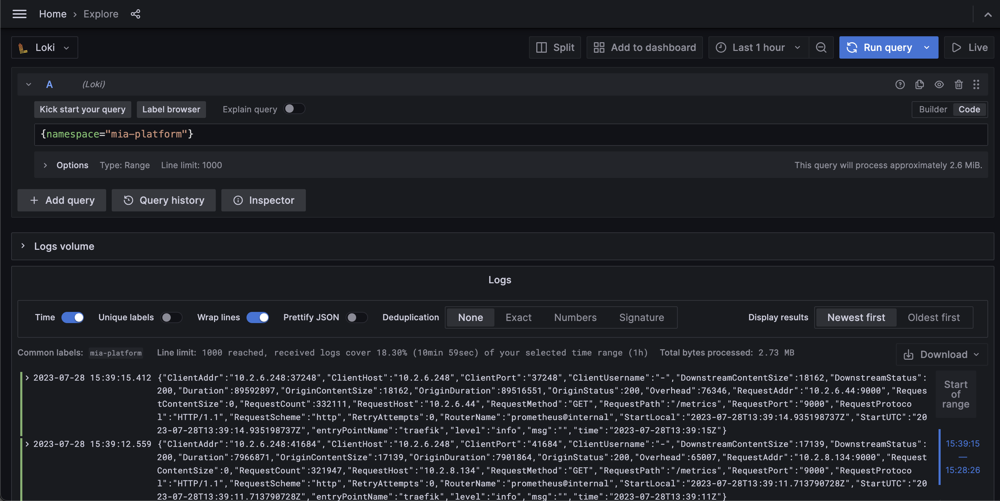
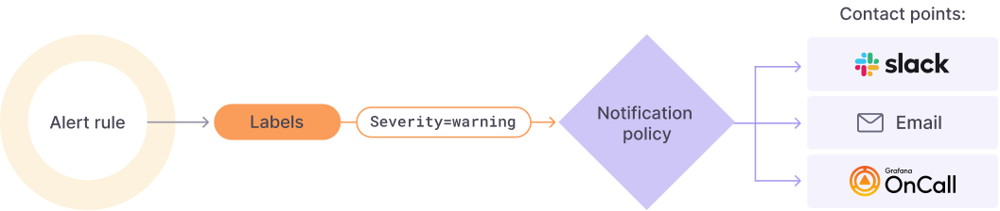
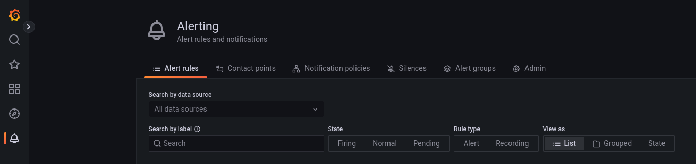

Mia-Platform PaaS offers to its users a Grafana instances where they can monitor metrics and logs of their own applications.  

To access Mia-Platform PaaS Grafana instance [click here](https://grafana.mia-platform.eu/). Use your Mia-Platform Console credentials to access your Grafana organization. If you can't access to Grafana, request access through our [Customer Portal](https://makeitapp.atlassian.net/servicedesk/customer/portal/21).  

## Monitoring dashboards

After logging into your Grafana organization, you will have access to a collection of ready-to-use dashboards, enabling you to monitor your applications instantly. Your Mia-Platform PaaS Company is already configured and connected to Grafana, all metrics from your namespaces are automatically collected and available for immediate visualization and analysis.

Out-of-the-box dashboards are:

* Api Gateway APIs
* Kubernetes Cluster resources
* Kubernetes Cluster resources pods by namespace
* Kubernetes Cluster resources workloads by namespace
* Kubernetes Cluster resources pods
* Kubernetes Cluster resources workloads
* Kubernetes Cluster networking
* Kubernetes Cluster networking pods by namespace
* Kubernetes Cluster networking workloads by namespace
* Kubernetes Cluster networking pods
* Kubernetes Cluster networking workloads
* Mia-Platform PaaS License Review

## Application logs

Grafana's integration with our logging services enables you to access and visualize your application logs. By correlating logs with metrics, you gain deeper insights into application behavior and can efficiently troubleshoot any issues that may arise.  

To explore your application logs, simply navigate to the `Explore` section within Grafana and select `Loki` datasource. Then, enter your Loki query (e.g.: `{namespace="mia-platform"}`) and click on `Run query` to fetch the relevant log data instantly. 

  

## Retention policy  

We enforce retention policies within our monitoring and logging stack in order to determine how long data is stored in our system. These policies ensure that you can effectively monitor and troubleshoot your applications while maintaining optimal performance levels.

By default, Mia-Platform PaaS applies the following retention policies:  

* Metrics data is retained for 45 days.
* Logs data is retained for 15 days.

However, we understand that different customers may have specific requirements. If you need longer retention periods, our service allows for easy customization based on your specific needs.

## Alerting

Grafana Alerting allows you to learn about problems in your systems moments after they occur [[1](https://grafana.com/docs/grafana/latest/alerting/)].

But how does the Grafana Alerting system works?

- **Alert Rules**:
  The evaluation criteria that will fire an alert instance. It is formed by:
  - one or more queries and expressions
  - a condition
  - the frequency of evaluation
  - (optional) the duration over which the condition is met
- **Labels**:
  A label matches an Alert Rule and its set of notification policies and silences
- **Notification policies**: 
  Here you can set where, when and how the alerts get routed.
- **Contact points**: 
  Define how the alerts are notified to your team

### Create An Alert

To create an alert we need to create the necessary components.

### Create an Alert Rule

- Select 'New Alert Rule' from the side menu (in the 'Alerting' section)
- Step 0: Select 'Grafana managed alert' or 'Mimir or Loki alert'
  
If you selected 'Grafana managed alert':
- Step 1: use query or expression to create your rule:
  - If you need to use a query, select the data source;
  - Add query and expressions;
  - Click 'Run queries' to check the correctness of the query;
- Step 2: Set an evaluation behavior (The interval and duration of queries valuation);
- Step 3: Add details:
  - The name, where to store the rule and annotations;
- Step 4: Specify custom labels to enable contact points.

If you selected 'Mimir or Loki alert':
- Step 1: Select a compatible data source (Loki/Prometheus) and write your LogQL/PromQL expression;
- Step 2: Set an evaluation behavior (Duration of time in which the query needs to have a 'true' value before firing the alert);
- Step 3: Add details:
  - The name, where to store the rule and annotations;
- Step 4: Specify custom labels to enable contact points.

### Suggested Alarm rules
We suggest to add the following rules to your infrastructure to have a basic control on faulting services.

**Crashloopbackoff pods**
To create an Alarm that detects if one or more pods in your system is in a CrashLoopBackOff state:

- Create a new Alert Rule (Grafana managed alert)
- Insert `kube_pod_container_status_waiting_reason{reason="CrashLoopBackOff"}` as Query A
- Insert an Expression B with:
  - Operation: Classic condition
  - When: last()
  - OF: A
  - IS ABOVE: 0
- Set alert condition: B-expression
- Manage as needed the rest of the configuration (details and contact points)

**Throttling pods**

- Create a new Alert Rule (Grafana managed alert)
- Insert `container_cpu_cfs_throttled_periods_total / container_cpu_cfs_periods_total` as Query A
- Insert a Expression B with:
  - Operation: Math
  - Expression: `$A > 0.8`
- Set alert condition: B-expression
- Manage as needed the rest of the configuration (details and contact points). You can use `{{ $labels.pod}}` to refer to the pod that is throttling.

:::note
  The value in the Expression B will fire if the utilization is above 80%. This value can be changed at will.
:::

**CPU limits percentage**

- Create a new Alert Rule (Grafana managed alert)
- Insert `sum(rate(container_cpu_usage_seconds_total{image!="", pod !="", container!="POD"}[5m])) by (pod, container) / sum(container_spec_cpu_quota{image!="", container!="POD"}/container_spec_cpu_period{image!="", pod !="", container!="POD"}) by (pod, container)` as Query A
- Insert an Expression B with:
  - Operation: Reduce
  - Function: Mean
  - Input: A
  - Mode: Strict 
- Insert an Expression C with:
  - Operation: Math
  - Expression: `$B > 0.8`
- Set alert condition: C-expression
- Manage as needed the rest of the configuration (details and contact points). You can use `{{ $labels.pod}}, {{ $labels.container }}` to refer to the pod that is throttling.
 
:::note
  The value in the Expression B will fire if the utilization is above 80%. This value can be changed at will.
:::

### Manage contact points (chatOps)

This section defines how to set up and manage the services where you want to send your alert notifications.

- In the alerting section of Grafana, click 'contact points' and 'New Contact Point';
- Select an alertmanager ('Grafana managed alert' or 'Mimir or Loki alert');
- Choose a name for the contact point and fill out the mandatory fields of your selected 'Contact point type'.

### Example: set up Google chat contact point

To set up a connection with Google chat, in the 'New contact point' menu:
- Select Google Hangouts Chat
- Generate a webhook Url and fill out the corresponding field:
  - Go to the Google chat where you want to receive the alerts.
  - Click on the downward triangle next to the Chat name and select 'Manage Webhooks'
  - Add another webhook, copy the Url given by Google chat and insert it in the Grafana Field.

## Default alerts

Mia-Platform PaaS Monitoring defines a set of alerting rules by default. Currently, you cannot add custom alerting rules.

These rules refer to AlertManager, Kafka, Kubernetes cluster, and Prometheus. Each rule has one the following 3 severity levels:

1. **Info**: An informative message. No action is required;
2. **Warning**: Action must be taken to prevent a severe error from occurring in the near future;
3. **Critical**: A severe error that might cause the loss or corruption of unsaved data. Immediate action must be taken to prevent losing data.

Below there is a list with all the alerts that you may receive. For each alert you will find a brief description and its severity level.

### AlertManager

|                 **Alert**                 | **Description** | **Severity** |
| ------------------------------------- | ----------- | -------- |
| AlertmanagerClusterCrashlooping                 | Half or more of the Alertmanager instances within the same cluster are crashlooping. Alerts could be notified multiple time unless pods are crashing too fast and no alerts can be sent.                  | critical             |
| AlertmanagerClusterDown                         | Half or more of the Alertmanager instances within the same cluster are down.                                                                                                                              | critical             |
| AlertmanagerClusterFailedToSendAlerts           | All Alertmanager instances in a cluster failed to send notifications to a critical integration.                                                                                                           | warning   |
| AlertmanagerConfigInconsistent                  | The configuration of the instances of the Alertmanager cluster namespace/services are out of sync.                                                                                                        | critical             |
| AlertmanagerFailedReload                        | Reloading Alertmanager's configuration has failed for namespace/pods.                                                                                                                                     | critical             |
| AlertmanagerFailedToSendAlerts                  | At least one instance is unable to routed alert to the corresponding integration.                                                                                                                         | warning              |
| AlertmanagerMembersInconsistent                 | Alertmanager has not found all other members of the cluster.                                                                                                                                              | critical             |

### Kafka

|                 **Alert**                 | **Description** | **Severity** |
| ------------------------------------- | ----------- | -------- |
| KafkaNoActiveController                         | There are no active Kafka Controller.                                                                                                                                                                               | critical             |
| KafkaOfflinePartitions                          | Kafka partitions are offline.                                                                                                                                                                      | critical             |
| KafkaPartitionOver80                            | Kafka Partition disk usage over 80%.                                                                                                                                                                      | critical             |
| KafkaUnderReplicatedPartitions                  | Kafka Partitions are under replicated.                                                                                                                                                                       | critical             |

### Kubernetes Cluster

|                 **Alert**                 | **Description** | **Severity** |
| ------------------------------------- | ----------- | -------- |
| ConfigReloaderSidecarErrors                     | Errors encountered in a pod while the config-reloader sidecar attempts to sync config in namespace. As a result, configuration for service running in the pod may be stale and cannot be updated anymore. | warning              |
| CPUThrottlingHigh                     | Kubernetes containers processes experience elevated CPU throttling. | info              |
| KubeClientErrors                                | Kubernetes API server client is experiencing errors.                                                                                                                                                      | warning              |
| KubeContainerWaiting                            | Pod container is waiting longer than 1 hour.                                                                                                                                                              | warning              |
| KubeCPUOvercommit                               | Cluster has overcommitted CPU resource requests.                                                                                                                                                          | warning              |
| KubeCPUQuotaOvercommit                          | Cluster has overcommitted CPU resource requests.                                                                                                                                                          | warning              |
| KubeDaemonSetMisScheduled                       | DaemonSet pods are not properly scheduled.                                                                                                                                                                          | warning              |
| KubeDaemonSetNotScheduled                       | DaemonSet pods are not scheduled.                                                                                                                                                                         | warning              |
| KubeDaemonSetRolloutStuck                       | DaemonSet rollout is stuck.                                                                                                                                                                               | warning              |
| KubeDeploymentGenerationMismatch                | Deployment generation mismatch due to possible roll-back.                                                                                                                                                 | warning              |
| KubeDeploymentReplicasMismatch                  | Deployment has not matched the expected number of replicas.                                                                                                                                               | warning              |
| KubeHpaMaxedOut                                 | HPA is running at max replicas.                                                                                                                                                                           | warning              |
| KubeHpaReplicasMismatch                         | HPA has not matched desired number of replicas.                                                                                                                                                           | warning              |
| KubeJobCompletion                               | Job did not complete in time.                                                                                                                                                                             | warning              |
| KubeJobFailed                                   | Job failed to complete.                                                                                                                                                                                   | warning              |
| KubeletClientCertificateExpiration              | Kubelet client certificate is about to expire.                                                                                                                                                            | warning   |
| KubeletClientCertificateRenewalErrors           | Kubelet has failed to renew its client certificate.                                                                                                                                                       | warning              |
| KubeletDown                                     | Target disappeared from Prometheus target discovery.                                                                                                                                                      | critical             |
| KubeletPlegDurationHigh                         | Kubelet Pod Lifecycle Event Generator is taking too long to relist.                                                                                                                                       | warning              |
| KubeletPodStartUpLatencyHigh                    | Kubelet Pod startup latency is too high.                                                                                                                                                                  | warning              |
| KubeletServerCertificateExpiration              | Kubelet server certificate is about to expire.                                                                                                                                                            | warning   |
| KubeletTooManyPods              | The alert fires when a specific node is running >95% of its capacity of pods.                                                                                                                                                            | info   |
| KubeletServerCertificateRenewalErrors           | Kubelet has failed to renew its server certificate.                                                                                                                                                       | warning              |
| KubeMemoryOvercommit                            | Cluster has overcommitted memory resource requests.                                                                                                                                                       | warning              |
| KubeMemoryQuotaOvercommit                       | Cluster has overcommitted memory resource requests.                                                                                                                                                       | warning              |
| KubeNodeNotReady                                | Node is not ready.                                                                                                                                                                                        | warning              |
| KubeNodeReadinessFlapping                       | Node readiness status is flapping.                                                                                                                                                                        | warning              |
| KubeNodeUnreachable                             | Node is unreachable.                                                                                                                                                                                      | warning              |
| KubePersistentVolumeErrors                      | PersistentVolume is having issues with provisioning.                                                                                                                                                      | critical             |
| KubePersistentVolumeFillingUp                   | PersistentVolume is filling up.                                                                                                                                                                           | warning   |
| KubePodCrashLooping                             | Pod is crash looping.                                                                                                                                                                                     | warning              |
| KubePodNotReady                                 | Pod has been in a non-ready state for more than 15 minutes.                                                                                                                                               | warning              |
| KubeQuotaExceeded                               | Namespace quota has exceeded the limits.                                                                                                                                                                  | warning              |
| KubeQuotaAlmostFull                               | Namespace quota is going to be full.                                                                                                                                                                | info              |
| KubeQuotaFullyUsed                               | Namespace quota is fully used.                                                                                                                                                                 | info              |
| KubeStatefulSetGenerationMismatch               | StatefulSet generation mismatch due to possible roll-back.                                                                                                                                                | warning              |
| KubeStatefulSetReplicasMismatch                 | Deployment has not matched the expected number of replicas.                                                                                                                                               | warning              |
| KubeStatefulSetUpdateNotRolledOut               | StatefulSet update has not been rolled out.                                                                                                                                                               | warning              |
| KubeStateMetricsListErrors                      | kube-state-metrics is experiencing errors in list operations.                                                                                                                                             | critical             |
| KubeStateMetricsShardingMismatch                | kube-state-metrics pods are running with different --total-shards configuration, some Kubernetes objects may be exposed multiple times or not exposed at all.                                             | critical             |
| KubeStateMetricsShardsMissing                   | kube-state-metrics shards are missing, some Kubernetes objects are not being exposed.                                                                                                                     | critical             |
| KubeStateMetricsWatchErrors                     | kube-state-metrics is experiencing errors in watch operations.                                                                                                                                            | critical             |
| KubeVersionMismatch                             | Different semantic versions of Kubernetes components running.                                                                                                                                             | warning              |
| NodeClockNotSynchronising                       | Clock not synchronizing.                                                                                                                                                                                  | warning              |
| NodeClockSkewDetected                           | Clock skew detected.                                                                                                                                                                                      | warning              |
| NodeFileDescriptorLimit                         | Kernel is predicted to exhaust file descriptors limit soon.                                                                                                                                               | warning   |
| NodeFilesystemAlmostOutOfFiles                  | Filesystem has less than 5% inodes left.                                                                                                                                                                  | warning   |
| NodeFilesystemAlmostOutOfSpace                  | Filesystem has less than 5% space left.                                                                                                                                                                   | warning   |
| NodeFilesystemFilesFillingUp                    | Filesystem is predicted to run out of inodes within the next 24 hours.                                                                                                                                    | warning   |
| NodeFilesystemSpaceFillingUp                    | Filesystem is predicted to run out of space within the next 24 hours.                                                                                                                                     | warning   |
| NodeHighNumberConntrackEntriesUsed              | Number of conntrack are getting close to the limit.                                                                                                                                                       | warning              |
| NodeNetworkInterfaceFlapping                    | Network interface device changing it's up status often on node-exporter namespace/pods.                                                                                                                   | warning              |
| NodeNetworkReceiveErrs                          | Network interface is reporting many receive errors.                                                                                                                                                       | warning              |
| NodeNetworkTransmitErrs                         | Network interface is reporting many transmit errors.                                                                                                                                                      | warning              |
| NodeRAIDDegraded                                | RAID Array is degraded.                                                                                                                                                                                   | critical             |
| NodeRAIDDiskFailure                             | Failed device in RAID array.                                                                                                                                                                              | warning              |
| NodeTextFileCollectorScrapeError                | Node Exporter text file collector failed to scrape.                                                                                                                                                       | warning              |
| PodCrashOOM                                     | Pod Crashing for OOM.                                                                                                                                                                                     | critical             |

### Prometheus

|                 **Alert**                 | **Description** | **Severity** |
| ------------------------------------- | ----------- | -------- |
| PrometheusBadConfig                             | Failed Prometheus configuration reload.                                                                                                                                                                   | critical             |
| PrometheusDuplicateTimestamps                   | Prometheus is dropping samples with duplicate timestamps.                                                                                                                                                 | warning              |
| PrometheusErrorSendingAlertsToAnyAlertmanager   | Prometheus encounters more than 3% errors sending alerts to any Alertmanager.                                                                                                                             | critical             |
| PrometheusErrorSendingAlertsToSomeAlertmanagers | Prometheus has encountered more than 1% errors sending alerts to a specific Alertmanager.                                                                                                                 | warning              |
| PrometheusMissingRuleEvaluations                | Prometheus is missing rule evaluations due to slow rule group evaluation.                                                                                                                                 | warning              |
| PrometheusNotConnectedToAlertmanagers           | Prometheus is not connected to any Alertmanagers.                                                                                                                                                         | warning              |
| PrometheusNotificationQueueRunningFull          | Prometheus alert notification queue predicted to run full in less than 30m.                                                                                                                               | warning              |
| PrometheusNotIngestingSamples                   | Prometheus is not ingesting samples.                                                                                                                                                                      | warning              |
| PrometheusOperatorListErrors                    | Errors while performing list operations in controller.                                                                                                                                                    | warning              |
| PrometheusOperatorNodeLookupErrors              | Errors while reconciling Prometheus.                                                                                                                                                                      | warning              |
| PrometheusOperatorNotReady                      | Prometheus operator is not ready.                                                                                                                                                                         | warning              |
| PrometheusOperatorReconcileErrors               | Errors while reconciling controller.                                                                                                                                                                      | warning              |
| PrometheusOperatorRejectedResources             | Resources rejected by Prometheus operator.                                                                                                                                                                | warning              |
| PrometheusOperatorSyncFailed                    | Last controller reconciliation failed.                                                                                                                                                                    | warning              |
| PrometheusOperatorWatchErrors                   | Errors while performing watch operations in controller.                                                                                                                                                   | warning              |
| PrometheusOutOfOrderTimestamps                  | Prometheus drops samples with out-of-order timestamps.                                                                                                                                                    | warning              |
| PrometheusRemoteStorageFailures                 | Prometheus fails to send samples to remote storage.                                                                                                                                                       | warning              |
| PrometheusRemoteWriteBehind                     | Prometheus remote write is behind.                                                                                                                                                                        | critical             |
| PrometheusRemoteWriteDesiredShards              | Prometheus remote write desired shards calculation wants to run more than configured max shards.                                                                                                          | warning              |
| PrometheusRuleFailures                          | Prometheus is failing rule evaluations.                                                                                                                                                                   | critical             |
| PrometheusTargetLimitHit                        | Prometheus has dropped targets because some scrape configs have exceeded the targets limit.                                                                                                               | warning              |
| PrometheusTargetSyncFailure                     | This alert is triggered when at least one of the Prometheus instances has consistently failed to sync its configuration.                                                                                  | warning              |
| PrometheusTSDBCompactionsFailing                | Prometheus has issues compacting blocks.                                                                                                                                                                  | warning              |
| PrometheusTSDBReloadsFailing                    | Prometheus has issues reloading blocks from disk.                                                                                                                                                         | warning              |
| TargetDown                                      | Percentage of jobs and services down in the target namespace above some threshold.                                                                                                                        | warning              |
