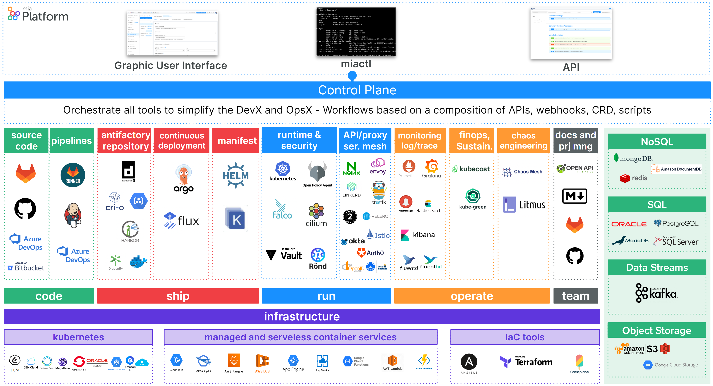

Platform as a Service (PaaS) software is a **cloud computing model** that provides a platform for developers to build, deploy, and manage applications without the complexity of infrastructure management. Mia-Platform Console, which is the **cloud application platform**, runs top of infrastructure as a service and it offers a range of tools, services, and resources necessary for the whole product life-cycle development.

The consequence is a revolution of organizations' approach to hardware and software management, liberating them from the burdens of in-house infrastructure setup and maintenance. By doing so, it not only expedites and streamlines operations but also empowers businesses to achieve unprecedented scalability in their IT projects.

## Mia-Platform PaaS key features

- **Application Hosting**: Mia-Platform PaaS users can deploy their applications on a scalable and reliable infrastructure without the need to concern about maintenance tasks or tools provisioning. It provides a k8s runtime with managed load balancing, scaling, and distributed dependent services where applications can run efficiently and securely.
  
- **Database Management**: Mia-Platform PaaS software incorporates robust database management capabilities based on MongoDB database instances offering backups services and data replication.

- **Updated Mia-Platform Console and tools**: Mia-Platform PaaS gives the customer the possibility to have [Mia-Platform Console](/development_suite/overview-dev-suite.md) and all its connected tools always up to date exploiting the new offering provided by service providers and Mia-Platform R&D teams.

- **Monitoring and Logging**: Mia-Platform PaaS offers a ready to use monitoring and logging capabilities to track application performance, resource utilization, and detect potential issues useful to identify bottlenecks, to optimize performance, and to troubleshoot problems.

- **Security and Compliance**: Mia-Platform PaaS prioritizes security and compliance to safeguard applications and data by employing a comprehensive set of security measures, including but not limited to, secure authentication mechanisms, robust access controls, and data encryption in transit and at rest.

- **24/7 Incident support**: Mia-Platform PaaS offers highly specialized support to address incidents and fast fixes activities.

- **Disaster Recovery**: Mia-Platform PaaS ensures the resilience and continuity of applications and data in case of unexpected critical event. The platform employs a structured approach to disaster recovery, incorporating measures and protocols to mitigate the impact of the disaster.
