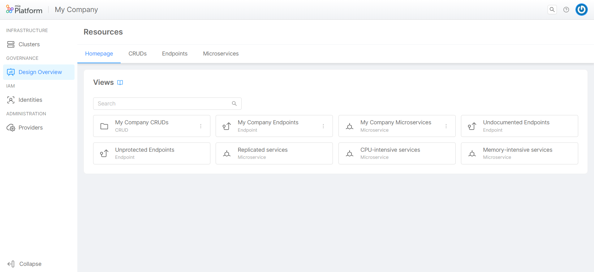

_May 11th, 2023_

## Console

### Breaking Changes

#### Removed support for Kubernetes v1.20

Kubernetes v1.20 is no longer supported, please refer to the [System Requirements documentation](/self_hosted/self_hosted_requirements.md#software-and-hardware-prerequisites) section to know more about supported versions.

#### Cluster CA as a required field

To improve security, the Certification Authority for Cluster connections has been made mandatory.
It is recommended to check all connections, as clusters in the absence of the CA will stop working properly. 

#### Unique group names

A `unique` index has been introduced on the `Groups` collection for the `name` property; before upgrading Mia-Platform Console make sure to remove possible duplicates, otherwise the application will not start!

### New Features

#### Added support for Kubernetes v1.25, v1.26 and v1.27

Kubernetes v1.25, v1.26 and v1.27 are now officially supported!

:::info
Please note that CronJob resources are now created with API version `batch/v1` instead of `batch/v1beta1`; existing CronJob will be automatically update during the first Project save from the Design area.
:::

#### GitHub Actions as CI/CD tool in Console

Starting with this version, Mia-Platform Console supports GitHub Actions as a CI/CD tool.

Within the Providers section, accessible through the Company Overview area, you can now configure a GitHub provider as a CI/CD tool and use it for the deployment of your workload.

For more information, [go to the documentation](/development_suite/deploy/pipeline-based/configure-github-actions.md).

#### Console CLI

For all CLI lovers, we have great news: Mia-Platform Console v11 will have its own CLI. So let's give a big welcome to our new `miactl`!  
For the moment, the CLI will only be available for SaaS users.
The commands supported to date are:

* User authentication
* Context management
* Company list
* Project visualization
* Project deploy and status deploy

For more information, [go to the documentation](/cli/miactl/10_overview.md).

#### Design Overview

From the Design Overview section – which is accessible from Company Overview – Company Owners and Project Administrators can now aggregate into single tabs resources like Endpoints, Microservices and CRUDs collections, from all Projects across their Company. This data can be saved as custom views and made available for all the members of the Company, who can easily search, sort, and filter those resources.

For more information, [go to the documentation](/development_suite/governance/design-overview.md).

## Fast Data

### Bug Fix

This version addressed the following bug:

* We fixed an error that prevent to save the configuration if you delete a Real Time Updater with a non-existing Projection Changes collection

## How to update your Console

For self-hosted installations, please head to the [self hosted upgrade guide](/self_hosted/installation-chart/100_how_to_upgrade.md#v11---version-upgrades) or contact your Mia-Platform referent and upgrade to _Console Helm Chart_ `v9.1.1`.
