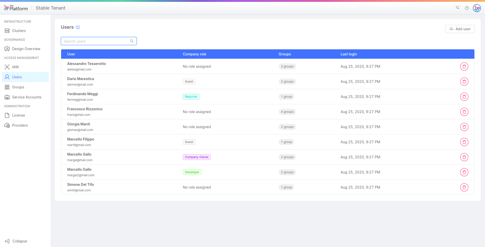
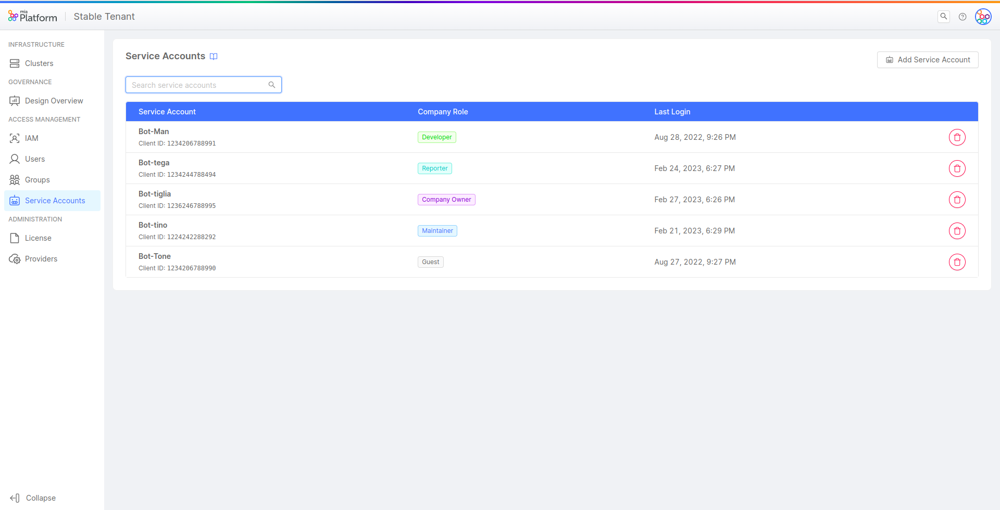

_June 8th, 2023_

## Console

### New Features

#### Users and Service Accounts portals

Analogously to what has been implemented for groups management, from now on even users and service accounts will have their own management portals inside the Company Overview. These dedicated pages provide specific governance tools based on the nature of the identity, whether it is a user, a group, or a service account.

**Users section** allows Company Owners to view all user accounts which have access to the Company, providing a way to add new ones or to completely remove access to the Company for existing ones.  
For more information, [go to the documentation](/development_suite/identity-and-access-management/manage-users.md).

**Service Accounts section** allows Company Owners to view all service accounts of the Company, with the possibility to create new ones or permanently delete existing ones.  
For more information, [go to the documentation](/development_suite/identity-and-access-management/manage-service-accounts.md).

:::note
As a result, Company Overview displays an entire section dedicated to **Access Management**, which consists of three different governance portals (one for each identity type: users, groups, service accounts), and the Identities portal that from now on <u>has been renamed in **IAM portal**</u>.

The purpose of [IAM portal](/development_suite/identity-and-access-management/manage-identities.md) is to allow Company Owners - _at Company level_ -, and Project Administrators - _solely at Project level_ -, to view and manage roles directly assigned to identities in order to grant them specific capabilities.
:::

#### Delete a Provider

In the "Providers" section  – inside the Company Overview area  – you can now remove a provider. 
This can only be done if the provider is not used in any Project or if it is not set as the default of the respective Company.

For more information, [go to the documentation](/console/company-configuration/providers/configure-provider.mdx#remove-a-provider-connection).

#### Console CLI v0.6.0

With this release, the use of the CLI has been extended to all types of Console installations, including On-Premise clients.

In addition, the command that allows the creation of a service account in Console has been added.

For more information, [go to the documentation](/cli/miactl/30_commands.md).

### Improvements

#### Microservice HTTPS and SSH RepoURLs manageability

From the detail page of a microservice - inside the Design Area - it is possible to configure and update both HTTPS and SSH repository URLs.
By configuring these fields, the View repository and Clone repository actions will be enabled for that specific microservice.

#### Project creation and respective permission management 

If the user does not have the necessary permissions to create a Project in a respective Company, the user can not proceed to the step two of creation.

#### Marketplace filtered only for Private Company items

It is now possible to choose to view only private Marketplace items available exclusively for my Company, thanks to a switch button in the top right of the Marketplace interface.   
For more information about how to set up privatized Marketplace items for Companies, visit the dedicated [documentation page](/marketplace/add_to_marketplace/contributing_overview.md#public-and-private-marketplace).

#### More features in collapsed dynamic sidebar

In the Design Area, it is now possible to view the additional features yet to be activated even when using dynamic sidebar in collapsed mode.

:::info
Dynamic sidebar can be activated from the [Feature Preview](/development_suite/user-settings/feature-preview.md) modal, available for SaaS Console users.
:::

## Fast Data

### Bug Fix

This version addressed a bug in the No Code ER Schema, that made it impossible to create a rule between two fields with the same name.

### Improvements

#### Support for autogenerated Projection Updates in Real Time Updater v7.5.2

The Real Time Updater now supports the Projection Updates autogenerated by the console.

#### Ingestion Reloader can now handle very large amount of files

Fixed the Ingestion Reloader way of downloading files preventing memory overflow. From version 1.3.1 onwards, the files are properly downloaded with streams to prevent memory problems.

#### Ingestion Reloader v1.3.1 invalid date throws an error

When starting a reingestion the Ingestion Reloader properly checks whether a date is valid or not and throws an error if needed.

## Marketplace

### Marketplace Updates

#### Dev Portal

Dev Portal and its core plugins are compatible with [micro-lc](https://micro-lc.io/docs) v2.

## Backoffice 1.3.13

### Bug Fix

#### `bk-button` correctly updated parents history

Property `selectedParents` of component `bk-button` is correctly updated when navigating nesting levels.

#### `items` keyword is supported in data-schema

Keyword `items` is supported in data-schema for fields of type array of objects by components `bk-table`, `bk-breadcrumbs` and form components.

### Added

#### URL-encoding of query params

Query parameters are url-encoded in http calls.

#### `bk-crud-client` can send DELETE requests to `CRUD Service`

New event `http-delete` is listened to by `bk-crud-client`, allowing to send DELETE requests according to `CRUD Service` interface.

#### `bk-table` allows to highlight rows

`bk-table` allows to highlight rows that match mongo-like queries through property `highlightedRows`.

## How to update your Console

For self-hosted installations, please head to the [self hosted upgrade guide](/self_hosted/installation-chart/100_how_to_upgrade.md#v11---version-upgrades) or contact your Mia-Platform referent and upgrade to _Console Helm Chart_ `v9.2.0`.
