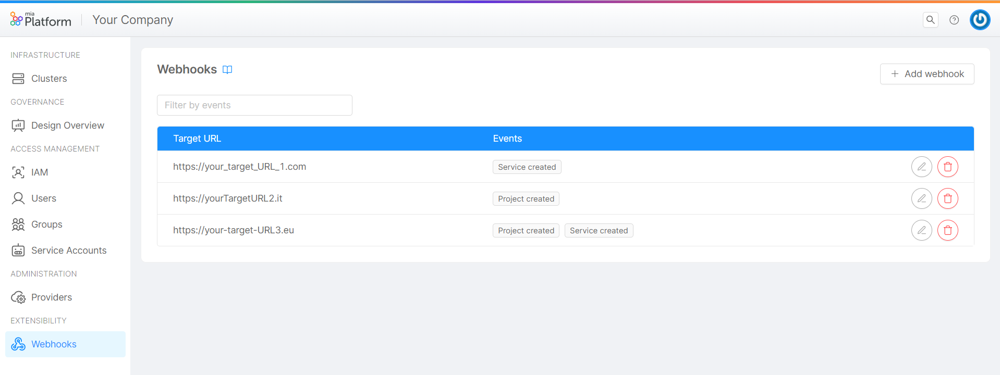
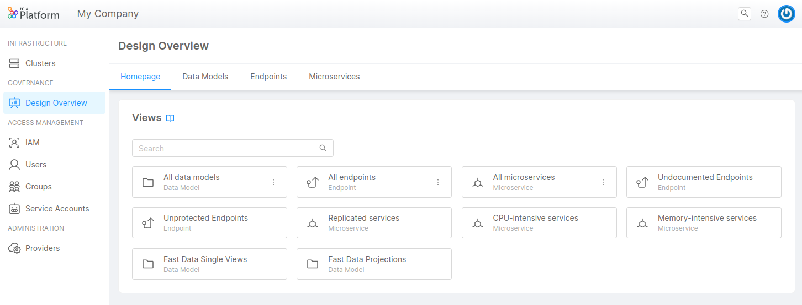
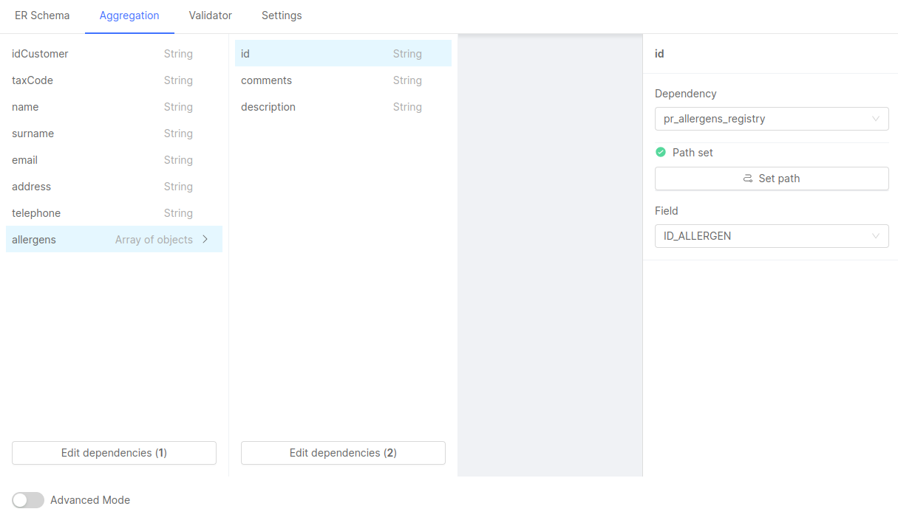

_June 22th, 2023_

## Console

### New Features

#### Manage and configure Webhooks directly via Console UI

Starting from today, it will be possible to view, create, edit and delete custom Console Webhooks directly through the user interface.
Whereas before today this was only possible through Console CMS, now the user can enter the Company Overview area and easily manage all the respective hooks under the new "Webhooks" section.

For more information, [go to the documentation](/development_suite/webhooks-and-events/webhooks.md).

#### Configurable `defaultAnnotations` and `defaultLabels` for microservices

From now on, within the CMS you can configure `defaultAnnotations` and `defaultLabels` properties for your Marketplace microservices. For more information about microservice properties, visit the [related page](/marketplace/add_to_marketplace/contributing_overview.md#common-to-microservice-components-plugins-templates-examples).

### Improvements

#### Design Overview

We have updated the Design Overview section with the following features:

- CRUDs tab becomes **Data Models** and includes also Single Views and Projections collections
- **contains** operator to allow case insensitive free search on text fields
- **not set** operator to filter null values

For more information, [go to the documentation](/development_suite/governance/design-overview.md).

#### Shortcut for saving configuration process:`⌘ + S` (`ctrl + S`)

It is possible to use `⌘ + S` (alternatively, `ctrl + S`) to speed-up your saving process, allowing to automatically open the Save configuration modal.

:::note
In the case in which Save configuration modal is opened through shortcut, and someone else in the meantime has already saved a new configuration update, the Save configuration modal will force you to save on a new branch. Nevertheless, you can always decide to pull or start a merge process with the last saved configuration.
:::

#### Addition of ignoreTrailingSlash flag in manual routes configuration

In Authorization section, when configuring a [manual route](/development_suite/api-console/api-design/authorization.md#manual-routes-tab), it is now possible to set the `ignoreTrailingSlash` flag. When enabled, a path registered with a trailing slash is considered the same path as the one without it, and viceversa.
To know more about manual routes configuration options, visit the official [Rönd documentation](https://rond-authz.io/docs/configuration#route-specific-options).

### Bug Fix

This version addressed a bug, listed here below:

- The Preserve files and directories flag has ben removed from Secrets section inside the detail page of a Microservice, as this functionality is not supported for secrets

## Fast Data

### New Features

#### Fast Data No Code Configuration for Aggregation

It is with great pleasure to inform you that it is now possible to generate an Aggregation configuration without writing a line of code!

This new feature will allow you to see a list of Single View fields, taken from the Single View Data Model, and to easily map them to their related Base Projection fields with point-and-click actions. You will only need to select a dependency, an automatically generated path to reach this dependency, and, eventually, a field in order to set the mapping.

This tool will then create a JSON file containing the newly set Aggregation config map, which will be then used by the Single View Creator service. The generated JSON is exactly the same JSON that would have been written manually in the Low Code Configuration. If you still wish to configure your JSON manually, an Advanced Mode toggle will allow you to switch between the No Code and the manual mode.

To access the new feature, please navigate to the Single Views section, open a Single View, then its related Single View Creator, and click on the updated Aggregation tab, where you will be able to create a new configuration or edit the existing one.

This feature can be activated only for specific projects. If you want to try it out, contact your system administrator!

Do not miss out the [official documentation](/fast_data/configuration/config_maps/aggregation.md#use-the-no-code).

#### Fast Data No Code Configuration for Single View Key and other settings

Each Single View Creator detail page now includes a Settings tab, which replaces the existing Single View Key tab.

The new tab includes the following sections:

- Single View Key, where it is possible to configure and edit a Single View Key configuration in a No Code mode. The new feature will allow you to easily map a Single View field to a Base Projection field (or to a Projection Changes identifier) and to automatically generate a configuration JSON file. As it is for the No Code ER Schema and for the newly introduced Aggregation, it will still be possible to manually configure the Single View Key by using the Advanced mode
- General Settings, where it is possible to access and edit data about the selected ER Schema and Base Projection
- Generate Aggregation, where it is possible to generate an Aggregation JSON configuration by automatically matching the fields of the Single View with those of the projections, based on the information in the selected ER Schema

## Backoffice

### Backoffice Configurator

#### New Features

Starting from this new version the Backoffice Configurator provides some new features listed below!

- Shared Property page is available, allowing to define shared properties and interact with them.
For more information, [go to the documentation](/microfrontend-composer/composer/20_compose_pages.md#shared-properties)
- `dynamic-icon` manifest schema hint allows the dynamic selection of icons
- `mia/endpoints/data-source` manifest schema hint allows selecting single-view, mongo-view, and projections endpoints in no code interface
- Field `entry` of Micro Frontend pages can be created through the no-code interface
- Support for external assets via configuration of a service worker which acts as a reverse proxy is available.

#### Improvements

Some improvements on the Backoffice Configurator provided with this version are listed below!

- Select input in the components props editing menu can now be cleared
- Preview Status bar filters out info notifications from count total
- Primary color is chosen for superscripts of badges (Variables and Service-Worker buttons)
- Configuration parsing errors are now notified and no longer break the editor
- Test variables are trimmed on the creation

#### Bug Fix

This version addressed a few bugs, listed here below:

- Values of properties with the same name in different components are no longer bound
- Fixed references resolution in the preview
- When the compose application is removed, its metadata are deleted

### Backoffice Library - 1.3.15

#### New Features

##### `bk-expanded-filters` parse URL

`bk-expanded-filters` optionally performs bootstrap, applying filters that are read from URL

##### New component `bk-file-picker-modal`

New component [bk-file-picker-modal](/microfrontend-composer/back-kit/60_components/270_file_picker_modal.md) is available, analogous to `bk-file-picker-drawer`.

##### File metadata can be added

File fields support `dataSchema` and `items` properties, allowing to specify meta-data. Form components interact with `bk-file-picker-drawer` and `bk-file-picker-modal` to edit files with metadata.

#### Bug Fix

##### Form components correctly edit nested data when opened with `customActions`

Nested objects/arrays are correctly updated when editing form is spawned through `customActions` property of `bk-table`.

##### `bk-button` is temporarily disabled on file download/upload

`disbaleOnAction` property of `bk-button` correctly interacts with `bk-file-client`.

## Marketplace

### Marketplace Updates

#### CRUD Service

##### New Features

Version 6.6.1 of the CRUD service is now available. In particular, we added an option to enable tracing (added in version 6.6.0). This capability provides valuable insights into the execution flow, making debugging and performance optimization a breeze.

##### Improvements

Version 6.6.1 also brings a few enhancements, listed here below:

- improved support for dot (.) notation with `$set` operator
- extended support for `$addToSet` and `$pull` Operators on AdditionalProperties JSON Schema Definition
- the collection definition validation process has been improved, in order to optimize performances
- we have made modifications to enable the concurrent configuration of MongoDB calls, in order to boost efficiency

##### Bug Fix

With version 6.6.1, we also addressed a bug, listed here below:

- fix of the Swagger configuration

For a complete list of the changes, check the complete [CHANGELOG](/runtime_suite/crud-service/changelog.md)

## How to update your Console

For self-hosted installations, please head to the [self hosted upgrade guide](/self_hosted/installation-chart/100_how_to_upgrade.md#v11---version-upgrades) or contact your Mia-Platform referent and upgrade to _Console Helm Chart_ `v9.3.0`.
