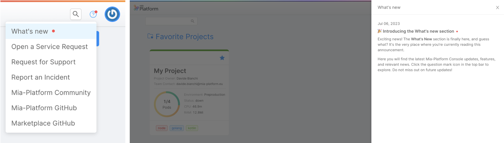
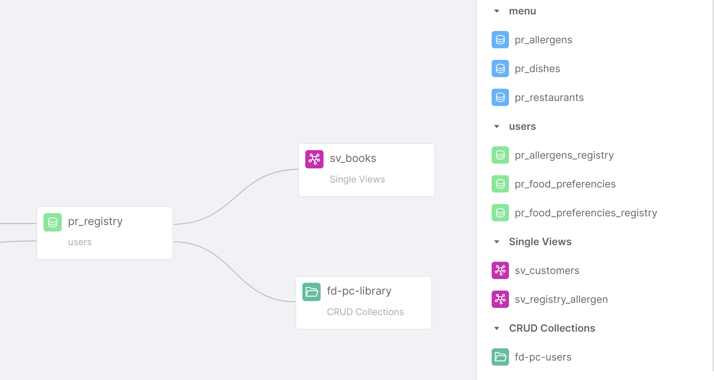

_July 06th, 2023_

## Console

### New Features

#### What's new section

A big welcome to the [What's new section](/development_suite/overview-dev-suite.md#whats-new), where you can stay up to date with the latest product news!  
You can access this section by clicking on the question mark icon located in the top bar of the Console interface.
In case there is any unread news, a notification symbol will appear, so that you do not miss the latest updates that can improve your experience on Mia-Platform Console!

#### Support to automatic logout from identity provider

From now on, Mia-Platform Console supports the configuration of user automatic logout from an OIDC compliant identity provider when logging out from the Console itself. For more information, visit the related [Mia-Platform installations documentation page](/self_hosted/installation-chart/30_authentication_provider.md#logout-flow).

### Improvements

#### Checkmarks on Merge modal sections

Now, after you have resolved all the diffs inside a specific section of the Merge modal, you see a visual indicator in the form of a green checkmark next to each section, indicating that all the diffs within that section have been resolved.

#### GitHub support for pipeline retrieval in Deploy compare table

In Deploy Area, the compare table supports pipeline retrieve even for Projects using GitHub.

### Bug Fix

This version addressed the following bugs:

* It has been fixed a bug that prevented the correct retrievals of markdown service documentation for some specific providers
* We solved a bug that prevented, upon saving, the re-creation of a CronJob with the same name of a previously deleted CronJob

## Fast Data

### New Features

#### Fast Data No Code Configurations generally available

From now on, the ER Schema No Code Configuration and the Aggregation No Code Configuration are generally available without the need for specific activation. Every Console user can now exploit the power of seamless Fast Data Configuration!

#### Single Views and CRUD Collections available as sources inside the No Code ER Schema

Single Views and CRUD Collections can now be used as input for the No Code ER Schema. The new sources will be available in the right panel of the canvas and can be easily added to the canvas with a simple drag-and-drop, just as it is already possible with Projections.  
When added to the ER Schema, Single Views, and CRUD Collections are then included as available dependencies inside the No Code Aggregation.

#### Index autogeneration for projections creates indexes for `__internal_counter` and `__internal_counterType`

The Console can now automatically generate the `__internal_counter` and `__internal_counterType` indexes, which have been introduced from `v7.5.0` of the Real-Time Updater in the update Projection queries.

#### Aggregation ConfigMap automatically handled inside the Single View Creator microservice

When attaching a Single View Creator to a Single View, the Aggregation ConfigMap is now automatically handled by Fast Data. The ConfigMap will be editable from the No Code Aggregation screen, without the need to access the Microservice section and the related Single View Creator. Thus, the ConfigMap will be displayed as read-only inside this section.

#### Projection changes on Mongo with Single View Trigger Generator

Starting from the `v3.0.2`, Single View Trigger Generator now supports projection changes to Mongo. Previously, the SVTG could only trigger the generation of new Single Views by sending messages onto Kafka following the `sv-trigger` format. Now, Projections Changes are generated onto the MongoDB database.

### Improvements

* The UX has been improved inside the Dependency editor modal in the No Code Aggregation page with improved warnings and placeholders
* The Single View Creator column inside the Single Views page now includes links to each Single View Creator detail page instead of redirecting to the Microservices section

### Bug Fix

* This version addresses a bug inside the Dependency editor modal in the No Code Aggregation, which allowed the selection of Source Projections with one-to-Many conditions from every configuration and not only from their parent.
* Real-Time Updater `v7.5.0` now properly supports Debezium CDC change events with and without the change schema. 

## Backoffice

### Backoffice Configurator

#### New Features

##### Dataschema automatically generated

`back-kit` data schema can be automatically generated starting from a CRUD collection

##### Mia CDN is available

Support for Mia CDN: static files for the default configuration, default templates, and loading animation are fetched from `cdn.mia-platform.eu`

#### Bug Fix

##### Shared property form is reset on close

When renaming a shared property, the modal will no longer retain a previously inserted value upon closing

##### Better management of `oneOf` properties

`oneOf` schema-hint composed of a primitive type and an object, now shows an in-form monaco-editor if the object type is chosen. Moreover, if a `oneOf` schema-hint is composed by indiscernible options (eg, two options that are both type objects) an in-form monaco-editor will be shown

##### Helper `noService` uses URL encoding

To accommodate branches that have special characters (eg, `/`) the URL linking to services section in placeholder for no-service case, is now correctly URL-encoded

### Backoffice Library - 1.3.16

#### New Features

##### User can select previously uploaded files

`bk-file-picker-modal` allows to visualize and select files that have already been uploaded (requires `Files Service` version 2.7.0 or higher)

#### Bug Fix

##### `bk-button` is responsive to URL updated

`bk-button` callback context is responsive to url updates when using `urlMask` property

##### `bk-expanded-filters` resets initial filters

`bk-expanded-filters` with filters parsed from URL correctly perform reset

## Marketplace

### Marketplace Updates

#### CRUD Service

##### New Features

With the `v6.7.0` of the CRUD service it is now easier for the client to interact with MongoDB Views. Users can now configure the `enableLookup` flag and follow specific pipeline requirements to obtain data from _lookup_ collections, simplifying interaction with views and improving support for collections with _one-to-one_ or _many-to-one_ relationships.

Check out the official documentation [here](/runtime_suite/crud-service/50_writable_views.md).

## How to update your Console

For on-premise installations, please contact your Mia-Platform referent and upgrade your _Console Helm Chart_ to `v9.4.0`.
