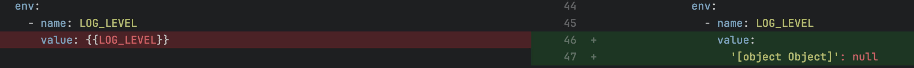

_Sep 18th, 2023_

## Console

### Hotfix: CronJob and Advanced service configuration upgrade

This version ships the hotfix for CronJob and Advanced service content migration bug that was introduced with `v11.6.0`.

When saving in Design with `v11.6.0` CronJob and Advanced Service with interpolated variables will produce an invalid configuration that cannot be deployed.

#### How to resolve the issue if I've already saved

:::warning

Unfortunately for those who saved the configuration, this fix only prevents new configuration save from breaking these kind of workloads; it does not fix configuration that were already saved and produced an invalid configuration.

:::

To fix those project either:

 - revert the commit and save again
 - manually resolve the problem within the Console file properly setting the file content to the previous value.

:::info

If you are still working with v11.6.0 be assured that the process that breaks the configuration is only executed once per-Project, therefore manually fixing the configuration allows you to keep working with the Console without any further issue.

:::

## How to update your Console

For on-premise installations, please contact your Mia-Platform referent and upgrade your _Console Helm Chart_ to `v9.5.7`.
