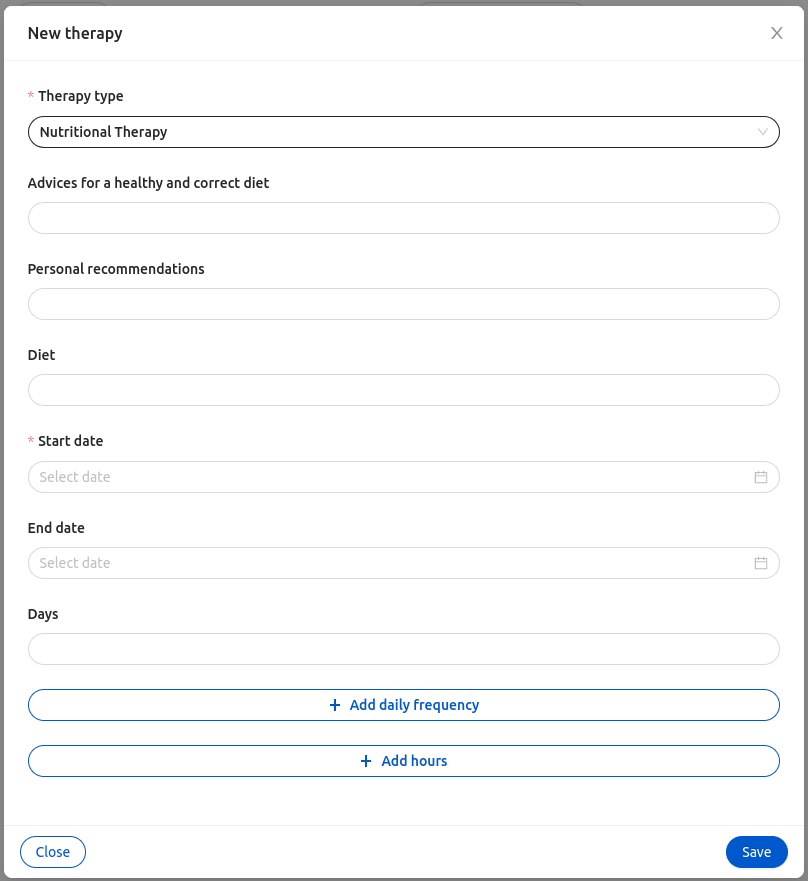

The `ck-add-plan-modal` web component is a modal specialized in adding/modify [Therapy and Monitoring Manager](../../therapy-and-monitoring-manager/overview) a therapy/monitoring plan.


## Usage

The web component consists of a form inside a modal with dynamically generated fields based on a [Therapy and Monitoring Manager prototype](../../therapy-and-monitoring-manager/overview#prototypes).

Upon opening, the modal fetches the prototypes of the type indicated in the `type` property. Once the user selects one of the prototype, each prototype schema properties are mapped to the relative form field. Alongside the property schema, the form will also have the field to set the plan duration and frequency.

If `type` is set to `measurement`,  monitoring prototypes will be fetched. The schema's property of monitoring prototype are not editable on creation, so the corresponding form fields are disabled.

Submitting the form will trigger the post of the therapy/monitoring.

The web-component also listens to the [selected-data](../../../business_suite/backoffice/events#selected-data) event. Upon receiving a `select-data` event, the `ck-add-plan-modal` opens in edit mode. For the modal to open correctly, the payload of the event must contain a valid `prototypeId` and the `_id` of the plan that has to be edited. If the modal was opened in edit mode, the submitting of the form will trigger the patch of the selected plan.

To fetch the prototypes and submitting the `tmmBasePath` property has to be set to the endpoint that expose the `Therapy and Monitoring Manger`.

In order to open the `ck-add-plan-modal` in a Backoffice, a configuration is needed to configure a button to emit the custom event [`add-plan-modal`](../30_events.md#addplanmodal). An example configuration follows: 

```
{
  "$ref": {},
  "content": {
    "attributes": {
      "style": "height: calc(100vh - 64px);"
    },
    "type": "row",
    "content": [
            {
        "type": "element",
        "tag": "bk-button",
        "properties": {
          "type": "default",
          "iconId": "PlusOutlined",
          "content": {
            "it": "Aggiungi piano",
            "en": "Add plan"
          },
          "clickConfig": {
            "type": "event",
            "actionConfig": {
              "label": "add-plan-modal",
              "payload": {}
            }
          }
        }
      },
      {
        "type": "element",
        "tag": "ck-add-plan-modal",
        "properties": {
          "tmmBasePath": "http://localhost:3456/api/v1/config",
          "type": "therapy"
        }
      }
    ]
  }
}
```

## Properties & Attributes

| property | type | required | default | description |
|----------|------|----------|---------|-------------|
|`tmmBasePath`| string | true | / | Base path to the Therapy and Monitoring Manager. |
|`type`| measurement \| therapy | true | measurement |  Defines if the monitorings or therapies are fetched. |
|`width`| string | false | 800px | The width of the modal. It must a valid CSS value. |
|`height`| string | false | 500px | The minimum height of the modal. It must a valid CSS value. |

## Listens to

| event | action | emits | on error |
|-------|--------|-------|----------|
|add-plan-modal| Triggers the opening or the closing of the modal. | - | - |
|[selected-data](../../../business_suite/backoffice/events#selected-data)| Triggers the opening of the modal in edit mod | add-plan-modal | - |

## Emits

| event | description |
|-------|-------------|
|add-plan-modal| Custom event, triggers the opening or the closing of the modal. |
