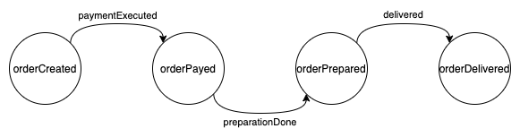
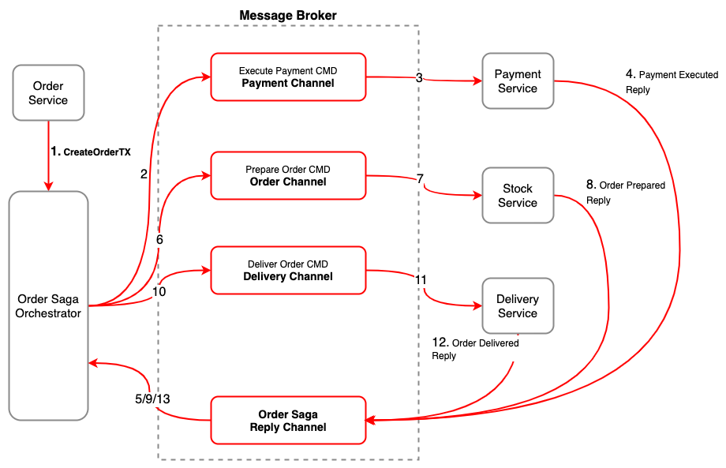
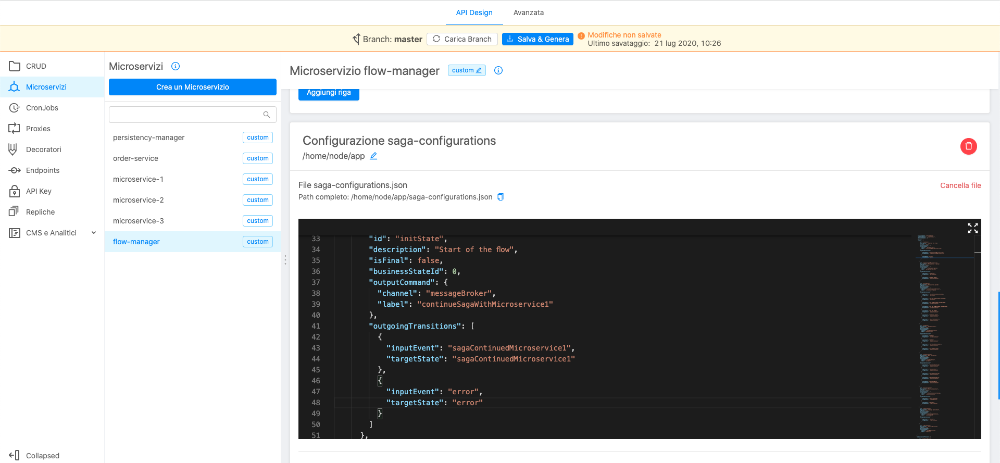
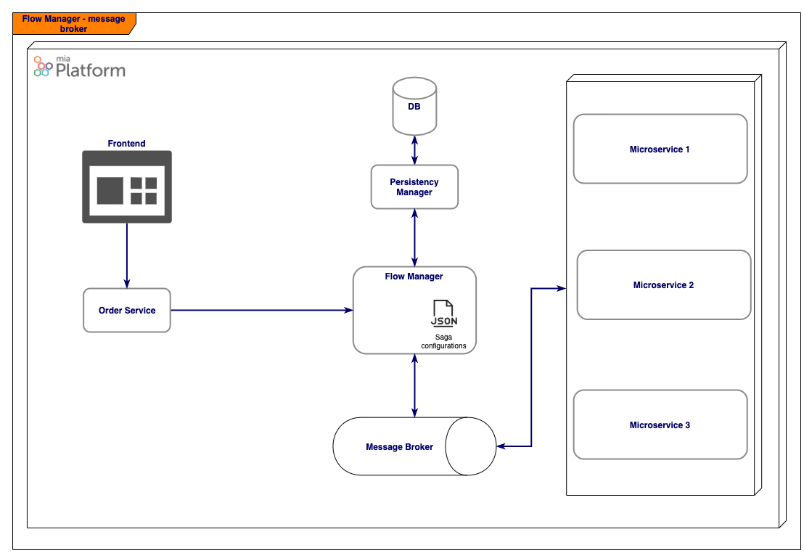
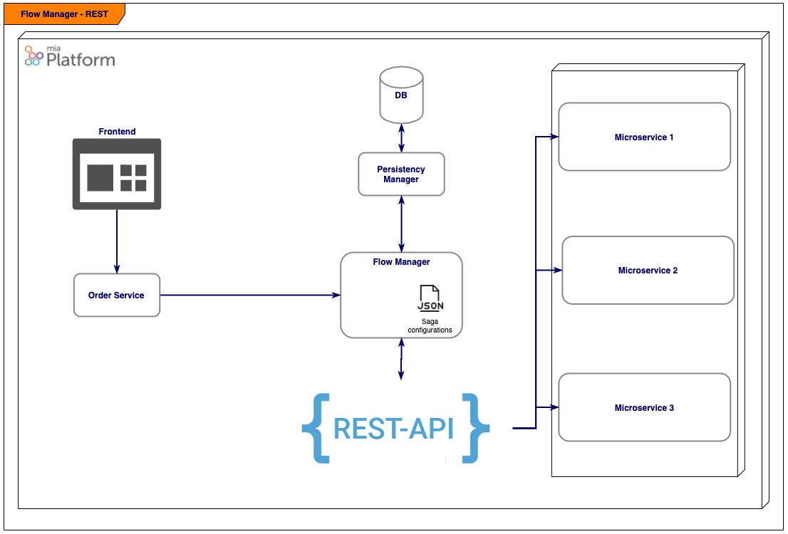

The [_Flow Manager_](https://blog.mia-platform.eu/en/flow-manager-the-saga-orchestrator-of-mia-platform) is a saga orchestrator, capable to manage flows structured by using the Architectural pattern named **Saga Pattern** using, in particular, the [Command/Orchestration approach](https://blog.mia-platform.eu/en/saga-pattern-how-to-manage-distributed-transactions-with-microservices).

## Introduction

The _Flow Manager_ receives a [_Finite State Machine_](https://brilliant.org/wiki/finite-state-machines/) through a configuration file and is capable to orchestrate the saga flow based on the received machine.

To handle the flow it needs other "actors", or, services that listen the _Flow Manager_ commands and reply with events (later will be explained the commands/events approach) through a common channel, usually a [_Message Broker_](https://www.ibm.com/cloud/learn/message-brokers).

Let's explain with an example of a well-known flow, the _e-commerce_ one.

The following schema contains a simple _commerce_ finite state machine (for simplicity, error flows are omitted):

The _Flow Manager_, with this _Finite State Machine_, can orchestrate the saga flow through the states above, working like in the following image (the _Flow Manager_ is the _Order Saga Orchestrator_):

As you can see in the flow above, every step is managed by the _Flow Manager_, named _Order Saga Orchestrator_ in the example above, so the flow could be the following:

- the user creates the order
- the _Order Service_ forwards a creation request to the _Flow Manager_
- the _Flow Manager_ sends the `executePayment` _command_ to the _Message Broker_
- the _Payment Service_, unknown to the _Flow Manager_, handles the command and replies with a `paymentExecuted` event
- the _Flow Manager_ listens the `paymentExecuted` event, handles it and replies with the `prepareOrder` command
- the _Stock Service_ handles the command and replies with a `orderPrepared` event
- the _Flow Manager_ listens the `orderPrepared`, handles it and replies with the `deliverOrder` command
- the _Delivery Service_ handles the command and replies with a `orderDelivered` event
- the flow is complete

As in the example above, the _Flow Manager_ is the core of the _Saga_, contains all the _business logic_ and orchestrates the flow.

More of the information above are about the _Saga Pattern_, _Command/Orchestration_ approach, go ahead into the documentation to know the details about the _Flow Manager_.

## Simple Flow Manager based architecture

To make the _Flow Manager_ architecture clearer, following some diagram of a "_Flow Manager_ based" microservices architecture.

In the example there are the following components (microservices):

- **flow-manager**: the _Flow Manager_ microservice
- **persistency-manager**: the _Persistency Manager_ microservice (see the dedicated documentation [here](./20_how_it_works.md#the-persistency-manager))
- **order-service**: a sample microservice that starts the saga
- **microservice-n**: some microservice that collaborate to continue the saga

The architecture above is simply feasible with the Console, as showed in the following image:

Following two architectures diagrams, based on different communication protocols (see the dedicated documentation [here](./30_configuration.md#communication-protocols)):

**Flow Manager architecture with message broker**

**Flow Manager architecture with REST protocol**

## Horizontal scaling

### Kafka approach

Using the [Kafka approach](./30_configuration.md#kafka-communication-protocol) allows the service to horizontal scale because the messages are processed sequentially and, moreover, the kafka message key is the ID of the saga, and is unique &rarr; grants the messages order because messages are in the same topic partition.

:::warning
The maximum number of replicas is limited by the maximum number of the kafka topics partitions.
:::

## Further details

Follow the pages below for more about the _Flow Manager_:

- [_Flow Manager_ - how it works](./20_how_it_works.md)

- [_Flow Manager_ configuration](./30_configuration.md)
