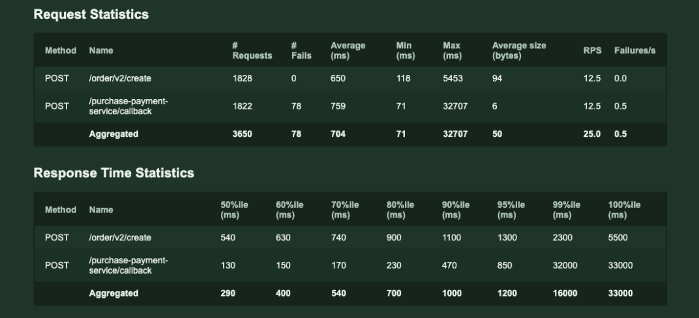
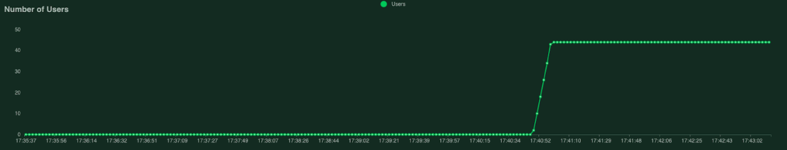
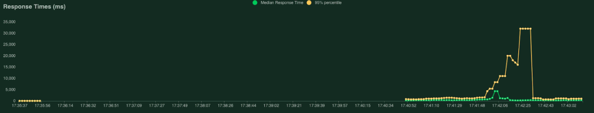
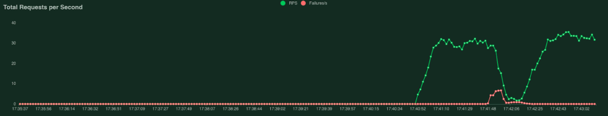
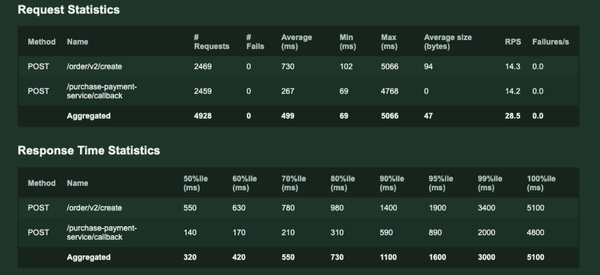
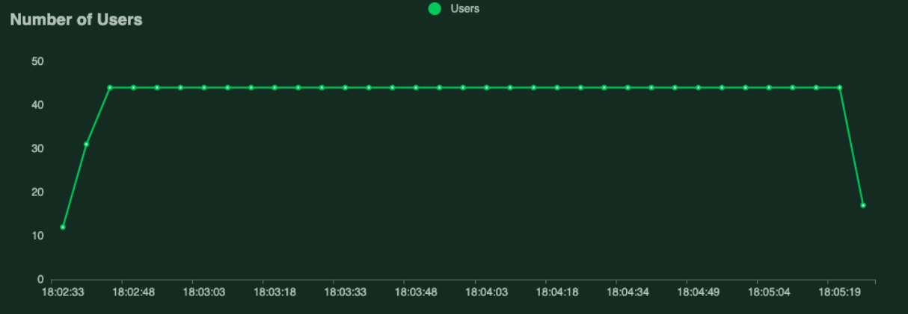
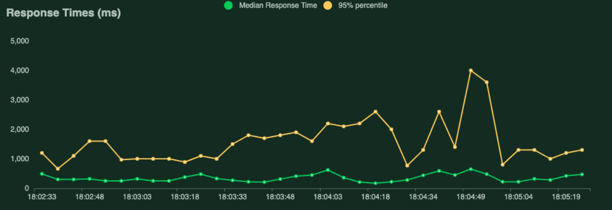
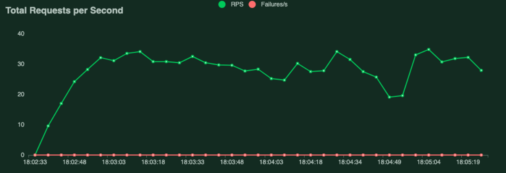

This document describes the tests that have been performed in order to analyze the Flow Manager scalability.

## Designed workflow description

A workflow simulating the phases of order creation, payment and closing has been designed in order to verify the capability of Flow Manager in orchestrating services operations during a load test.

:::info
The flow manager has been used in Kafka mode.
:::

The saga begins with the creation of the order; subsequently, the user proceeds with the payment and a feedback is given solely to communicate the outcome of the payment. Then, the used payment gateways invoke a callback endpoint that takes care of moving the saga to the next step. The rest of the flow is entirely based on Kafka messages.
Lastly, in case of orders that may be not confirmed by payment providers, a cron has been provided to check the status of the payment and possibly to confirm the saga continuation.

It is important to notice that, for test purposes, external services such as those related to external payment providers have been bypassed, and a fictitious payment method has been created to emulate their behavior. 
In addition, the normal delay between the creation of the order and the call to the payment confirmation callback has been removed, thus obtaining instant payments by adopting Locust.

## Methodology

To investigate on the Flow Manager scalability, a topic with two partitions has been created, and two replicas of the service have been released.
The test consisted in creating several orders and checking if they were processed only once, consequently generating a single ticket.

In managing the order issuing, the following worst case scenario has been taken into consideration:
- 0.73 req / sec for payment start
- 0.57 req / sec of completed orders
The duration of this peak is approximately 1 min.
On average, the number of completed orders is around 10 per minute.

On the base of this worst case, tests have been carried out for creating and closing orders by adopting even these constraints:
- 44 simultaneous users
- repeat order in a random interval every 1-3 sec
- 4 users created per second until the maximum number is reached

The services involved are the following:
- purchase-flow-manager
- purchase-flow-manager-crud-adapter
- purchase-payment-service
- orders-processors
- order-manager

For each of them, 1 single replica was released.
The test lasted from 2 to 3 minutes.

## Results

### Flow Manager Scalability

All the generated orders have been closed correctly, there is evidence that both replicas of Flow Manager have received orders to process.

No order has been processed multiple times and the number of tickets issued is consistent with that of creation.

Taking a sample of the orders, it seemed that the partition on which the Kafka message is written is always the same for the same saga, so an order is entirely processed in the same partition.

Furthermore, a thoughtful management of the services shutdown is necessary so that, during the shutdown, the consumer is disconnected and the orders in progress are not truncated, causing errors in the subsequent computation.

### Management of the orders load

During the first test, 1822 orders have been completed in 2 min 10 sec, of which 78 went into error due to the restart of the purchase-payment-service responsible for receiving the payment callback.

The analysis has shown that the service failed for OMMKilled.
No order has gone into an error state within the flow of the saga.

Below, the Locust test report with graphs.

The same test has been repeated by increasing the memory limit of the service.
In this case, 2459 orders have been completed in 2 min 52 sec none of which went wrong, in terms of both callback and saga.

Below, the Locust test report with graphs.

## Final considerations

Despite the fact that in a more realistic situation there are some external dependencies that have been not taken into account in designing this load testing, and that inevitably may lead to longer processing times, results confirm the scaling capability of the Flow Manager service and the ability of the orchestrated services in processing a much higher orders load than compared with the peak of the worst scenario that has been set.
