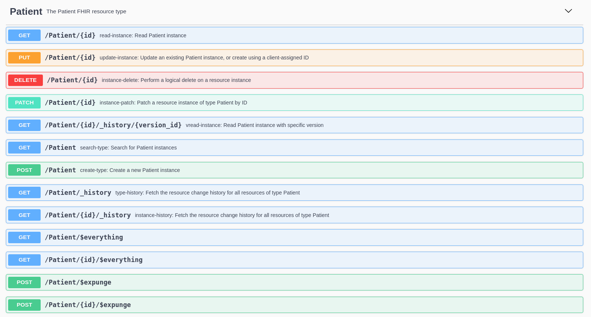

[FHIR](http://hl7.org/fhir/) stands for **_Fast Health Interoperability Resources_** and it is a standard for health care data exchange, published by [HL7](http://hl7.org/).

The Mia FHIR Server is microservice that fully implements the FHIR standard. It is based on [HAPI FHIR](https://hapifhir.io/), an open-source Java implementation of the FHIR standard.

The Mia FHIR Server has the task of exposing, storing and validating the FHIR resources as defined by the standard. The server fully supports the following HL7 FHIR releases: `DSTU3`, `R4` and `R5`.

:::warning
At the moment, the Mia FHIR Server supports the `R5` prerelease version.
:::

## Introduction
The Mia FHIR Server is composed by a web application and a swagger interface.

The web application can be seen as a user-friendly version of the swagger. It offers the user the ability to perform different operations on FHIR resources with a more intuitive and simple user interface. Moreover, it can be used to describe the server, project or company that exhibits the FHIR APIs. The web application is available at `/fhir/` route.

The swagger, instead, collects all the possible endpoints for every FHIR resource, specifying the expected payload for requests and responses, as well as the query and path parameters that can be provided to the endpoints. The swagger offers also the possibility to the test the endpoints. The swagger is available at `/fhir/api/` route.

## APIs
The Mia FHIR Server is a microservice that exposes a set of FHIR resources via Restful API.

In the following list, the most common operations performed via APIs are provided:
* read a resource collection and filter results;
* find elements of a resource collection;
* count number of elements in resource collection;
* create new element or a set of new elements in one or more resource collections ([Bundle concept](https://www.hl7.org/fhir/r4/bundle.html));
* update an element of a resource collection;
* delete an element of a resource collection;
* find a specific version of an element of a resource collection;
* find the version history of an element of a resource collection;

In addiction, there are other secondary operations, which are documented in the Mia FHIR Server swagger.

:::note
For further info about Mia FHIR Server APIs, it is recommended to consult the [official HAPI FHIR documentation](https://hapifhir.io/hapi-fhir/docs/), as well as the [official test server](http://hapi.fhir.org/).
:::
