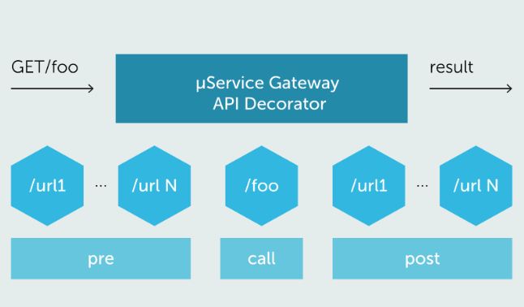

This microservice provides the ability to specify HTTP hooks to be invoked before and after each request, to decorate it with additional services.
Such services can modify the request (`PRE` decorators), for example to add ACL functionality, or to act after the request to the service has been done (`POST` decorators), for example to add more data to the reply.

The Microservice Gateway takes care of making calls to these hook services specified by configuration at startup, and modifying (or interrupting) the request as indicated by the services.

Hook microservices must meet a precise HTTP interface to be successfully interrogated by the Microservice Gateway.

:::note
At the moment, it is not possible to add a second Microservice Gateway from the Marketplace if it is already present in your branch.
:::

### `PRE` and `POST` Hooks

Pre and Post Hooks are reusable and convenient tools that can be used with the console, but in which situation is appropriate to use them?  

* When I want to change the behavior of core components or the logic of frontend and backend components on which I cannot make changes;
* if, due to the convenience of having the functionality available through console, I want to reuse simply and quickly the same logic for more routes;
* when, in order to make the CMS work with filter logics, ACL has to be attached to different objects;
* if I want to send notifications in small and limited projects.

Moreover, to standardize responses, conversion mapping and ACL can be used as standard architectures.

If you want to understand how to set them on the Console, visit the [create decorators section](../../development_suite/api-console/api-design/decorators), while for suggestions about their performance, check the [performance overview section](./30_performance_overview.md#pre-and-post-hooks).

### Service logging

:::warning
Consider never setting the log level to trace in production for this service. If you enable trace logging for it will log request and response body, useful for debugging but it could be an issue in production environments for performance and security reason.
:::
