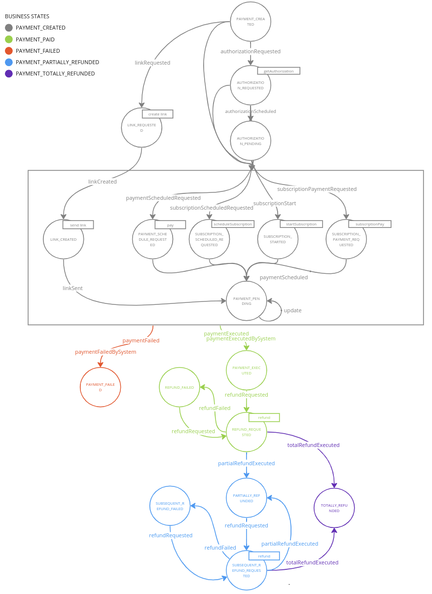

This service is able to communicate with the Flow Manager service via REST APIs.
The communication with the Flow Manager can be enabled setting the **FLOW_MANAGER_URL** environment variable and therefore **SAGA_CRUD_URL** too.

## Features

The PGM can both send events to Flow Manager and also process commands using the following APIs:
* Payment Request: `POST /saga/pay`
* Refund Request: `POST /saga/refund`
* Manage Subscriptions:
    * Schedule a new Subscription: `POST /saga/subscription/schedule`
    * Start *manually* a new Subscription: `POST /saga/subscription/start`
    * Perform *manually* a payment related to a Subscription: `POST /saga/subscription/pay`
* Pay By Link Request: `POST /saga/pay-by-link`

Moreover, the PGM has **read** access to the CRUD collection containing the payment sagas.

#### Events

The following events are sent by the **Payment Gateway Manager**:
- authorizationScheduled
- paymentExecuted
- paymentFailed
- paymentScheduled
- refundRequested
- refundPending
- refundFailed
- partialRefundExecuted
- totalRefundExecuted
- linkCreated

### Pay
`POST /saga/pay`

#### Request
```json
{
    "key":"{{sagaId}}",
    "value":{
        "messageLabel":"eventName",
        "messagePayload": {
            "payRequestData": {
              "successRedirect": "http://success/redirect/url",
              "failureRedirect": "http://failure/redirect/url",
              "redirectToUrl": "http://redirect/response/url",
              "redirectToUrlMobile": "http://redirect/response/mobile/url",
              "providerData": {
                "providerKey": "providerValue"
              }
            }
        }
    }
}
```
Based on the outcome of the transaction the service can sent the following events:
- paymentExecuted
- paymentFailed
- paymentScheduled

### Refund
`POST /saga/refund`

#### Request
```json
{
    "key":"{{sagaId}}",
    "value":{
        "messageLabel":"eventName",
        "messagePayload": {
            "refundRequestData": {
              "amount": 10000
            }
        }
    }
}
```
Based on the outcome of the transaction the service can sent the following events:
- refundRequested
- refundPending
- refundFailed
- partialRefundExecuted
- totalRefundExecuted

### Schedule Subscription
`POST /saga/subscription/schedule`

#### Request
```json
{
    "key":"{{sagaId}}",
    "value":{
        "messageLabel":"eventName",
        "messagePayload": {
            "payRequestData": {
              "successRedirect": "http://success/redirect/url",
              "failureRedirect": "http://failure/redirect/url",
              "redirectToUrl": "http://redirect/response/url",
              "redirectToUrlMobile": "http://redirect/response/mobile/url",
              "providerData": {
                "providerKey": "providerValue"
              }
            }
        }
    }
}
```
Based on the outcome of the transaction the service can sent the following events:
- paymentExecuted
- paymentFailed
- paymentScheduled

### Start Subscription
`POST /saga/subscription/start`

#### Request
```json
{
    "key":"{{sagaId}}",
    "value":{
        "messageLabel":"eventName",
        "messagePayload": {
            "payRequestData": {
              "successRedirect": "http://success/redirect/url",
              "failureRedirect": "http://failure/redirect/url",
              "redirectToUrl": "http://redirect/response/url",
              "redirectToUrlMobile": "http://redirect/response/mobile/url",
              "providerData": {
                "providerKey": "providerValue"
              }
            }
        }
    }
}
```
Based on the outcome of the transaction the service can sent the following events:
- paymentExecuted
- paymentFailed
- paymentScheduled

### Pay Subscription
`POST /saga/subscription/pay`

#### Request
```json
{
    "key":"{{sagaId}}",
    "value":{
        "messageLabel":"eventName",
        "messagePayload": {
            "payRequestData": {
              "successRedirect": "http://success/redirect/url",
              "failureRedirect": "http://failure/redirect/url",
              "redirectToUrl": "http://redirect/response/url",
              "redirectToUrlMobile": "http://redirect/response/mobile/url",
              "providerData": {
                "providerKey": "providerValue"
              }
            }
        }
    }
}
```
Based on the outcome of the transaction the service can sent the following events:
- paymentExecuted
- paymentFailed
- paymentScheduled

### Subscription Authorization
`POST /saga/subscription/authorization`

Get authorization token in order to start the subscription for some provider.

#### Request
```json
{
    "key":"{{sagaId}}",
    "value":{
        "messageLabel":"eventName",
        "messagePayload": {
            "payRequestData": {
              "successRedirect": "http://success/redirect/url",
              "failureRedirect": "http://failure/redirect/url",
              "redirectToUrl": "http://redirect/response/url",
              "redirectToUrlMobile": "http://redirect/response/mobile/url",
              "providerData": {
                "providerKey": "providerValue"
              }
            }
        }
    }
}
```
Based on the outcome of the transaction the service can sent the following events:
- authorizationScheduled

### Pay By Link
`POST /saga/pay-by-link`

#### Request
```json
{
  "key":"{{sagaId}}",
  "value":{
    "messageLabel":"eventName",
    "messagePayload": {
      "provider": "provider",
      "amount": 500,
      "currency": "EUR",
      "shopTransactionId": "shop-id",
      "payRequestData": {
        "successRedirect": "http://success/redirect/url",
        "failureRedirect": "http://failure/redirect/url",
        "providerData": {
          "providerKey": "providerValue"
        }
      }
    }
  }
}
```
Based on the outcome of the transaction the service can sent the following events:
- linkCreated
  ```json
  {
    "key": "{{sagaId}}",
    "value": {
      "messageLabel": "linkCreated",
      "messagePayload": {
        "paymentId": "payment-id",
        "link": "https://payment-link.com"
      }
    } 
  }
  ```
- paymentFailed
  ```json
  {
    "key": "{{sagaId}}",
    "value": {
      "messageLabel": "paymentFailed",
      "messagePayload": {
        "paymentId": "payment-id",
        "error": "error description"
      }
    } 
  }
  ```

## Flow Manager's Machine Definition

In order to work properly, the machine definition provided to the Flow Manager has to comply with the following image.


