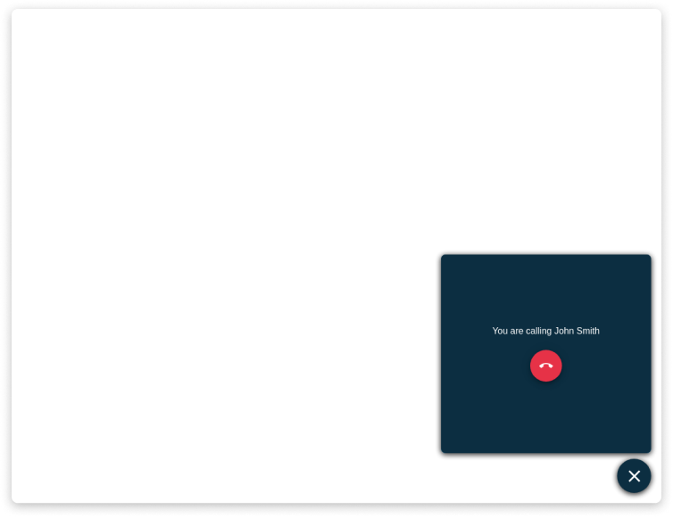

The following section explain the details about the routes in **Teleconsultation Service Frontend**.

:::caution
Please, avoid using the teleconsultation in an incognito session, you might get the following error:

```
We are sorry but it seems that the request went timeout
RE14
```
:::

## GET /teleconsultation/:roomId

This page will host the call of a specific room.

The parameter **teleconsultationId**, is the CRUD *_id* field of a specific teleconsultation.

Once the user will access the page, the _teleconsultationId_ will be used to connect the user to a specific Room. If the user is one of the participants of the Room, then the call will start, otherwise an error will be shown.

:::note
Kaleyra does not support the possibility to make changes to existing rooms. 

For this reason, if the Kaleyra room has not yet been created (i.e. some participant's data is not known) or if it could still be replaced by a new one, the `accessLinkURL` is not returned in the response (it is set to `null`). If all the participants are known, starting from `IMMUTABLE_PERIOD_MS` milliseconds before the starting time of the call, the service will refuse all the change requests to the teleconsultation instance and it will return the `accessLinkURL` to `GET /teleconsultation/:roomId` requests.
:::

If the access link URL is given, the user joins the call, otherwise he/she must wait until a Kaleyra room is created and make the call again later to obtain the link (e.g. a possible frontend behavior is adding the user to a waiting room, and perform polling until the access link is available).

In order to start the call, the Front End side needs to instantiate a Kaleyra Client Object. The needed data is provided by the API call: `GET /teleconsultation/:teleconsultationId`.

For further details about Kaleyra Client Side, check [this link][kaleyra-client-side].




[kaleyra-client-side]: https://github.com/Bandyer/Bandyer-Chat-Widget#create
