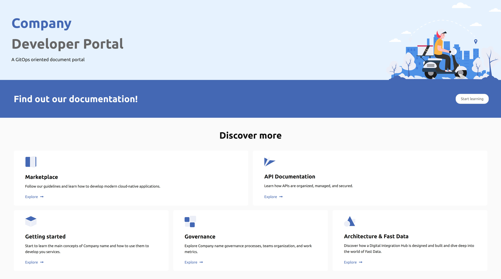

## Introduction

The digital transformation, combined with the increasingly widespread application of the concept of open innovation, has brought out the impellent business need to organize and document the structure of IT architectures.

The perfect vehicle to address such business needs are the **APIs**, from which the concepts of 'Open APIs' and 'API Economy' were born.

The Dev Portal is the interface between a set of APIs, SDKs, or other interactive digital tools, and their various stakeholders: it can be used to understand, interact, adopt, monitor, and govern new technologies.

## The benefits of having a developer portal

The developer portal can play several roles in achieving the business goals of an organization. It represents a new way of developing the platform of a company and it facilitates the collaboration with customers and partners.

In particular:

  - [Facilitate onboarding](#facilitate-onboarding)
  - [Improve innovation and business awareness](#improve-innovation-and-business-awareness)
  - [Increase opportunities](#increase-opportunities)

### Facilitate onboarding

Being capable of quickly and effectively responding to business needs is increasingly important, especially in IT contexts, which are often subject to frequent and sometimes disruptive changes.

In this context the capability to offer to the client or the developer a quick, complete and organized access to the architectural documentation is fundamental.
Moreover, like any other digital product, APIs may struggle to be adopted if not effectively documented and structured.

Therefore, a good Dev Portal guarantees an effective technical response while drastically decreasing the Time To First Hello World (TTFHW).

### Improve innovation and business awareness

In addition to documenting from a technical perspective, the developer portal should also ensure easy reading and interpretation for the business audience, bringing and guiding awareness of what areas for improvement and opportunities can be, guaranteeing innovation and a clear vision.

### Increase opportunities

The developer portal can give access to a whole series of opportunities with external partners or customers and lead to common strategies.

## The Mia way

We built the dev portal using [`micro-lc`](https://github.com/mia-platform/micro-lc), our open-source product to easily deploy web applications using the micro-frontends technology.

Given the great importance of the business side, we have structured a very simple and low-code process for the creation and the complete management of the portal. In [this section](/runtime_suite_applications/dev_portal/application_creation.md), you can easily access to the first step of the creation and configuration guide.

### Structure

The portal we offer consists of the following sections

- _[Functional Documentation](/runtime_suite_applications/dev_portal/functional_documentation.md)_: for the functional documentation of the architecture, using [Docusaurus](https://docusaurus.io/);
- _[Marketplace](/runtime_suite_applications/dev_portal/marketplace_management.md)_: as showcase for your services; you can use it to sell them;
- _[API Portal](/runtime_suite/api-portal/10_overview.md)_: to display your Open API specification documents.

In addition, we provide a dedicated [product](/business_suite/backoffice/10_overview.md) in order to manage all the _Marketplace_ content, as:
- **_Components_**: The list of the components that you want to make available through the _Marketplace_;
- **_Categories_**: the categories in which group your components;
- **_Requests_**: the access requests to your components;
- **_Documentation_**: a direct link to the _Docusaurus_ repository.
