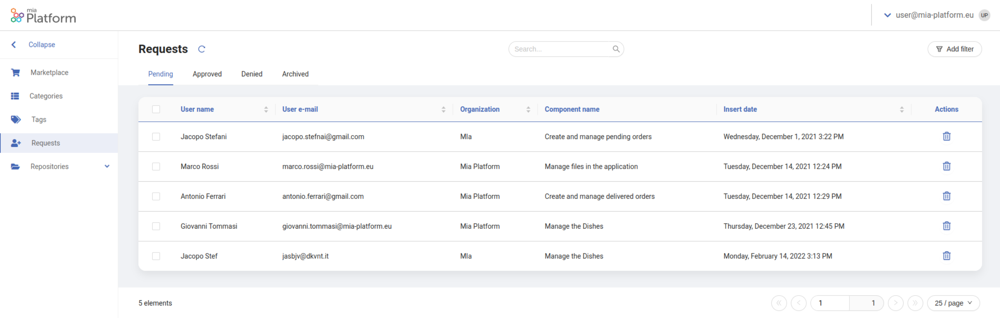
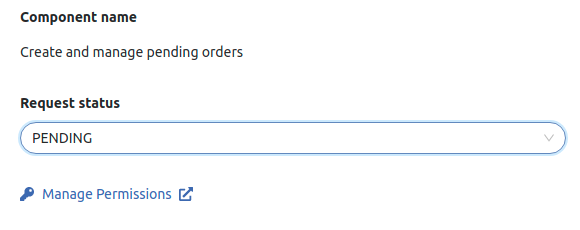

In order to test a specific API or event, the Marketplace allows users to request a unique **token** from a component detail page. Token requests need to be properly processed to eventually grant users permissions to use a certain API or event.

Once you successfully followed the [steps](/runtime_suite_applications/dev_portal/application_creation.md) to create the Dev Portal application, you can start managing all the information characterizing your organization at the endpoint `/dev-portal-backoffice/`. 

## Requests Page

The **Backoffice** section of the Dev Portal contains a specific page to manage all the users' requests to use a certain API or event, the Requests page.

:::note
The requests page can only be populated by external users requesting tokens. Its role is to control the incoming requests.
:::

### Overview

From this page, you will be able to visualize all the received requests and catalog them in different confirmation statuses.



In particular, a new request will be characterized by the following properties:

- **Email**: The email of the user requesting the token;
  
- **Name**: The name of the user requesting the token;
  
- **Status**: The status of the request: Pending, Approved, Denied;
  
- **Organization**: The name of the organization the user requesting the token represents or belongs to;

- **Requested Component**: The API or event for which the token has been requested;

- **Description**: an additional description field to include further details regarding the request;
  
- **Public Key**: the RSA public key of the user that is requesting the access;

- **Insertion Date**: the date and time of the creation of the request.

### Edit Permissions Management Link

When you select a received request, you will be able to see, along with all the request information, a **Manage Permissions** link.

This link, which can be configured from the design area of the console, aims at speeding up the [API token generation](/runtime_suite_applications/dev_portal/api_token_generation.md) process. Its role is to redirect the user managing the requests to the page where he/she will be able to give users access privileges for a certain component.  



:::info 
The Manage Permissions link helps the user manage the requests moving to the **API token generation page** faster.
:::

In order to edit this link, move to the design area of the console and go to `dev-portal-backoffice` microservice.
Move to the `requests.config.json` file and search for the `managePermissions` field inside the `dataSchema`.

The default field configuration should look like this:

```json
{
  "managePermissions": {
    "type": "form-addon",
    "format": "link",
    "excludeFromSearch": true,
    "formOptions": {
      "readOnly": true
    },
    "label": {
      "en": "Manage Permissions",
      "it": "Gestione Permessi"
    },
    "formLinkOptions": {
      "href": "https://www.mia-platform.eu/",
      "target": "_blank",
      "icon": "fas fa-key"
    }
  }
}
```
Update the `href` property with the URL you prefer.

:::caution 
If you strictly follow the architecture proposed with the Dev Portal, this link should be configured to redirect to a specific **CMS page** where you can generate the API token.
:::

### Modify Request Status

To Modify a request status, simply click on the corresponding row inside the table. Depending on your Dev Portal configuration, a drawer or a modal will be shown, where you will be able to edit the status of the selected request.
