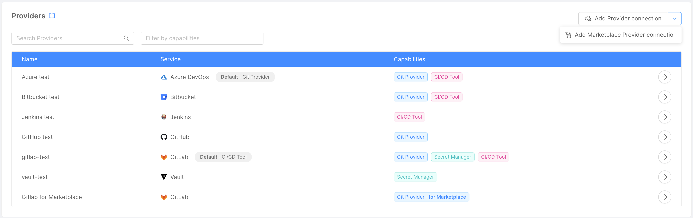
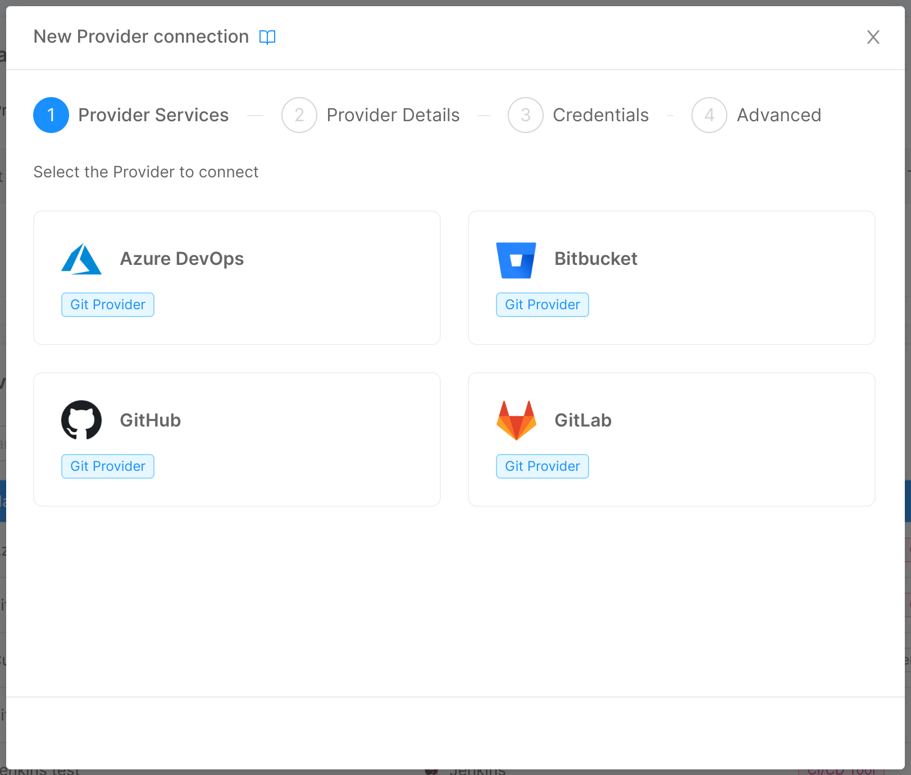
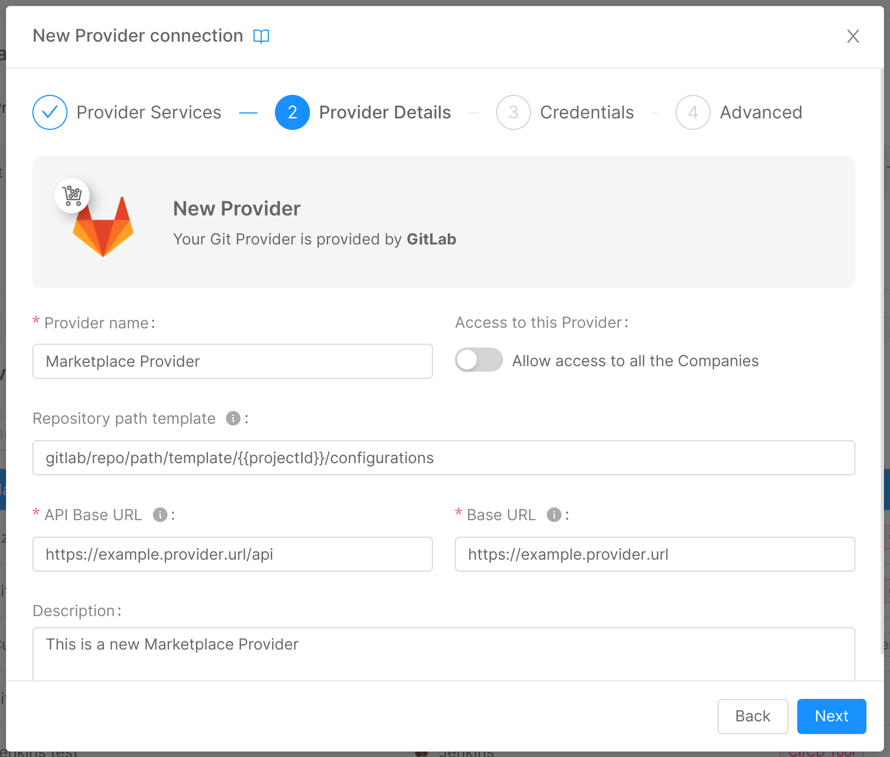

When adding a new Provider connection, you can choose to define it as a "**Marketplace**" Provider.  

By doing so, you can decide to make any resources related to that specific **Provider** available to other Companies.  
For more information about how to share a Marketplace Resource, please refer to the [dedicated documentation page](/marketplace/add_to_marketplace/marketplace_items_accessibility.md).

:::info

Marketplace related Providers are distinguished by the label "**for Marketplace**" in the Capabilities column.

:::

The process of connecting a Provider for Marketplace is similar to the one described in the [Connect a Provider](/console/company-configuration/providers/configure-provider.mdx#connect-a-provider) section, with only small differences in the first and second steps.
Here below you can find the description of the differences between the two processes.

## Connect a Marketplace provider

### Step 1: Provider Services

First step is the same as the one described in the [Connect a Provider Step 2](/console/company-configuration/providers/configure-provider.mdx#step-1-provider-services) section with only one difference:
you will be able to select only among Providers that allow to be used with the purpose of Marketplace connection.

:::info
Only Providers with Git-Provider capability allow the Marketplace Provider connection.
:::

### Step 2: Provider Details

This step is the same as the one described in the [Connect a Provider](/console/company-configuration/providers/configure-provider.mdx#step-2-provider-details) section with a **very important difference**:  

A toggle "**Allow access to all the Companies**" will be displayed in the Provider Details page, allowing you to manage the accessibility to the Provider.
By enabling or disabling this toggle you will be able to manage the accessibility to the Provider. 

**When enabled, this toggle allows other Companies to access this Provider related resources**.

:::info

Even when the "**Allow access to all the Companies**" is enabled, the Provider itself can be viewed and edited only in the Company where it is created.

Additionally, Provider credentials won't be shared with other Companies at any time.

:::

:::info
You can manage the accessibility to the Provider at any time, by simply switching off the accessibility toggle in Provider Edit page.
:::

### Step 3: Credentials

This step has no differences with the [Connect a Provider Step 3](/console/company-configuration/providers/configure-provider.mdx#step-3-credentials).

### Step 4: Advanced

This step has no differences with the [Connect a Provider Step 4](/console/company-configuration/providers/configure-provider.mdx#step-4-advanced).

## Edit a Provider for Marketplace

It is possible to edit the provider for marketplace as [showed here](/console/company-configuration/providers/configure-provider.mdx#edit-a-provider).

### Edit accessibility of a Provider for Marketplace

If you have selected a Provider for Marketplace, you are going to make available to the other Companies all the resources connected to that specific Git Provider.  
This action is reversible: you can manage the accessibility to that Provider at any time, by simply switching off the accessibility toggle. 

:::caution
By removing the accessibility of a Git Provider for Marketplace (by switching off the accessibility toggle), all the resources associated with that Git Provider will cease to function for other Companies.
:::
