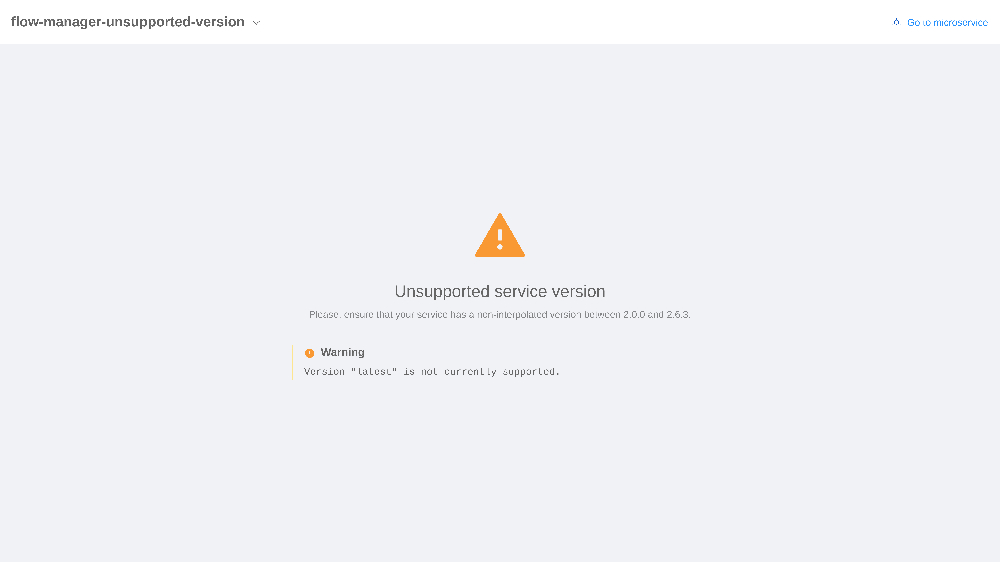
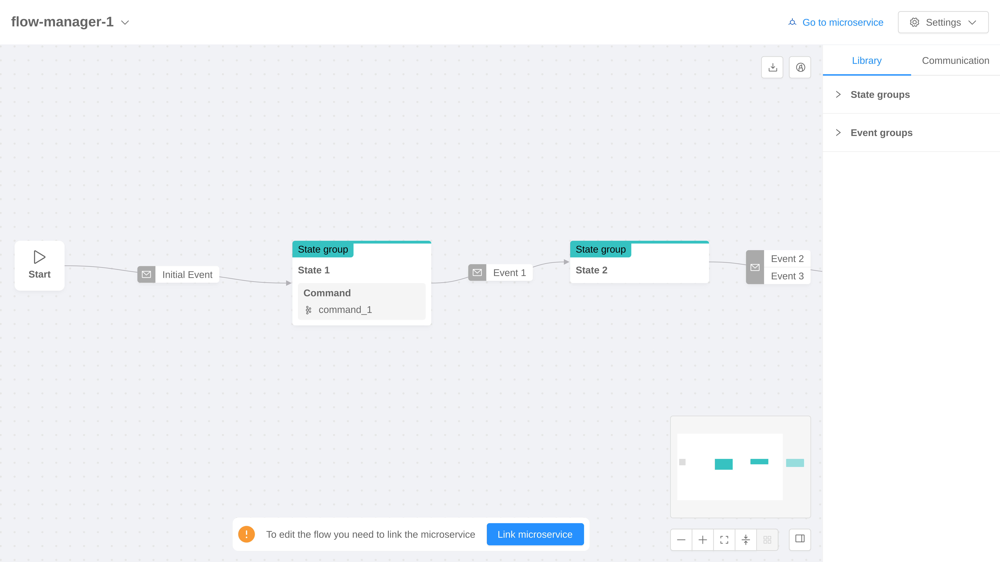
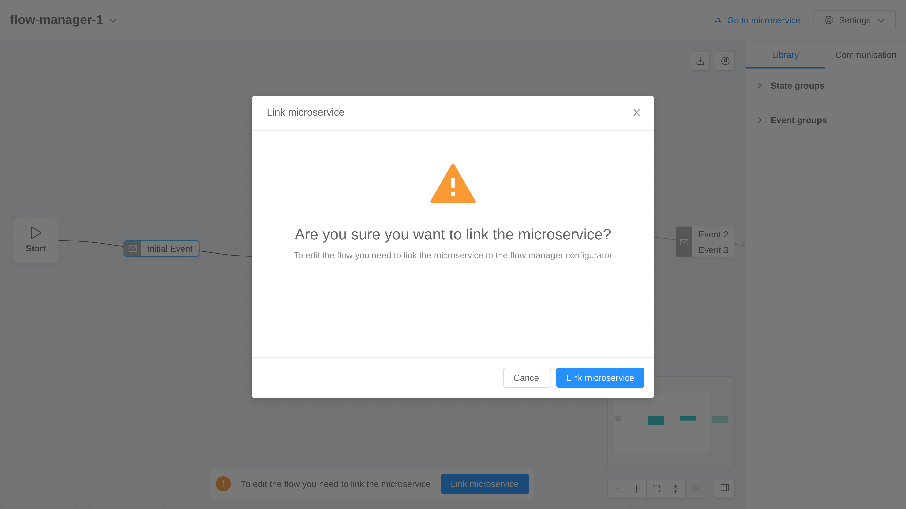
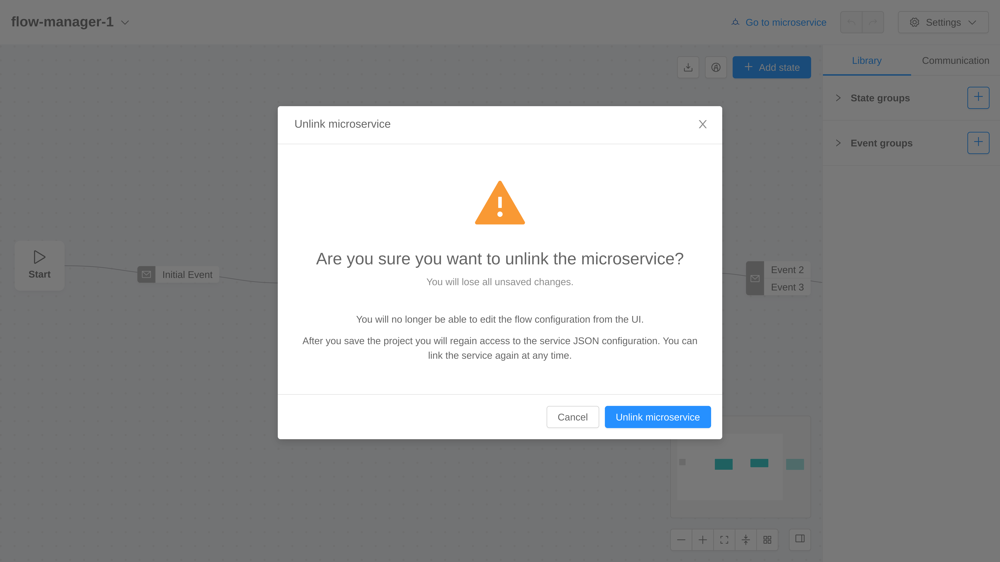

:::caution
Flow Manager Configurator is available from Console version **12.3.0**. For lower versions please refer to [Flow Manager Visualizer](/development_suite/api-console/api-design/flow-manager-visualizer.md) documentation.
:::

The Flow Manager Configurator is a tool that allows to easily configure Flow Manager services thanks to its intuitive graphical interface.

## Supported Versions

The Flow Manager Configurator supports many Flow Manager versions, starting from version `2.0.0`.
Below you can find a detailed list of supported versions.

  Supported versions
  <ul>
    <li>2.0.0</li>
    <li>2.0.1</li>
    <li>2.0.2</li>
    <li>2.1.0</li>
    <li>2.1.1</li>
    <li>2.1.2</li>
    <li>2.1.3</li>
    <li>2.2.0</li>
    <li>2.3.0</li>
    <li>2.3.1</li>
    <li>2.4.0</li>
    <li>2.4.1</li>
    <li>2.4.2</li>
    <li>2.5.0</li>
    <li>2.5.1</li>
    <li>2.6.0</li>
    <li>2.6.1</li>
    <li>2.6.2</li>
    <li>2.6.3</li>
  </ul>

In case the Flow Manager version is not included in the supported version list, the Configurator will show a warning banner and the user will not be able to link the service.

:::warning
The Configurator does not support versions interpolated using variables. In this case it will show the same warning banner described above.
:::

## Readonly Mode

The *Readonly* mode allows the user to visualize the flow defined in the configuration for those Flow Manager services still not linked to the Configurator.

No edits are allowed in this mode.

## Link

Each Flow Manager service can be manually linked at any time, this allows the usage of the Flow Manager Configurator in order to build the service configuration.

:::info
Once the Flow Manager service is linked, a commit is required in order to properly handle the service configuration. After the commit, indeed, the config map of the Flow Manager service will no longer be editable as it is completely controlled by the Configurator tool.
:::

There are some cases in which the Flow Manager service cannot be linked to the Configurator, those cases are:
- missing environment variable `CONFIGURATIONS_FILE_PATH`
- wrong `CONFIGURATIONS_FILE_PATH` value
- missing config map
- invalid config map content (does not match JSON schema)

For each of these cases the Configurator will show an error with a badge describing the error.

## Unlink

Each linked Flow Manager service can be manually unlinked at any time, without losing any previously saved configuration.

:::warning
Unlinking a flow with unsaved changes will cause the loss of those changes.
:::

:::info
As per the link process, a commit is required to regain access to the JSON configuration.
:::

