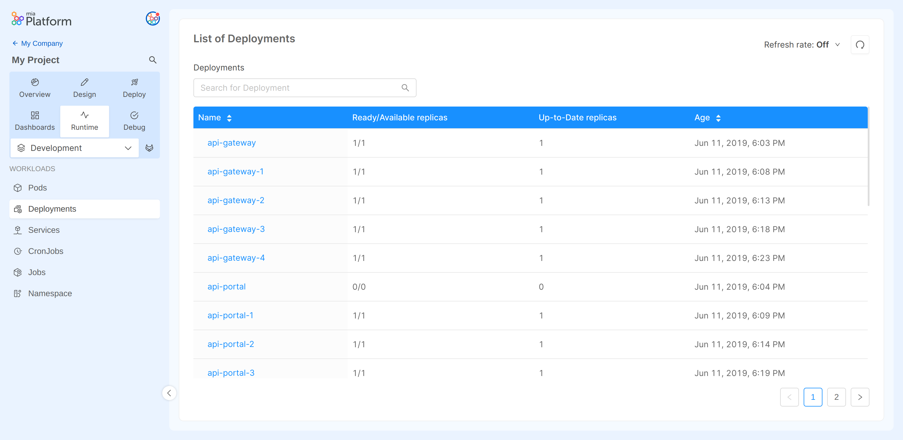
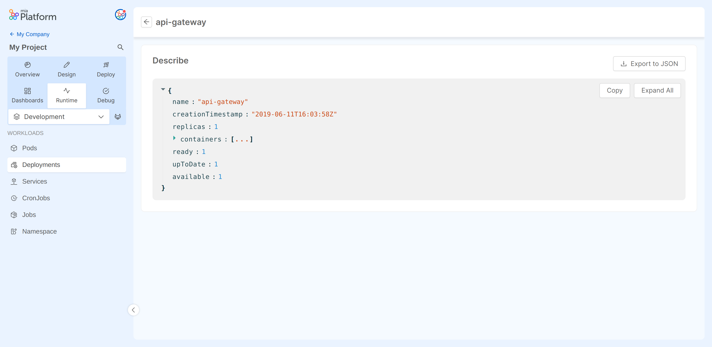

In Kubernetes, a [Deployment](https://kubernetes.io/docs/concepts/workloads/controllers/deployment/) provides declarative updates for Pods through ReplicaSets.  
After having described a desired state in a Deployment, the Deployment Controller changes the actual state to the desired state at a controlled rate.

On this section you can monitor all your Deployments and the relative properties.

## Deployments Table
The table presented here shows the following information:

* **Name**: the name of the relative resource.
* **Ready/Available replicas**: the number of ready replicas out of the desired ones.
* **Up-To-Date replicas**: displays the number of replicas that have been updated to achieve the desired state.
* **Age**: the date when the Deployment was lastly deployed.

## Inspecting a Deployment

Selecting the resource name you can inspect more detail about the Deployment for that resource.
  
### Deployments Describe

In the `Describe` view you can find information about the selected Deployment in JSON format.
These details are the ones exposed by the [Kubernetes APIs](https://kubernetes.io/docs/reference/kubernetes-api/workload-resources/deployment-v1/).

