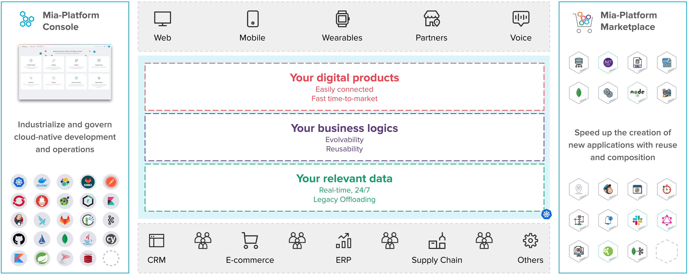

Welcome to the Mia-Platform Console Overview page!

In an omnichannel and evolutionary market, successful enterprises are the ones with the capabilities to operate and innovate like tech companies:

* **Speed**: Being able to build and launch new digital products with great speed;
* **Evolvability**: Continuously looking at the ongoing market changes as opportunities;
* **Scalability**: Being flexible and ready to answer rapidly to demand expansions or contractions;
* **Openness**: Being able to integrate with tools, partner channels, platforms and ecosystems.

Modern companies build their digital products, data and logics through a Digital Platform.  
The tool to reach this goal is the **Internal Developer Portal** which will help you to industrialize and govern cloud-native development and operations. It allows to:

* Design and Expose APIs;
* Develop and Orchestrate microservices;
* Manage Real-time Data Streams and Event-driven architectures;
* Govern and monitor runtime on K8s.

Mia-Platform Console allows you to govern all projects in one place, industrialize & automate DevOps, avoid organizational bottlenecks, self-serve developers, solve cloud complexity and enhance accountability & reliability.

**Hierarchical Organization of Mia-Platform Console:**

Mia-Platform Console is organized into hierarchical levels to help users navigate its structure effectively. Starting from the highest level down to the most detailed, this section provides a quick guide for understanding the architecture.

- **Console:** The overarching workspace and management environment, serving as the primary gateway to the platform.
- **Company:** An organizational entity that acts as a container for projects. It can represent the entire organization or a specific operational unit.
- **Project:** A structured collection of microservices, configurations, and data. It might represent a full digital system or a specific component.
- **Project Sections:** Designated areas within a project that delineate and organize functionalities and tasks.

This structure ensures clear and scalable management of resources and activities within Mia-Platform Console.
