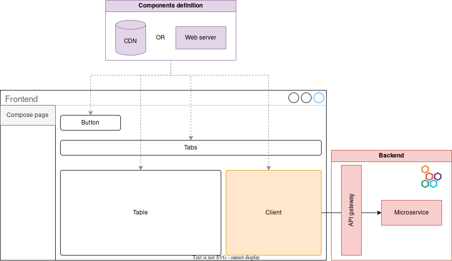

Given their remarkable degree of flexibility, frontend applications are usually composed of multiple moving parts that interacts with each other and with external systems. 

The following sections are intended to give the reader a general idea of the actors involved and their connections.

## How Microfrontend Composer is served

Being composed at runtime, Mia-Platform Microfrontend Composer needs a couple of configuration files to build your frontend application. These files can be easily generated using the low-code/no-code configurator provided by the Console, and then served through a microservice called [Middleware](https://micro-lc.io/add-ons/backend/middleware) that acts both as web server and configurations provider for the Microfrontend Composer. 

The service can be easily deployed using one of two [marketplace applications](/marketplace/applications/mia_applications.md):
- [Microfrontend Composer](/runtime_suite_applications/microfrontend-composer-toolkit/10_overview.md), which will deploy only one pod loading the needed resources from a CDN, or
- [Microfrontend Composer On Prem](/runtime_suite_applications/microfrontend-composer-on-prem-toolkit/10_overview.md), which will deploy all the needed resources to avoid cross origin fetching.

## How Microfrontend Composer works at runtime

At runtime the Microfrontend Composer uses the [configuration files](#how-microfrontend-composer-is-served) to structure the desired frontend application, which in turn needs to fetch resources and create connections to populate its pages.

In pages composed by Web Components the custom elements have to be sourced remotely, for example from a CDN or a web server. Either way, the components are used by the underlying engine (i.e., [micro-lc](https://micro-lc.io/docs)) to build the pages following the blueprints provided by configuration files. 

In turn, on the page, the components may need to communicate with a backend. While back-kit tends to centralize this functionality on _clients_ components, each component is independent in performing HTTP requests to external systems.
