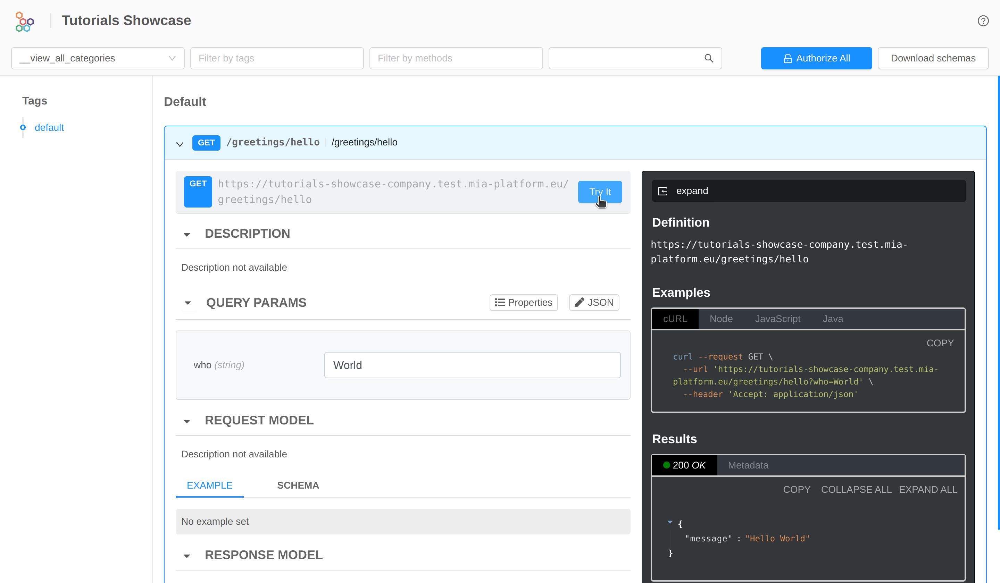

In this tutorial, we will learn how to configure and use the [_API Portal_](/runtime_suite/api-portal/10_overview.md) and the [_Swagger Aggregator_](/runtime_suite/swagger-aggregator/10_overview.md) in order to provide the developers with a user-friendly interface that enables them to easily visualize and test endpoints of different microservices in a single place. It is built on top of the [OpenAPI 2.0](https://swagger.io/specification/v2/)/[OpenAPI 3.0](https://swagger.io/specification/) Specification.

## What we will build

We will add the _API Portal_ and _Swagger Aggregator_ [_Marketplace_ plugins](/plugins/mia-platform-plugins.md) in a project using the dedicated _Application_. As a result, we will use the Portal to view and test project endpoints.

In particular, we will:

- Set up the _API Documentation Aggregator_ application;
- Open the interface and test the endpoints;

## Prerequisites

:::info
If you have already done the [previous tutorial](/console/tutorials/configure-marketplace-components/microservice-hello-world.mdx), you can skip this section and go on using the same project.
:::

Before starting, we will assume that, you already have a clean project in Mia-Platform Console. In order to know how to create a project on Mia-Platform Console, read [this guide](/console/project-configuration/create-a-project.mdx).

The project must:

1. Be integrated with a [deploy pipeline](/infrastructure/self-hosted/pipeline-configuration.md);
1. Have an [ingress route](/infrastructure/paas/tools/traefik.md) with `api-gateway` as `service`;
1. Have an [API Gateway](/runtime_suite/api-gateway/10_overview.md) or a [Envoy API Gateway](/runtime_suite/envoy-api-gateway/overview.md) in your project;
1. Have a service in your project that at least exposes:
    - an endpoint that is also reachable outside the project thanks to a proper the endpoints section configuration;
    - an endpoint, internal respect to the project, that replies with the OpenAPI documentation of the service in json format.

:::tip
If your are using a Mia-Platform Console in PaaS and the project has been created using the "Mia-Platform Basic Project Template", the project already satisfies conditions 1 and 2.
:::

Moreover, you need at least:

- `developer` role on the project you want to use to reproduce the steps;
- `maintainer` role on the environment of the project you want to deploy on.

## API Documentation Aggregator Application

In order to start the tutorial, you must be in the _design_ section of the project in the [Microservices section](/development_suite/api-console/api-design/services.md) from the left side menu.

Since a project is meant to have several microservices, we want to have the ability to access their documentation from a single place.
To do so we need to include in our project an [_API Portal_](/runtime_suite/api-portal/10_overview.md) and a [_Swagger Aggregator_](/runtime_suite/swagger-aggregator/10_overview.md) service.
We can install each plug-in manually from _Mia-Platform Markeplace_, but in this example we use the _API Documentation Aggregator_ application.

This application include the following components:
- [_API Portal_](/runtime_suite/api-portal/10_overview.md), that will present a graphical interface to show the OpenAPI documentation of our endpoints;
- [_Swagger Aggregator_](/runtime_suite/swagger-aggregator/10_overview.md), that will be contacted by the _API Portal_ to have the entire OpenAPI documentation to be shown. In order to create it, the _Swagger Aggregator_ will retreive the OpenAPI documentation of each service and merge it into a single one.
- you can choose to create a new _API Gateway_ service or choose an already installed service.

and the following endpoints:
- _/documentations/api-portal_ to the [_API Portal_](/runtime_suite/api-portal/10_overview.md) service
- _/documentations/api-portal/api_ to the [_Swagger Aggregator_](/runtime_suite/swagger-aggregator/10_overview.md) service
- _/documentations/openapi_ to the [_Swagger Aggregator_](/runtime_suite/swagger-aggregator/10_overview.md) service
- _/documentations/swagger_ to the [_Swagger Aggregator_](/runtime_suite/swagger-aggregator/10_overview.md) service

:::caution
In the Mia-Platform Marketplace are available two different applications to install the _API Portal_ and _Swagger Aggregator_.
The difference between them is the _API Gateway_ used:
- the _API Documentation Aggregator_ uses the _Envoy API Gateway_
- the _API Documentation Aggregator NGINX_ uses the _NGINX API Gateway_

Pay attention and choose the one best suites your needs.
:::

### Install the application

To install our _API Documentation Aggregator_ follow the following steps:

1. Click the _Applications_ menu item in the _Workloads_ section of the console left menu;
1. Click the button _Create new Application_;
1. Search the application _API Documentation Aggregator_ in the marketplace's right panel search bar;
1. Choose between the _NGINX_ or the _Envoy_ version;
1. Follow the wizard and choose the name for service you want to create or simply choose one of the already installed service for the specific category.

## Set which documentations must be aggregated

Before testing the _API Portal_, we need to configure the services and endpoints in order make the _Swagger Aggregator_ include their documentations in merged one.

### Configure the service

First of all we must make the swagger aggregator aware of the endpoints to contact in order to retrieve the documentations of the various services. Therefore, if we want a service documentation to be included in the one shown by the _API Portal_, we need to follow the following steps:

1. Click on the _Microservices_ section;
1. Select the service to configure, in this case _hello-world-service_;
1. Under the _details_ section fill the **API documentation path** with the service endpoint that exposes the OpenAPI documentation, in this case `/documentation/json`;
1. Save the changes by committing.

:::tip
Note that `api-gateway`, `api-portal` and `swagger-aggregator` services should have _API documentation path_ field blank, since we don't want to fetch any documentation from them.
:::

### Configure the endpoint

To configure the endpoints:

1. Click on the _Endpoints_ section;
1. Select the endpoint to configure, in this case _/greetings_;
1. Under the _Endpoint settings_ section in the _Documentation_ tab check the `Show in API Portal`;
1. Save the changes by committing.

:::caution
Be sure that those flags are unchecked for `/documentations/api-portal` and `/documentations/api-portal/api` endpoints!
:::

Repeat these operations for each service and endpoint you want to show in the API Portal.

Once you have configured everything, you can deploy the project! 🚀

:::tip
If you do not know how to do it, take a quick look at [Mia-Platform handbook](/console/handbooks/project-usage.md#deploy-changes).
:::

## Open the interface and test the endpoint

The last step is to open the API portal interface. Firstly, go to the [_environments_](/console/project-configuration/manage-environment-variables/index.md) section of the _Project Overview_ area. Now open the Environment's menu item and select "Go to Documentation" of the wanted environment, as shown in the image below:

After clicking the link, this interface will be displayed. Here you will find and search for each endpoint exposed by API Portal, you can also try the endpoint by filling in the parameters and click on the `Try it` button:

Congrats, we have now a portal for exploring and contacting all your endpoints documentation in a single place! 🎉
