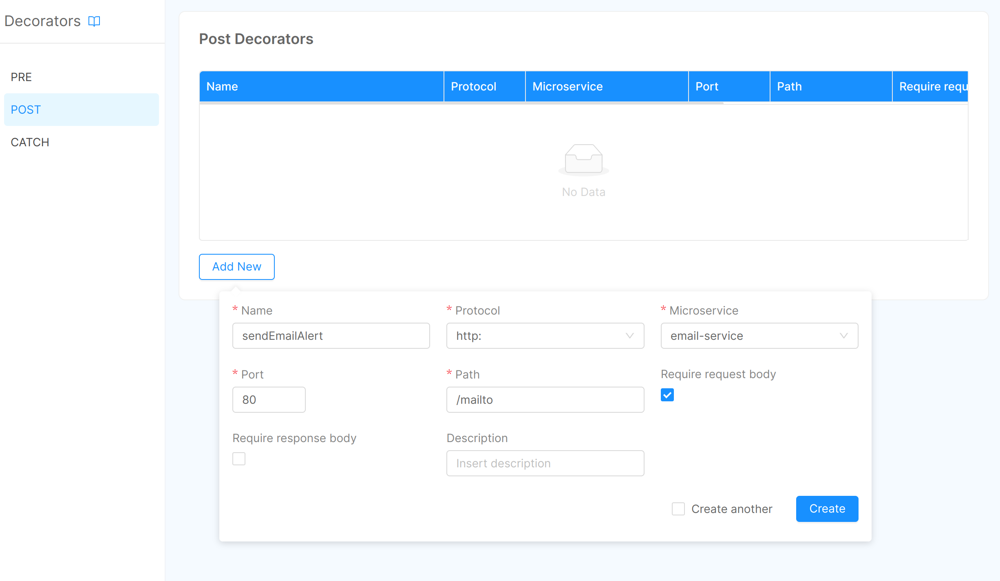

## Decorators

Decorators are special endpoint that a microservice can expose. Using the Console you can manage your decorators and link them to your endpoint routes.

Decorators allow you to perform custom actions upon specific API handler invocations. There are three types of decorators:

* **Pre**: invoked *before* the configured route handler;
* **Post**: invoked *after* the successful execution of configured route handler (a 2xx status code is returned);
* **Catch**: invoked *after* the failure of the configured route handler (any other error status code, 4xx or 5xx).


### Manage your decorators

Upon accessing the Console Design area and selecting the Decorators section in the left menu, you'll see the available types of decorators in the sub menu.

To add a decorator, select the desired type and enter the required information:

* `Name`: a human-readable name that will be used to identify the decorator
* `Protocol`: the scheme to be used when invoking the decorator (http/https)
* `Microservice`: the service name defined in the specific Design area section
* `Port`: the port that should be used when invoking the decorator. Typically you have to **use port 80** for all services created and released by the console.
* `Path`: the path where the decorator is available.
* `require request body`: use this to enforce request body presence before invoking the decorator
* `require response body` (only for Post and Catch decorators): use this to enforce response body presence before invoking the decorator
* `description`: a custom field that can be used to describe the decorator usage information




### Link a decorator to a route

Once you've designed your decorators, you can use them by linking to a route. Each route can have as many Pre and Post decorators as you wish but only one catch decorator so be sure to use them properly.

In order to link a decorator to a route use the "Add decorator" button below each route, a popup will be shown where you'll be able to select the desired decorator type and then select the decorator you wish to add by its name.

If configured, linked decorators will be shown below the button. Please note that decorators are invoked in the order they are defined for each route, for this reason the decorator list can be rearranged simply by drag and dropping the decorators in the list.


### Develop a decorator from scratch

Even though there're [several Mia-Platform libraries](/libraries/mia-service-libraries.md) that abstract the concept of decorator, providing a simple programming interface you might find yourself in the need of design your decorator from scratch.

In order to do so it is important to know the interface that Mia-Platform uses to send decorator requests and how does it interpret the decorator response.

#### Expose a decorator

To expose a decorator of any kind you need your service to expose a new route supporting `POST` method, accepting and replying with `application/json` content type.

The difference between **Pre**, **Post** and **Catch** decorators resides in the request body that your route will receive.

#### Pre Decorator Request

A **Pre** decorator will receive a JSON body object with the following properties:

* `body`: the original request body
* `method`: the original request method
* `headers`: an object containing the original request headers
* `path`: the original request path
* `query`: an object containing the original request query parameters

**Example**

```
{
  "body": { },
  "method": "GET"
  "headers": { "Content-Type": "application/json", "user-agent": "Deep-Thought" },
  "query": { "life": true, "universe": true, "everything": true },
  "path": "/answer"
}
```

#### Post and Catch Decorator request

A **Post** decorator will receive a JSON body object with the following properties:

* `request`: an object representing the original request (its content is the same as the body for **Pre** decorators)
  * `body`: the original request body
  * `method`: the original request method
  * `headers`: an object containing the original request headers
  * `path`: the original request path
  * `query`: an object containing the original request query parameters
* `response`: an object representing the original response issued from the target service
  * `body`: the original response body
  * `headers`: an object containing the original response headers
  * `statusCode`: the original response Status Code

**Example**

```
{
  "request": {
    "body": { },
    "method": "GET"
    "headers": { "Content-Type": "application/json", "user-agent": "Deep-Thought" },
    "query": { "life": true, "universe": true, "everything": true },
    "path": "/answer"
  },
  "response": {
    "body": { "answer": 42 },
    "statusCode": 200,
    "headers": { "Content-Type": "application/json", "user-agent": "Deep-Thought" }
  }
}
```

#### Pre, Post and Catch Decorator response

While the request body differs between the decorator types, the response interface is the same for all. In particular there are three types of response that a decorator can return to its caller:

* leave original information unmodified
* change original information
* abort decorator chain

**Leave original information unmodified**

To do so, just return status code **204** without a response body

**Change original information**

You decorator must return status code **200** with `Content-Type: application/json` a body with properties similar to the one used by decorator requests,
thus for **Pre** decorators:

* `body`: the request body to be sent to the target microservice
* `headers`: an object containing the request headers to be sent to the target microservice
* `query`: an object containing the request query parameters to be sent to the target microservice

While for **Post** decorators:

* `body`: the response body to be sent to the original caller
* `headers`: an object containing the response headers to be sent to the original caller
* `statusCode`: the response status code to be sent to the original caller

Please note that all these properties are optional and only the one provided will overwrite original information,
also when replying from a **Pre** decorator this information will be used to overwrite original request information
while when replying from a **Post** decorator the information will be used to overwrite original response.

**Example**

```
{
  "body": { "answer": 33 },
  "statusCode": 201,
  "headers": { "Content-Type": "application/json", "user-agent": "Deep-Thought" }
}
```

**Abort decorator chain**

All decorator types can interrupt at any time the decorator chain defined in Mia-Platform Console by retuning status **418**.

An optional body can be provided to customize the response sent to the original caller by returning:

* `body`: the response body to be sent to the original caller
* `headers`: an object containing the response headers to be sent to the original caller
* `statusCode`: the response status code to be sent to the original caller

**Example**

```
{
  "body": { "errorMessage": "invalid question!" },
  "statusCode": 501,
  "headers": { "Content-Type": "application/json", "user-agent": "Deep-Thought" }
}
```
