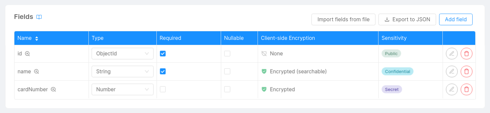
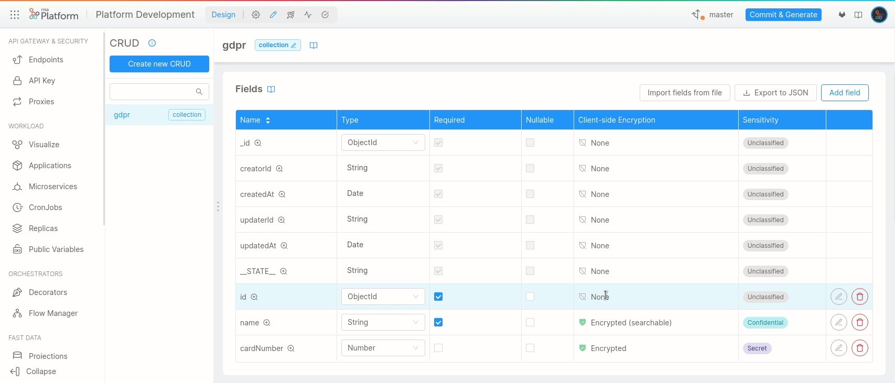
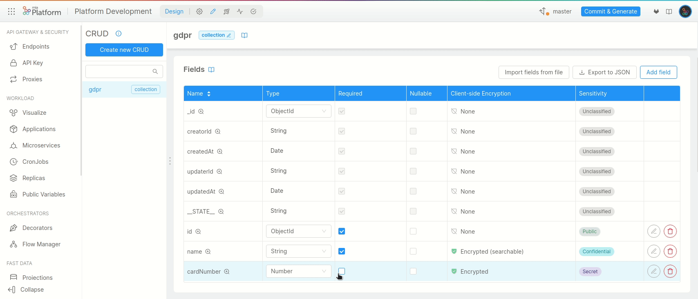
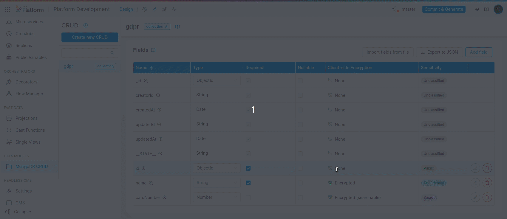

The General Data Protection Regulation ([GDPR](https://gdpr-info.eu/)), applicable as of May 25th, 2018 in all European member states, harmonizes data privacy laws across Europe.

GDPR requires organizations to protect the data of their consumers and to guarantee proper security controls. 

## How can you protect data using the console?

The design section ensures sensitive data are organized and protected through two functionalities:

* **Sensitivity**;
* **Client-side Encryption**.

These two features allow you to specify:
* the level of confidentiality data are associated to;
* the way data are encrypted when stored.

### Where do I find these functionalities?

To manage data protection, Mia-Platform's Console offers two dedicated columns for every collection populating your project: Sensitivity and Client-side Encryption.

In this section, you will understand how to correctly configure collections in order to set a sensitivity level and an encryption strategy. 

## Sensitivity

Setting a sensitivity level is an effective way to **classify your data**.     

Data can be classified in many different ways, organizing information into fixed categories with specific attributes. Data classification can help you stay compliant with the GDPR by allowing you to properly organize your data and implement security controls to detect anomalies.

:::note
Classifying data helps you understand the value of your data, determine whether data are at risk, and implement controls to mitigate those risks.
:::

Below you can find the categories in which data can be classified according to the standards of classification of NATO and European Union, but please remember that the actual data-sensitivity level association strictly depends on the operating context in which you operate:

* **Unclassified**: default classification of the data for which no value has been set;

* **Public**: non-sensitive information based on the operating context, which is not subject to any non-disclosure agreement. Anyone inside and outside the organization can have access to this data without any privacy damage of any kind *(e.g. for a company, the name of an employee)*;

* **Confidential**: information intended for internal use only. This information is sensitive and must not be shared or distributed externally: any compromise of the data can have a limited impact on your organization or its individuals *(e.g. for an e-commerce, the name of a customer)*;

* **Secret**: information intended for restricted and limited use, i.e. only certain members inside the organization should be able to access and modify it. This data must remain strictly internal and can be viewed and handled in clear only by a small group of people inside the organization: any compromise of the data can have a medium impact on your organization or its individuals *(e.g. for a medical organization, the diagnosis of a patient)*;

* **Top Secret**: information intended for mission-critical use, i.e. nobody inside the organization should be able to access and modify it. This data must be inaccessible to anyone including the system admin, any compromise of the data can have a catastrophic impact on your organization or its individuals.

### Select a sensitivity level

You can set a sensitivity level from every collection table in the design section. 

**Each collection field** can be associated with a different sensitivity level: open the drawer by clicking the edit icon and select the desired sensitivity level.

### Add a description

Displaying a sensitivity label leads to a compact and visually appealing representation of the security level of your data. 

However, for certain fields, it might be useful to specify a more detailed set of characteristics or additional security policies that should be taken into consideration before modifying that field.

Open the drawer by clicking the edit icon and move to the GDPR description field. Here you will be able to describe more accurately security-related information regarding your data.

 

## Client-side Encryption

By enabling client-side encryption, you can encode a specific portion of your data to become hidden or inaccessible to unauthorized users once stored on your database.

:::note
Encryption helps you protect private information by means of an **encryption key**, an unpredictable and unique string of bits created explicitly for encrypting and decrypting data.
:::

You can have further details regarding different encryption key generation techniques in the [dedicated section](/runtime_suite/crud-service/30_encryption_configuration.md#configuration).

There are several ways in which encryption algorithms can be designed to protect your data. Different implementations may provide different levels of protection or other types of capabilities, such as the searchability of encrypted data.

Mia-Platform's Console allows you to choose between two different encryption strategies:

* **Randomized**: this strategy ensures a given input value always encrypts to a different output value each time the encryption algorithm is executed. It provides the strongest guarantees of data confidentiality, but it also prevents support for any read operations which must operate on the encrypted field to evaluate the query;

* **Deterministic (searchable)**: this strategy ensures a given input value always encrypts to the same output value each time the encryption algorithm is executed. It provides greater support for reading operations, however encrypted data with low cardinality are susceptible to frequency analysis recovery.

:::note
The custom mode is available only for type `Object` and allows you to encrypt only certain fields defined in your JSON Schema. Furthermore you can also decide to make some specific fields searchable, based on your preferences and operating context.
For more details, please visit the [dedicated section](/runtime_suite/crud-service/30_encryption_configuration.md#activate-object-encryption).
:::

:::info
For sensitive fields that are not used in reading operations, Randomized Encryption can offer improved protection from frequency analysis recovery.
:::

### Select an encryption strategy

You can set an encryption strategy from every collection table in the design section.

**Each collection field** can be associated with a different encryption strategy, you only have to open the drawer by clicking the edit icon and search for the data protection section:

* Check *Enable client-side encryption* to enable the randomized version of the encryption algorithm;

* Check also *Allow search on encrypted data* to enable the deterministic version of the encryption algorithm.

For further details regarding client-side encryption, check out the complete [encryption configuration](/runtime_suite/crud-service/30_encryption_configuration.md).

:::caution
It's only advisable to encrypt newly created collection fields.

Changes in the encryption configuration **will not modify any existing record** populating your collection.  
If you decide to enable encryption on already populated fields, please verify to have already manually migrated your data correctly.
:::
