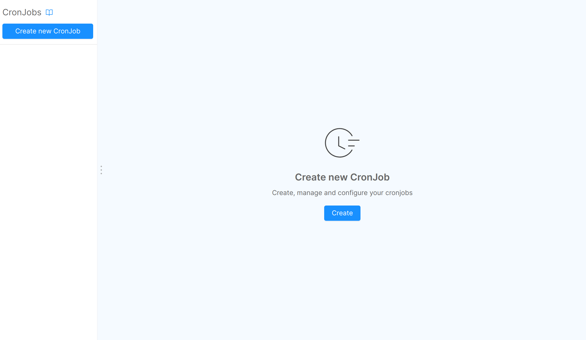
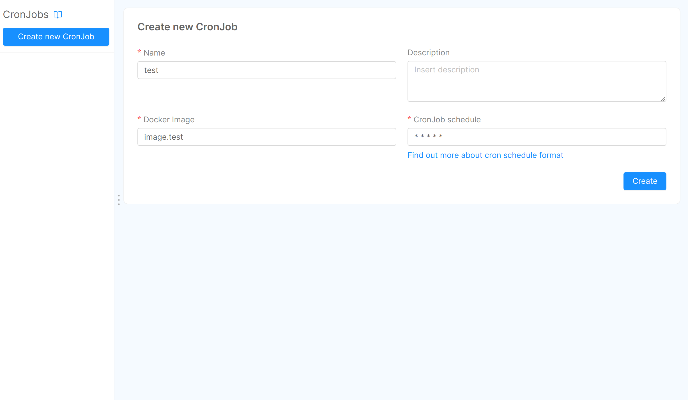
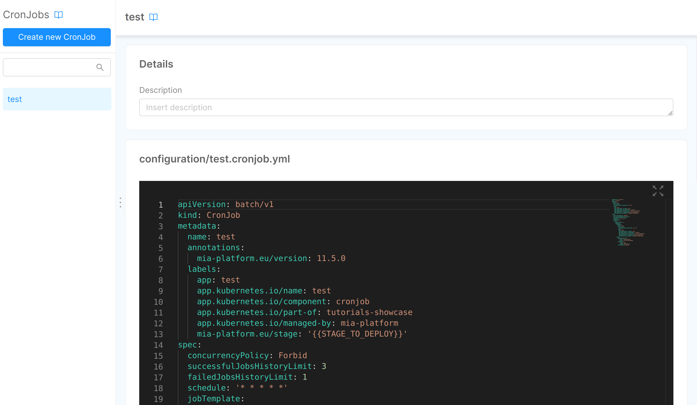
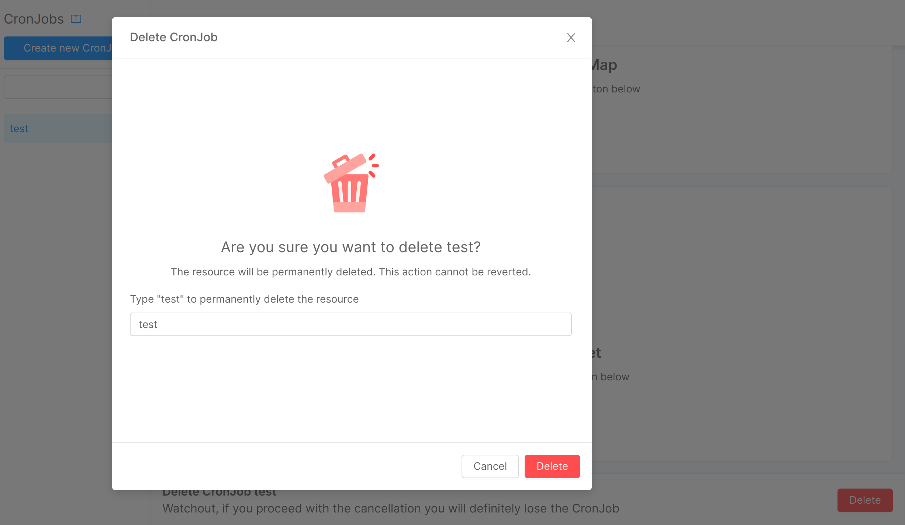

## What is a CronJob

In this section, you can find the guidelines about how to create and manage CronJobs using Console.

A **CronJob** is a scheduled Job that will be executed periodically on a given schedule. For example, you can use CronJobs to conduct repeated tasks like sending emails, running backups or automating system maintenance. A CronJob does not expose API as a microservices does.

Each **Job** creates one or more Pods and guarantee that a specified number of them successfully terminate.

To learn more about CronJobs, you can find more information on [Kubernetes website](https://kubernetes.io/docs/concepts/workloads/controllers/cron-jobs/).

:::info
With Console, when you create a CronJob, you are creating Jobs which configures Pods in Kubernetes on a time-based schedule.
:::

## How to create and manage CronJobs through Console

 To manage CronJobs, Mia-Platform's Console offers a specific section, CronJobs, in the Design area:

 

 In this section, you can create your own CronJob with the create button in the menu or in the placeholder.

 In the creation section, you are required to insert the following information:

* **Name** (*mandatory*): This is the label that you attribute to your CronJob.
  
* **Description** (*optional*): This is the description of your CronJob.
  
* **Docker Image** (*mandatory*): Insert the name of the docker image that you want to create.

* **CronJob schedule** (*mandatory*):  This is the scheduling time. You can insert here a CronTab expression by following these [examples](https://crontab.guru/examples.html).

 

 After the creation of a CronJob, you will be redirected to the CronJob detail where a yaml file is filled with the information provided during the creation:

 

Once you have created your CronJob, you can manage it by editing directly its advanced file. The benefits of creating an advanced CronJob are disclosed on [Kubernetes website](https://kubernetes.io/docs/tasks/job/automated-tasks-with-cron-jobs/#writing-a-cron-job-spec).

## How to delete CronJobs

You can delete a CronJob with the delete button at the bottom of the page. To confirm the deletion, you have to insert the correct name of the Cronjob in the specific field.

 

:::warning
If:
- you are deleting a Cronjob using the `autocreate` feature and
- you use  mlp, the Mia-Platform official command line deployment tool, to deploy it
You also need delete the existing Pods on Kubernetes.
:::
