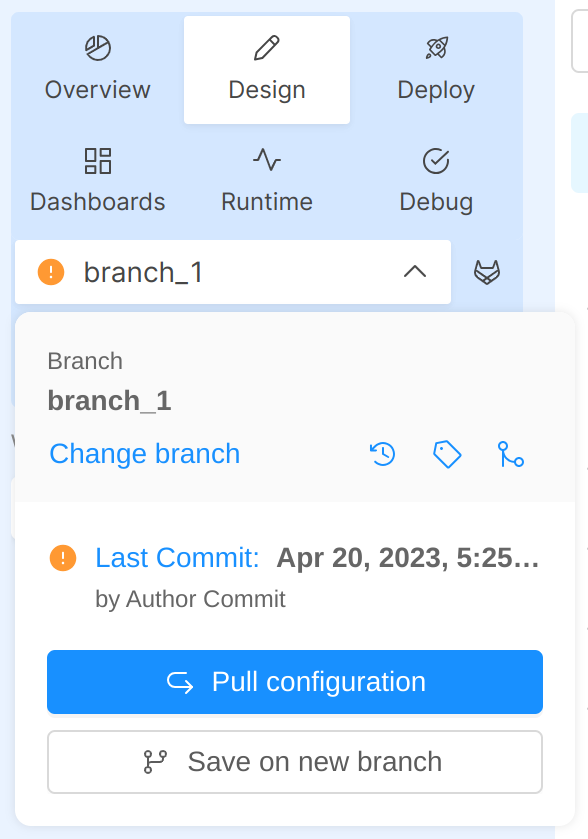
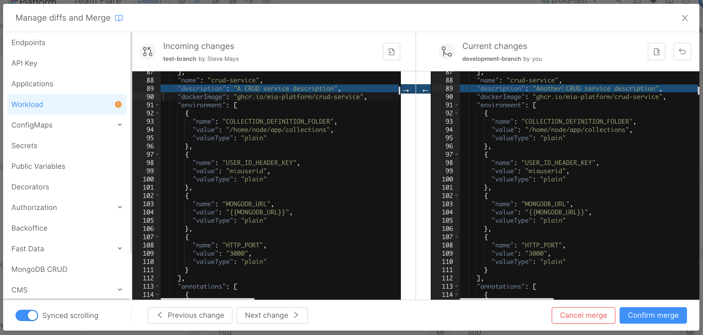
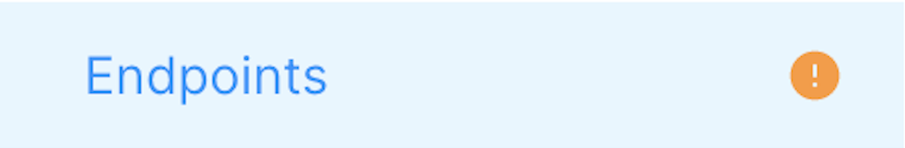
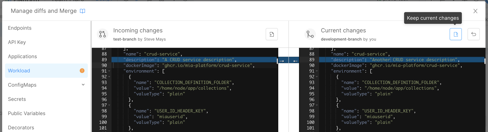
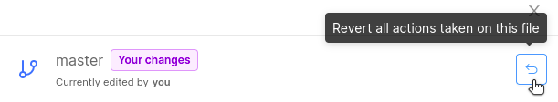
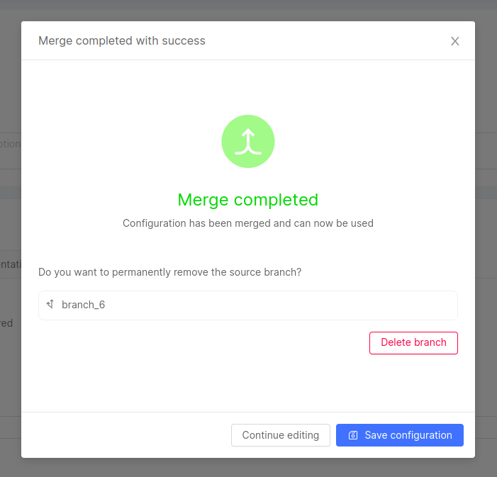

:::caution
Currently, in the merge process, the following Design sections are not supported:

- Visualize
- Advanced

Therefore, the user must manage them manually.
:::

Within the project, different users can concurrently work on the same branch while having visibility of any configuration changes made by other users.
As a matter of fact, from the Design area, and specifically through the branch action popover, it will be possible to:

- Have visibility if other users have committed new changes to the configuration of the branch you are also working on
- Be aligned to the latest changes remotely committed by starting a merged flow that will allow you to identify diffs between compared configurations and to resolve changes/conflicts
- Align the configurations of two different branches within the same project
- Have visibility on all the configuration changes made locally before committing them

Therefore, in case of a new commit is available, users can decide whether to start a merge configurations process or to save their local changes on a new branch.  

  
 

  

:::note
If you want to **save on the same branch** you must perform the merge; otherwise you'll have to discard your changes, pull the new configuration and manually apply your changes again. 
:::

## Differences between Pull and Merge

Once there is a new available commit from remote, the action popover will display two different options, Merge or Pull, based on whether you have already performed some changes or not in your local configuration.

If no local changes have been made, you can click on the Pull action from the action popover in order to download the updated configuration and start working on it.

  
 

  

Conversely, if you have already performed some changes, a merge modal will be opened when clicking on the Merge configuration button. This will let you start the merge process between your changes and the remote changes that another user has just saved.

  
 

  

## How to perform a Merge of configurations

In order to perform the merge, press on the _Merge Configuration_ button: this will open a modal where the different parts of the configuration are shown; each configuration part will open up two editors displaying the remote configuration saved by someone else (on the left) and your local configuration (on the right).

From the sidebar on the left, you can navigate through different sections showing different parts of your project configuration.
The items shown in the sidebar follow the grouping order used within the Design area sidebar (for example, the user can easily identify the Endpoints section on top, then move on to the Workload section - in which there are the microservices configurations - and finally arrive at the MongoDB CRUD section to view its collections).

The sections where changes occur are marked with a warning so you can review them easily.

Entering one of them, to resolve a diff, you can:
- edit the local configuration on the right-hand editor (the left-hand editor is read-only)
- either apply the remote changes from the left into the editor on the right or approve your local changes by moving them to the editor on the left. To apply the specific changes, you have to click on the small arrows located between the two editors (as shown in the image right above). 

  
 

  

In every section, navigate from one change to the following/previous one thanks to the related navigation buttons. If there are no changes in the current section, the navigation buttons will be disabled.

In case you want to accept all incoming or current changes inside a specific section of the merge modal, to speed up your merge process you can leverage two different buttons:

* The `Keep current changes` button (above the right-hand editor) allows you to accept the entire content of your current configuration

* The `Accept incoming changes` button (above the left-hand editor) allows you to accept all changes from the incoming configuration

When you are satisfied with your merge just press the _Confirm Merge_ button.

:::caution
Once the merge is confirmed, the content from the editor on the _right_ is taken as the correct configuration and injected into your local configuration.

Please note that **you will have to approve all the changes coming from the remote configuration**, otherwise you may lose some changes.
:::

After the merge process is completed with success, you can can proceed to save your local changes applied to the current configuration, or continue editing it.

### What if I made a mistake?

If you are working on a section of the Merge modal and want to undo all changes applied to that section since the start of the Merge, you can use the **Revert button**.  
This button allows you to go back to the initial situation for the current section, without having to cancel the entire Merge process. 

  
 

  

## Merge from another branch

As an alternative to the merging process already described above, it is also possible to merge your actual configuration not only with the different remote configuration within the same branch, but also with other different branches. 

In order to perform this action, you have to click on the "Merge from another branch" icon inside the action popover: at this point, a list of all the other different available branches will appear and from this list you can choose the branch with which you want to merge your actual branch.

This will open a modal where the two different branches are shown; each branch will open up two editors displaying the other branch you have chosen (on the left) and your actual branch (on the right). Subsequently, from this modal, you can manage diffs and then confirm your merge in the same way as described above.

  
 

  

If the 'merge from another branch' operation is successful, you can choose to delete the source branch. In any case, you can choose either to continue editing or to save your configuration.

  
 

  

