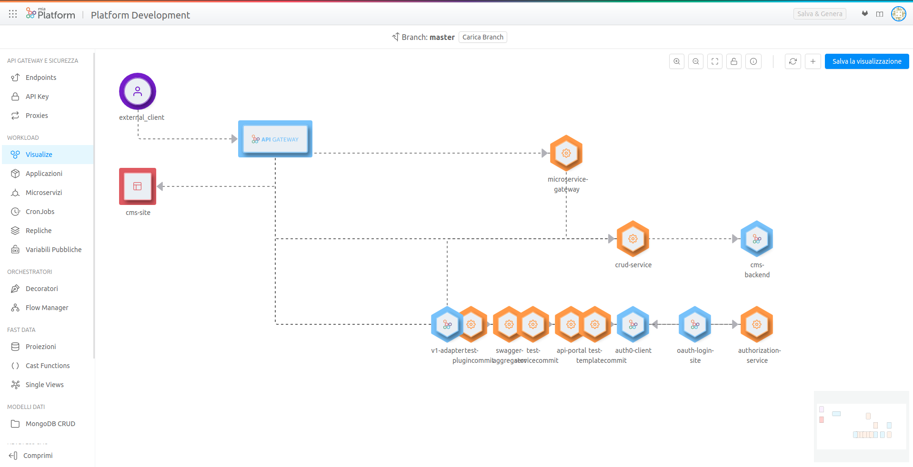
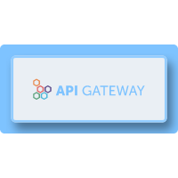
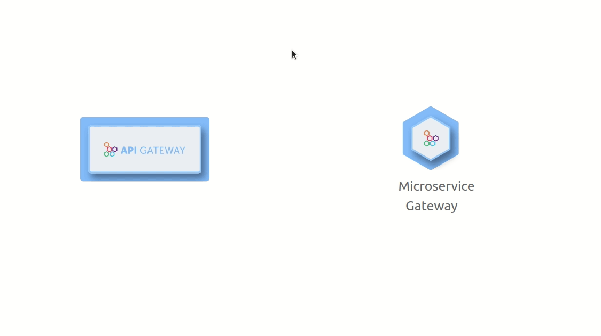
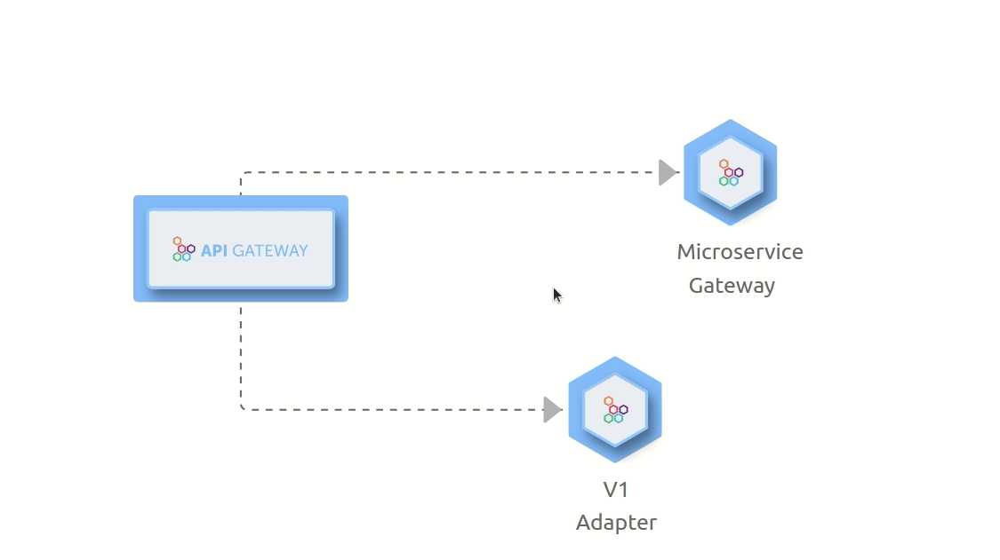
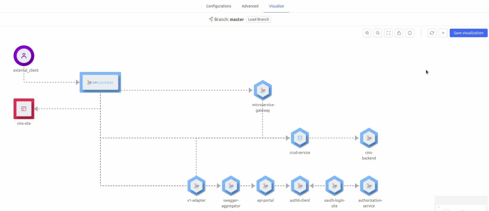
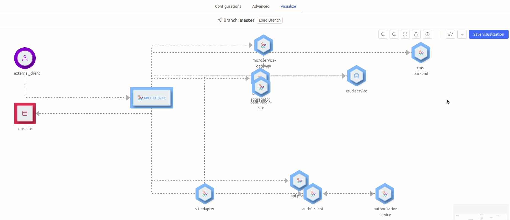
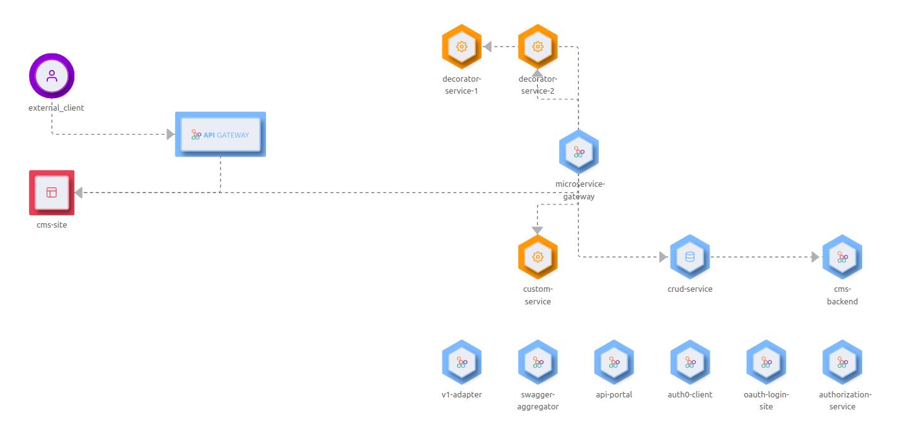
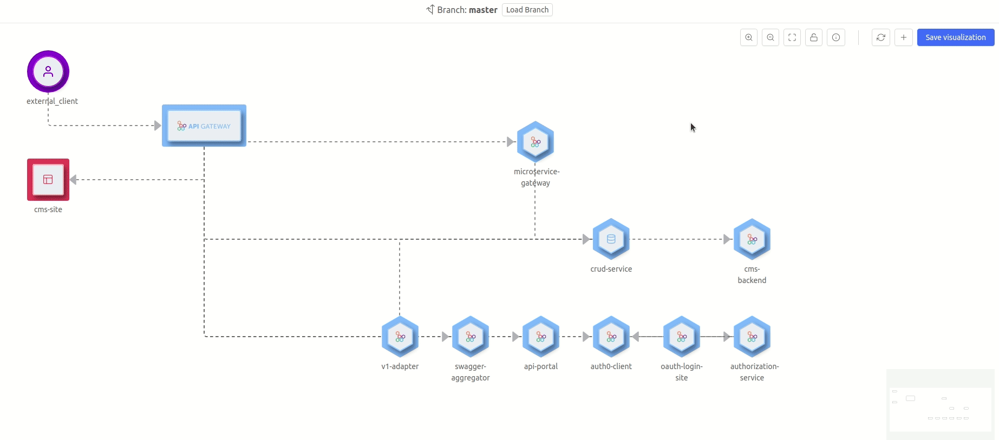
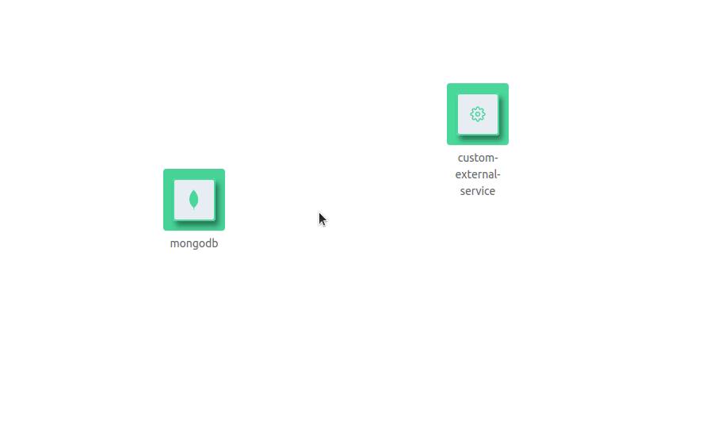

## What is Mia-Craft

Mia-Craft is a visualization tool accessible from the dedicated section of the Design area of the Console.
The aim of Mia-Craft is to help the user to obtain a graphical overview of the project architecture starting from his project's configuration and also to replicate the conceptual flow adopted during the design of the project’s configuration via the functionalities explained in the next section.

From the project configuration, Mia-Craft creates the starting visualization where the microservices are shown without connections between them except for the connection between the Client and the API Gateway (if present) and the connection between the CMS Site and the API Gateway (if both of them present in the configuration file). An example is in the following picture.

All the icons shown correspond to a specific type of microservice except for the “Client”:

| Icon      | Description |
| :-----------: | ----------- |
|  |Client|
|  |[API Gateway](/runtime_suite/api-gateway/10_overview.md)|
|  | Microservices which type is “core” |
|  | Microservices which type is “custom”|
|  | [CRUD](/development_suite/api-console/api-design/crud_advanced.md)|
|  | [CMS Site](/microfrontend-composer/previous-tools/cms/guide_cms.md)|

## Main functionalities

The user can replicate the conceptual flow adopted during the design of the project’s configuration, by pointing out how services in the architecture communicate with each other and by changing the position of the services inside the namespace of Mia-Craft. This can be achieved via the functionalities explained in the next parts.

### Draggable microservices

The microservices, represented by their icon, can be dragged by doing a left click on them and then dragging them in the allowed area.

### Add connections between microservices

The creation of the arrow have to be between a microservice that is the source and a microservice that is the target. In order to create it, you have to go close on the icon of the first microservice (the source) and then a gray area will be shown. Subsequently, you have to do a left click and drag outside the gray area and you are going to see a line attached to your cursor that starts from the center of your microservice. Then you have to bring this line on the gray area of the target microservice. After doing this operation a new edge will appear between the two microservices.

### Delete a connection between microservices

The arrows created between the microservices can be deleted via the context menu that can be seen simply by doing a right click on the arrow that should be deleted.

:::note 
If present, the connection between the API Gateway and the Client cannot be removed. The same rule is applied for the connection between API Gateway and CMS Site.
:::

### Save the visualization created

The visualization created by the user can be saved and retrieved the next time that the user access this area. This can be done via the 'Save visualization' button on the top right of the window. The new visualization is saved in the project git repository in the file 'mia-craft-config.json'.

### Reset the generated visualization

The visualization can be brought back to a starting default position at any moment via the reset button, which repositions all the services in a precise way. 

As it can be seen in the following example, the API Gateway, the CMS site and the Client are going to be positioned on the left and the other services on the right based on the following logic: 
* in the top area are going to be positioned the services that act as decorators;
* in the middle is going to be positioned the microservice gateway;
* in the bottom area are going to be positioned all the other services.

### Create external services

In order to better represent the graphical overview of the project architecture, external services can be added. 
There are four typologies of external services available: Kafka, MongoDB, Redis and Custom. For each of them there is a specific icon and a custom name that a user can specify in the process of creating it. There is no limit in the number of external services that can be created for each typology, however the only constraint is the fact that the custom name chosen for a new external service must be different from the names of the console's services such as api-gateway, cms-site or the names of any custom service created by the user in the Configuration tab.

| Icon      | Description |
| :-----------: | ----------- |
|  |Kafka|
| | Mongo DB |
| |  Redis|
|  | Custom external service|

The external services can be added as it can be seen in the following representation.

Furthermore, the external services can be deleted via the context menu that can be seen by doing a right click on the external service that should be deleted.

