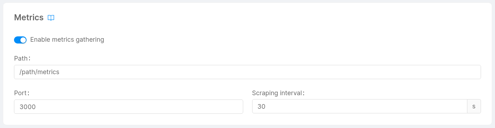

In the Metrics card it is possible to configure in which path and how often the metrics produced by your service should be gathered.

## Enable Metrics Card

In order to visualize the Metrics card and be able to define a ServiceMonitor for your services you should set up the monitoring system in the [Runtime](/console/project-configuration/project-settings.md#runtime) card found in the Project Settings section of the Console.

If the section of the Console is not available you can set through the CMS, in your project settings, the `monitoring` property in the following way:

```json
{
  "systems": [
    {
      "type": "first-monitoring-system-type"
    },
    {
      "type": "another-monitoring-system-type"  
    }
  ]
}
```

So far, only one type of monitoring system is supported: `prometheus-operator`. [Prometheus Operator](https://github.com/prometheus-operator/prometheus-operator/blob/master/README.md#prometheus-operator) is responsible for natively providing Kubernetes deployment and management of Prometheus components.  
One of the features provided by Prometheus Operator is the **ServiceMonitor**.

A ServiceMonitor is a Kubernetes [Custom Resource](https://kubernetes.io/docs/tasks/extend-kubernetes/custom-resources/custom-resource-definitions) that is responsible for automatically generating a [Prometheus scrape configuration](https://prometheus.io/docs/prometheus/latest/configuration/configuration/) based on its definition.

## Configure ServiceMonitor

In the Metrics card you will be able to specify if your service metrics should be gathered or not. If you enable this feature for your service you should then set the following properties:

* **Path** (default: `/-/metrics`): The path that should be contacted to gather your service metrics.
* **Port** (default `http`): The port (e.g., `80` or `http`) exposed by your service.
* **Scraping Interval** (default `60s`): the interval at which metrics should be scraped.


