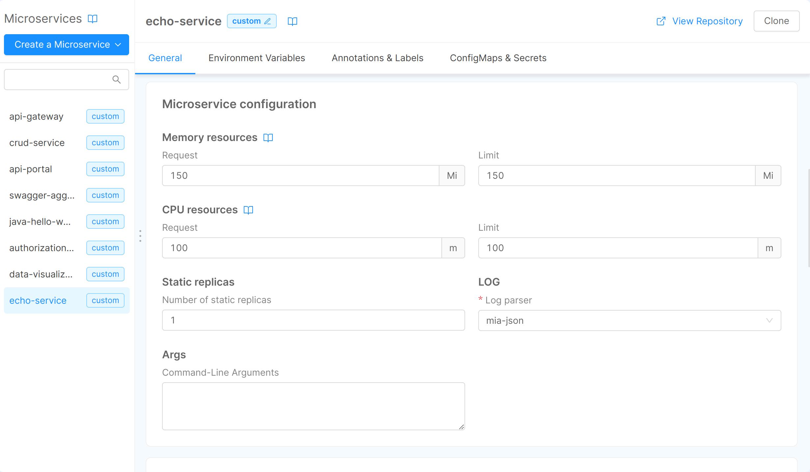

In the field CPU Resources, you have to specify:

- **Request**: the minimum number of "thousandth of a core" (m) that the container needs (in Kubernetes it's the _request_).
- **Limit**: the maximum number of "thousandth of a core" (m) that it can use (in Kubernetes it's the _limit_).

:::info
To learn more about the meaning of these values inside Kubernetes, please visit [this page](https://kubernetes.io/docs/concepts/configuration/manage-resources-containers/) in the Kubernetes documentation.
:::

CPU resources are measured in CPU units. One CPU, in Kubernetes, is equivalent to:

- 1 AWS vCPU;

- 1 GCP Core;

- 1 Azure vCore;

- 1 Hyperthread on a bare-metal Intel processor with Hyperthreading.

CPU Resources, which are measured in CPU units, can be expressed as an integer or a fractional value with one of these suffixes: m and milli.

The different suffixes, applied to different integers or fractional values, can express the same CPU Resource value. For example: 100m CPU, 100 milliCPU, and 0.1 CPU are all the same.

It is not possible to be more precise than 1m and CPU is a always an absolute quantity. For example, 0.1 is the same amount of CPU on a single-core, dual-core, or 48-core machine.

In the microservice detail of Mia-Platform Console, **you can only express the CPU Resource value in m**.

You can use interpolated variables to value the CPU resources (e.g. `{{CPU_MIN}}`). The variables should contain only numerical values.

:::note
The check about that _Limit_ have to be greater than _Request_ won't be done if you use interpolated variables.
:::

:::info
To learn more about CPU Resources, please visit [this page](https://kubernetes.io/docs/tasks/configure-pod-container/assign-cpu-resource/#cpu-units) of Kubernetes Docs.
:::
