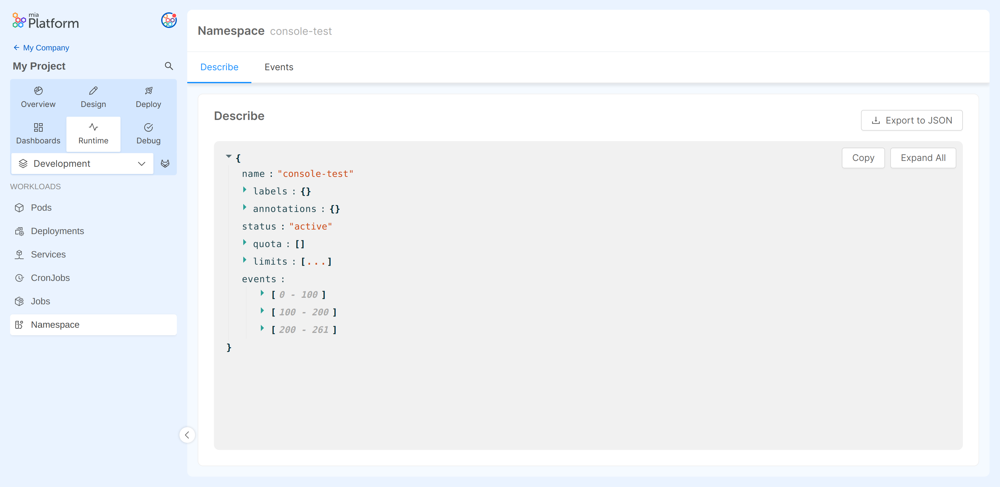
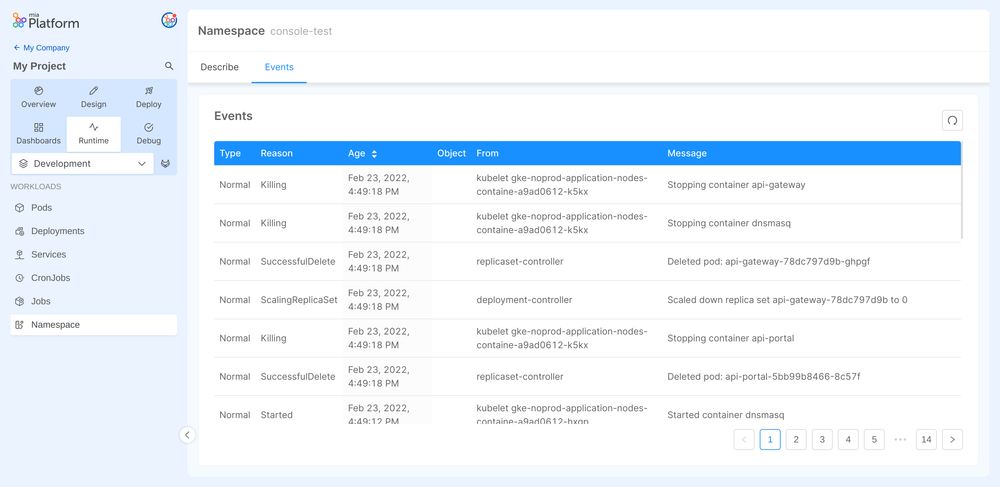

### Namespace describe

In the `Namespace` section, under the `Describe` tab, you can find the describe of the current Namespace in JSON format.

Using the dedicated buttons, the Namespace describe can be:
-  copied to clipboard;
-  expanded in the viewer;
-  downloaded as JSON file

### Namespace events

In the `Namespace` section, under the `Events` tab, you can find the events of the current Namespace sorted in a table.

Using the dedicated button, the events can be refreshed.