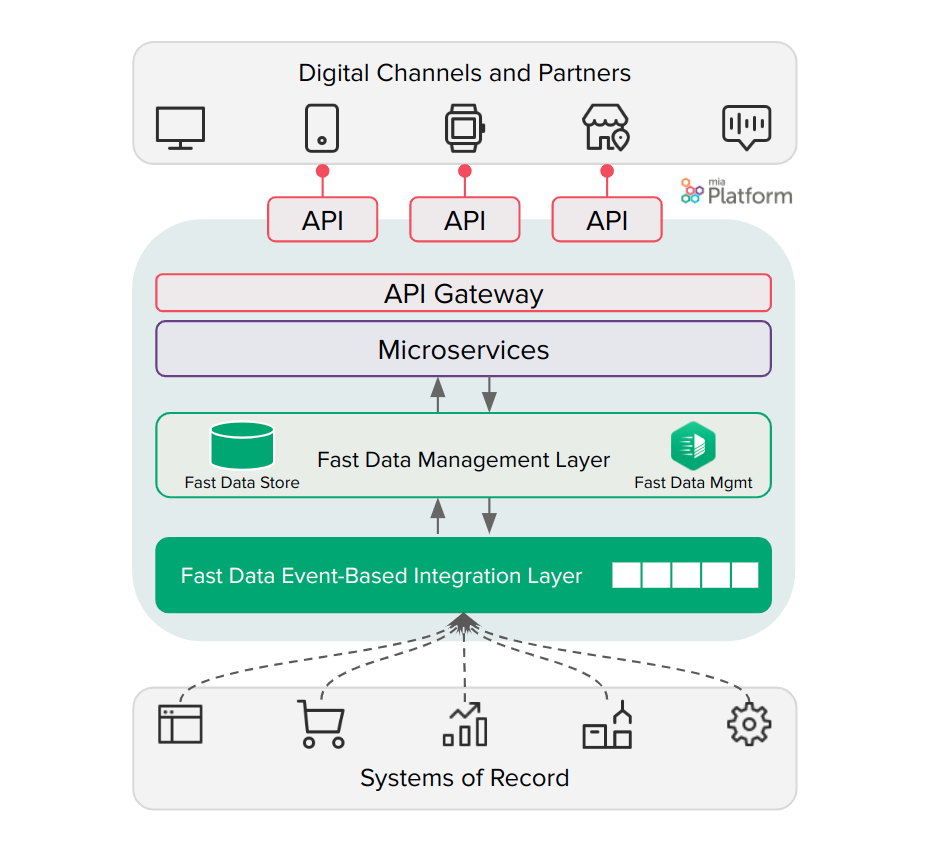
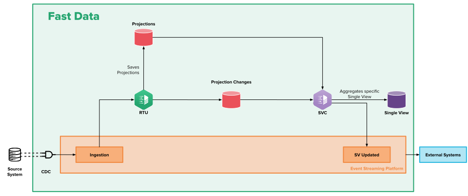
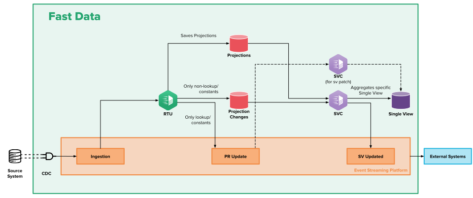
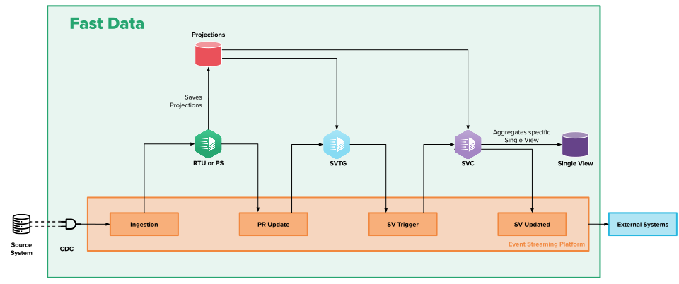
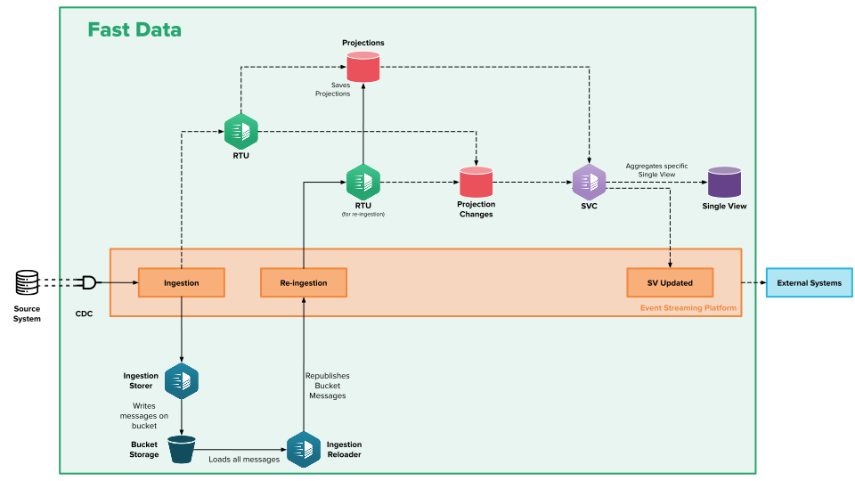

On this page, you will find:
* An overview of the services and technologies used in a Fast Data system; 
* A discussion over the architecture.

## Overview

Fast Data is based on a group of services that communicate with each other via events sent on **Kafka** or **MongoDB**, and persisting Projections and Single Views on MongoDB.
This architectural setup allows for **great horizontal scalability**.

## Services

### Real-Time Updater (RTU)

The Real-Time Updater is responsible for listening to the events concerning changes to the System of Record (SoR) and updating the Projections accordingly. Optionally, the RTU can perform other activities:

* Emit `Projection Update` events, notifying the listener that a certain Projection has been updated;
* Check which Single Views should be updated, and emit the relevant `Projection Change` event.

It is up to you to decide whether to make it execute any of these, based on the architecture you prefer to build. For example, if having your Projections up to date in a very short period of time is crucial for your business, you might want to skip the part where you check which Single Views should be updated, delegating this job to the Single View Trigger and decreasing the overhead of the RTU.

### Projection Storer (PS)

Projection Storer service is an alternative to the Real-Time Updater that can be employed when configuring Fast Data event-driven architectures. Its goal is to ingest, clean and filter change events, transforming them into projections records to be stored onto the storage system (e.g. database).
It has a compatible input and output interface with Real-Time Updater, which means Projection Storer still consumes [ingestion events](/fast_data/inputs_and_outputs.md#ingestion-message)
and emits [pr-update events](/fast_data/inputs_and_outputs.md#projection-update-message) once it has stored projection records on the storage system.

Compared to the Real-Time Updater it offers an overhauled and improved configuration experience and enhanced performances. When starting new Fast Data projects, it is strongly recommended to deploy this service instead of the Real-Time Updater. Furthermore, whenever possible, it is advised to migrate existing Fast Data configuration toward the use of an event-driven architectures and replace Real-Time Updater services with Projection Storer ones.

A migration guide can be found [here](/fast_data/configuration/projection_storer.md#migration-guide) and a command-line is available to all customers to facilitate their transitioning towards the adoption of Projection Storer as entrypoint for Fast Data system. 

### Single View Trigger Generator (SVTG)

The Single View Trigger Generator listens to `Projection Update` events, performing the logic needed to get the identifiers of all the Single Views that need to be updated, and emits the relevant `Projection Change` or `sv-trigger` events.
This activity can be performed by the RTU as well. Using the SVTG is recommended for a faster update of Projections, and a greater fault tolerance for the RTU.

### Single View Creator (SVC)

The Single View Creator reacts to Projection Change or `sv-trigger` events, updating the Single Views by aggregating the relevant data. It can optionally emit `Single View Event` and `Single View Before After` events.
If the service is configured to read the `Projection Change` events on Kafka, then it will use the usual publish/subscribe pattern, granting support to horizontal scalability and fault tolerance with ease.
If the service is configured to read the `Projection Change` events on MongoDB, then it will poll MongoDB to check if there are any events that need to be handled. To avoid concurrency problems, it reads atomically and marks the `Projection Change`, so that other SVCs won't start processing the same data.

## Other Services

### Connectors

The Connectors are the components responsible for transmitting the changes that occur within your systems (e.g. create, update, or delete operations) to the event streaming platform in near real-time.

Depending on how changes are produced, where your source data is stored, and how they can be accessed there can be different ways to produce the corresponding change event on the Fast Data ingestion topics. When data is stored on a database and the changes to be monitored are the action on the database itself, exploiting a Change Data Capture (CDC) system is usually recommended. This system works by detecting changes in the database and emitting the corresponding events in near real-time on the configured event streaming platform so that subsequent components can process the events.

### Bucket Storage Support

The Bucket Storage Support is a feature that enables the storing of messages flowing through a channel into an external object storage system, such as a [Google Cloud Storage bucket](https://cloud.google.com/storage) or any bucket compatible with [Amazon AWS S3](https://aws.amazon.com/s3/) interface. Such an external archiving system can be configured to retain saved messages for a very long time and it enables a large array of different applications and processing over the stored data, promoting different types of access to the messages. The main feature is the ability to replay onto a channel messages that were previously read and stored in the bucket.

## Technologies

Fast Data revolves around three major technologies: Kubernetes, Kafka, and MongoDB.
The Kubernetes part is pretty much standard, and thanks to the Console, you won't need to directly deal with it, but will still enjoy all its advantages.

On the other hand, Kafka and MongoDB can be used in different steps of the process, and are thus discussed in the following subsections.

### Kafka

Kafka is a distributed event streaming platform, and it is used for most Fast Data events, starting from the ones produced by the CDC, up to the ones produced by the SVC.
For some intermediate data, however, it is possible to choose whether you want it on Kafka or MongoDB, that is the case for `Projection Change` events.

Kafka is very reliable and has great support for topic partitioning. This enables horizontal scalability since it is possible to have multiple replicas of the same service: each replica will read from its own partition, granting all the required properties and speeding up the process. This way, it is as close to being real-time as possible.

### MongoDB

MongoDB is a non-relational data store, used for storing Projections, Single Views, and some intermediate data, namely `Projection Change` and `Single View Error` collections.
In the case of Fast Data, the Projection, and Single View collections are saved in a format that is compatible with the CRUD service, which opens a ton of possibilities for exposing new services and consuming data in innovative ways.

MongoDB is great for horizontal scalability.

#### CRUD Service

Since the MongoDB collections are compatible with the CRUD Service and are automatically registered by the Console, they are ready to be exposed as APIs and are easily customizable (e.g. adding indexes just requires a few clicks in the Console). This allows you to easily connect them to the CMS, your applications, analytics, and third-party software.

## Putting it all together

The Fast Data architecture can be configured in various ways depending on your needs. There are no hard constraints, but generally, all the services belong to the same Kubernetes namespace, while the MongoDB and Kafka instances can be on managed hosts, on the same cluster, on-premise, etc.

The System of Record usually belongs to a different network portion, far from all the processing logic, since they must be kept independent of all the Fast Data flow, with the only exception of the CDC being connected to them. 

### Standard Architecture

The standard architecture is rather streamlined, with just a couple of pivot points. A regular flow of information follows this path:
1. The CDC emits an event stating that some data in the SoR has changed;
2. The RTU performs the normalization of the messages received by the CDC to select the ones of interest and makes them adhere to a standard of interest, and then stores the transformed events as Projections Records on MongoDB;
3. The RTU computes and emits a `Projection Change` and saves it on MongoDB;
4. The SVC reads the `Projection Change`by polling MongoDB. Then, it aggregates the Single View using the new data and stores it in MongoDB.
   1. The SVC emits a `Single View Update Event` if it is configured to do so. 

### Standard Architecture with an SV-Patch

:::info
Everything related to the Standard Architecture is also valid with an SV-Patch.
:::

Aggregation is not the only way possible to update Single Views, there is also an alternative called SV-Patch. This kind of operation is strongly recommended when a field of a Projection record that is in common with a vast portion of Single Views, is updated. Example of this type of fields can be a zip code or an internal product code.  
With this operation, the Single View Creator performs a Mongo update starting from the update of a single Projection record, without regenerating the whole Single View. For an SV-Patch, the flow of information is as follows:
1. The CDC emits an event stating that some data in the SoR has changed;
2. The RTU performs the normalization of the messages received by the CDC to select the ones of interest and makes them adhere to a standard of interest, and then stores the Projections on MongoDB;
  1. The RTU emits a `Projection Update` event (only for lookup/ constants);
4. The RTU computes and emits a `Projection Change`  (only for non-lookup/ constants) and saves it on MongoDB;
5. A second SVC, dedicated to SV-Patch operations, that consumes the `Projection Update` messages from the RTU and then uses them to aggregate the Single View and stores it in MongoDB.
   1. The SVC emits a `Single View Event` if it is configured to do so. 

Click on [this link](/fast_data/configuration/single_views.md#single-view-patch) for more details on SV-Patch configurations.

### Event-Driven Architecture

As mentioned previously, you can use the SVTG service to keep your projections updated as quickly as possible. The SVTG will unload the RTU by taking up some of its responsibilities. For such an architecture, the information will flow as follows:
1. The CDC emits an event stating that some data in the SoR has changed;
2. The RTU performs the normalization of the messages received by the CDC to select the ones of interest and make them adhere to a standard of interest, and then stores the Projections on MongoDB;
   1. The RTU emits a `Projection Update` event;
3. The SVTG accesses the Projections database in order to compute the identifier of the Single View to be generated, then computes and emits an `sv-trigger` event, sending it to Kafka;
4. The SVC reads the `sv-trigger` message by reacting to the Kafka message. Then, it aggregates the Single View using the new data and stores it in MongoDB.
   1. The SVC emits a `Single View Update Event` if it is configured to do so. 

### Alternative Event-Driven Architecture

For the sake of being retro-compatible, you can configure the SVTG to compute and emit `Projection Change` events instead of `sv-trigger` events, and save it on MongoDB. Then the SVC will use the `Projection Change` collection to aggregate the Single View as in the [Standard Architecture](#standard-architecture). Such an architecture will look like this:

### Architecture with Bucket Storage Support

Bucket Storage Support can be seamlessly integrated into any Fast Data architecture by attaching it to the same projection ingestion topics coming from the CDC. Paired with a Standard Architecture, the flow of information will look similar to this:

Click on [this link](/fast_data/bucket_storage_support/overview.md) for more details on Bucket Storage Support.
