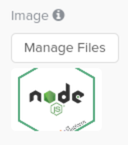
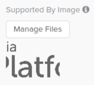
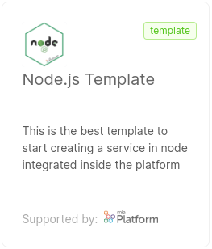

As a Console user, you can contribute to the Marketplace by creating new items of any kind. You can choose to make them available on the internal Company, or request for them to be published.

In this section, we dive into the process of creating a new item for the Marketplace, analyzing the main differences between different types of items and providing some configuration examples.

:::info

There are different methods to manage Marketplace items, described in details in the [related page](/marketplace/add_to_marketplace/manage_marketplace_items.md)

:::

## Public and Internal Company Marketplace

The **Mia-Platform public Marketplace** is the place where every Company can find most of the items needed to set up its Project architecture. It is publicly available on Mia-Platform Console, meaning that all Companies can view and make use of its items.

However, a Company might want to have its own internal Marketplace, fulfilled also with items that must not be shared with everyone else outside the Company.


## Creation of a Marketplace Item

Creation of a Marketplace item consists of two steps. The first is writing a Marketplace Item configuration file, then you have to upload it to the Console.

You have to ways to upload the item file:

- by using [`miactl`](/cli/miactl/10_overview.md), the official Mia-Platform CLI tool (recommended)
- by creating it in the CMS

Company Owners and Project Administrators can create, delete and update those Marketplace items exclusively available for their Company, but they cannot manage public Marketplace items.  
The Console Super User role, instead, has permission to manage all Marketplace items from the CMS without any limitations.

### Deciding whether to create a private or public Marketplace item

The choice between a private and public Marketplace involves benefits on both sides that should be carefully analyzed before making a decision.

Creating an item within the private Marketplace is undoubtedly the better choice when you want to make something highly specialized available for the specific use cases of your Company. If the item cannot be generalized and would have little value for other Companies, then a private Marketplace is the way to go. Additionally, in this case, creating items within the private Marketplace allows for complete ownership in managing them, resulting in a faster maintenance process.

On the other hand, publishing your items in the private Marketplace leads to a loss of corporate visibility that you would otherwise have by making your item publicly available in the Marketplace. It also means missing out on the opportunity to receive reviews from the Mia-Platform team and potential external contributions that can help your product grow and improve more rapidly.

:::info

To create Marketplace items you need to be a *Company Owner* or a *Project Administrator* at Company level.

Company Owners and Project Administrators can create, delete and update those Marketplace items exclusively available for their Company, but they cannot manage public Marketplace items.  
The Console Super User role, instead, has permission to manage all Marketplace items from the CMS without any limitations.

If you want to contribute to the **Mia-Platform Marketplace** by making your Marketplace item accessible to other Companies, you can visit [this page](/marketplace/add_to_marketplace/marketplace_items_accessibility.md).

:::

:::info

To learn how to migrate an item from the public to private Marketplace and vice versa, please refer to the [dedicated page](/marketplace/add_to_marketplace/change_marketplace_item_visibility.md).

:::

### Marketplace item visibility and the `tenantId` field

When creating a new Marketplace item, you always need to set the `tenantId` related to the Company you are creating the item in.

You can also contribute to the **Mia-Platform Marketplace** by making your Marketplace item accessible to other Companies: visit [this page](/marketplace/add_to_marketplace/marketplace_items_accessibility.md) for further information on this point.

:::caution

Not setting the `tenantId` is no longer supported and deprecated.
Elements without `tenantId` will be public even if the `visibility.public` field is not set.

This behavior might change in the next Console releases.

If you have any item without the `tenantId` property set, we recommend to do the following:
- set the `tenantId` to any of your companies;
- set the `visibility` field according to your needs. See the [related doc](/marketplace/add_to_marketplace/marketplace_items_accessibility.md#marketplace-item-visibility) for more information on this point.

:::


## Marketplace items

A Marketplace **Item** (also referred to as **Component**) is the basic unit of the Marketplace and represents a software resource available for use within Mia-Platform Projects.

These components provide various functionalities and can be integrated into Mia-Platform Projects to streamline development and configuration processes.

The Mia-Platform Marketplace contains items belonging to many types, with different use cases.

To use a Marketplace item in a Project, a user have to **create** it; depending on the type, the creation of an element has different consequences on the Project.

### Item Types

The Marketplace is composed of items with the following types.

- **Plugins**: items for which users have no access to the actual code. Users will still be able to download their Docker image, in order to configure and use them within their Projects.
- **Templates** and **Examples**: archives for which a new repository is generated. The developer will have direct access to the new repository (created in their Project scope) and will be able to evolve its code at will. A template is a repository that, net of the development environment and framework setup, is empty; an example, instead, also implements some features tailored to help the user better familiarize with the development environment.  
- **Applications**: bundles of resources that can be created and configured in the Mia-Platform Console within a few clicks. [Applications](/marketplace/applications/mia_applications.md) are composed of microservices (Plugins, Examples, and Templates), endpoints, CRUD collections, and public variables. Users can monitor if all the resources composing an application have been correctly set up inside the project, as well as access their corresponding repository or configuration.  
- **Proxy**: specific configurations used to invoke APIs that are not part of the current project but may be exposed by an external provider or another project. You can find more information about proxies in this [section](/development_suite/api-console/api-design/proxy.md).  

:::note

Marketplace items are identified by a **Category** (e.g. Data Stream, Data Visualization, Insurance, Healthcare... ).

:::

## How to configure a new item

Each Marketplace item is identified by a specific data model (a JSON document).

In the following section we'll explore the common fields shared by all marketplace item types.

Refer to the [detailed explanation by type](#marketplace-items-example-and-explanation) for the type-specific fields and examples of working JSON marketplace items entities.

Here below are listed all the properties that must be provided for each type of item:

- **`name`** (required): the item name appearing in the Marketplace card
- **`description`**: a brief description (10 to 20 words) regarding the service functionalities
- **`type`**: the type of your item (plugin, template, example, application, or proxy)
- **`comingSoon`** and **`releaseStage`**: properties to identify the maturity of the item (learn how to configure them in a [dedicated section](#the-release-stage-of-a-new-item) later on this page)
- **`categoryId` **: a label to help categorize items by their purpose or use case. As specified before, categories are only created internally at Mia-Platform. The `categoryId` of a item uniquely specifies both the specific category and sub-category (e.g. Start from Code (category) - Node.js (subcategory) will be identified by the `categoryId` "nodejs"). The [available category IDs](#category-list) are listed below.
- **`supportedBy`**: a label to identify the company that has produced the item (only used if `supportedByImage` is not provided)
- **`tenantId`** (required): the ID of the Company the item belongs to
- **`imageUrl`** and **`supportedByImageUrl`**: respectively the image that will be associated with the item and the image that will be associated with the company that has produced it.

### Common to microservice items (Plugins, Templates, Examples)

:::info

This step does not apply to Applications

:::

Each property described in the following paragraphs regarding the microservices configuration must be configured under the property `resources/services/:serviceId` as follows:

```json
{
  "name": "Service Name",
  ...
  "resources": {
    "services": {
      "service-id": {
        "defaultEnvironmentVariables": [...],
        "defaultConfigMaps": [...],
        ...
      }
    }
  }
}
```

The serviceId **must** be in `kebab-case` format.

Here below are listed all the properties that you can provide for each microservice item:
  
- **`itemId`**: a unique item id that can be used to identify the item and all the services generated from it. Each service created using this item will have the identifier value in the **sourceComponentId** property.
- **`defaultEnvironmentVariables`**: the environment variables that will overwrite the default environment variables applied by DevOps Console.  
  In particular, for each of them you need to provide:  
  - **`name`**: the variable name (generally, a key written in `UPPER_SNAKE_CASE`)
  - **`value`**: the variable default value
- **`defaultConfigMaps`**: the default ConfigMaps, if any, that will be mounted inside the container of the microservice.  
  In particular, for each of them you need to provide:  
  - **`name`**: the name of the ConfigMap
  - **`mountPath`**: the directory where the ConfigMap data will be added  
  
  You can also provide:
  - **`files`**: a list of files where the ConfigMap data will be stored. Each file should be an object with the following properties:
    - **`name`**: the name of the file
    - **`content`**: the initial content of the file
  - **`usePreserve`**: a boolean the indicates whether the existing files and directories in the mountPath directory should be preserved or not. If not set, it will be considered as false.
- **`defaultSecrets`**: the default secrets, if any, to be mounted inside the container of the  microservice.
  In particular, for each of them you need to provide:  
  - **`name`**: the name of the secret file  
- **`defaultProbes`**: the readiness and liveness paths of the service. By modifying the map of the probes, you can overwrite the default paths applied by DevOps Console.
- **`defaultLogParser`**: one of the following log parser types:
  - `mia-plain`: collects logs but does not parse them
  - `mia-json`: parses JSON logs based on the documented format
  - `mia-nginx`: parses logs of Nginx that were created using templates and services of Mia-Platform (website and api-gateway)
- **`defaultAnnotations`**: the service annotations, which can be used to provide additional information about your services for various purposes (such as configuration, monitoring, or automation). The annotations that start with `mia-platform.eu` are reserved, you are not allowed to use them.
  The field is an array of objects that represent the labels. Each object has the following fields:
  - `name`: the name of the label,
  - `value`: the value of the label,
  - `description`: description of the label,
  - `readOnly`: boolean that represent if you can change the value of the label through the
- **`defaultLabels`**: the service labels, which can be used to categorize, group, and select your service. The labels that start with `mia-platform.eu` are reserved, you are not allowed to use them.
  The field is an array of objects that represent the labels. Each object has the following fields:
  - `name`: the name of the label,
  - `value`: the value of the label,
  - `description`: description of the label,
  - `readOnly`: boolean that represent if you can change the value of the label through the Console
- **`defaultDocumentationPath`**: the APIs documentation path.
- **`defaultResources`**: CPU and memory limitations of the service, which can be used to overwrite the default limitations imposed by DevOps Console for these parameters.
- **`visibility`**: this property determines the visibility of the Marketplace item you are creating. If not set, the service will only be visible within the specified Company mentioned in the tenantId property.
  - **`allTenants`**: a boolean that indicates whether your service should be visible to all other Companies, making it accessible if set to `true`.
  - **`public`**: a boolean that indicates wether the Marketplace item is public and visible also to not logged in users.
- **`providerId`**: the id of the provider that should be used to perform Git operations on your Marketplace item repository. If left unset, your project Git provider will be used instead.

:::caution

Please note that in this configuration **`min`** corresponds to the **`request`** value while **`max`** corresponds to the **`limit`** value specified in the Kubernetes documentation.  

In addition, measurement units are required. Resources are expressed in terms of milliCPUs (m) and MebiBytes 
(Mi) respectively for CPU and Memory.

:::

#### Configure Console Links

A service created from the Marketplace can feature custom links to other Console pages, managed by different microfrontend Plugins. To configure them on newly created services set up new objects in the `links` property for each template or plugin you wish.

A link is an object shaped as follows:

- **`label`** *string* (required): the label to be shown in the link button, does not support internationalization and it is shown right next to a  *View* copy (e.g. with the label set to **Resource** the resulting button will be **View Resource**);
- **`targetSection`** *string* (required): the name of the registered microfrontend where the link should land (e.g. `flow-manager`);
- **`enableIf`** *string*: the name of a feature toggle to be used to optionally display the link.
  
### Adding images

The procedure of adding images differs if you are using CMS or `miactl`.

#### With `miactl`

To upload the *image* and *supportedByImage* with the `miactl marketplace apply` command, you need to add the respective `image` and `supportedByImage` keys to the object.

Refer to the [related miactl documentation](/cli/miactl/30_commands.md#apply) to know the exact specifications of such object.

#### With the CMS

It is possible to add images using dedicated input fields:  

 

The final result will be as follows:  




### The Release Stage of a new item and Coming Soon

From the CMS of the Console, users can associate items with a **release stage** label that will help users identify the maturity of the item.

There are 2 fields that define the release stage of an item: `comingSoon` and `releaseStage`.

The `comingSoon` field is boolean, setting it to true will show the "Coming Soon" label and will prevent users to use the item.

The `releaseStage` field can have the following values

- preview
- beta
- stable
- deprecated

The fields are not required: if not specified, no label will be shown on the item.

:::info

Setting both the `releaseStage` and the `comingSoon` fields is not permitted and would lead to inconsistencies; please set either field or none according to the item lifecycle status.

:::

Refer to the [Items Lifecycle](/marketplace/overview_marketplace.md#marketplace-item-lifecycle) section for details about each specific release stage.

## Marketplace Items example and explanation

Refer to the detailed explanations and examples for each item type:

- [Plugins](/marketplace/add_to_marketplace/add_item_by_type/add_plugin.md)
- [Templates and Examples](/marketplace/add_to_marketplace/add_item_by_type/add_template_or_example.md)
- [Plugins](/marketplace/add_to_marketplace/add_item_by_type/add_application.md)
