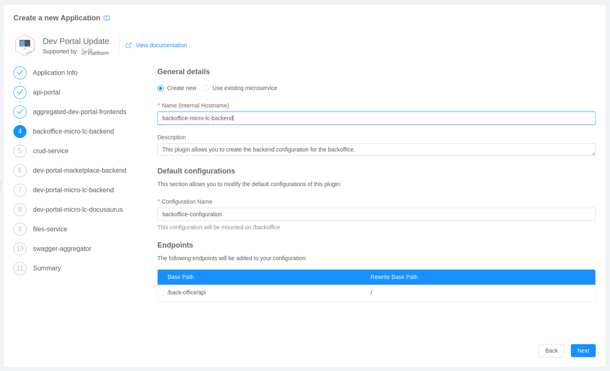
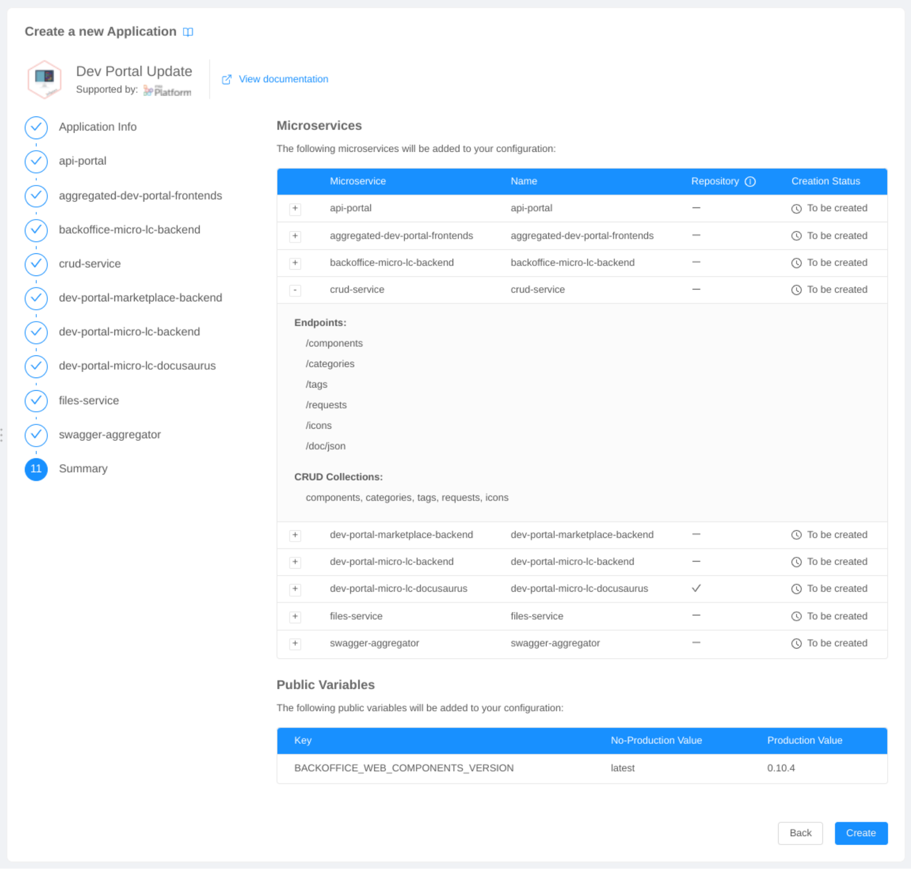
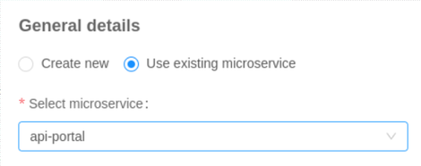
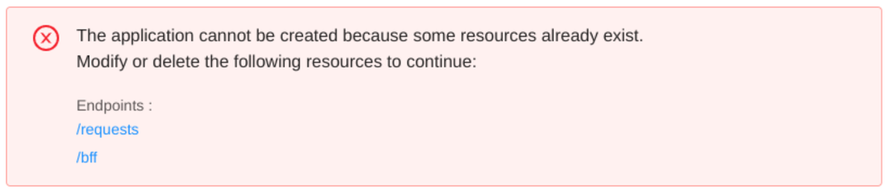
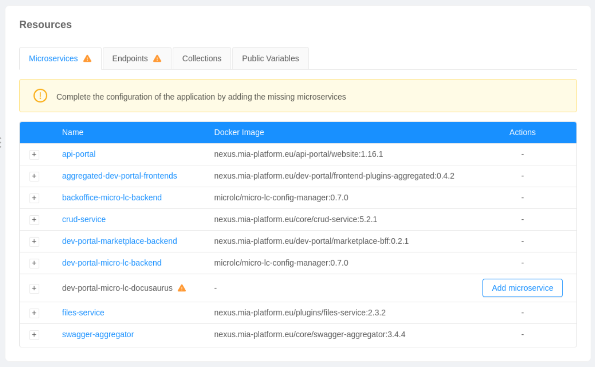

An **Application** represents a useful way to instantiate and configure, through a unified experience, a bundle of resources: 

- [**Microservices**](/development_suite/api-console/api-design/services.md) (Plugins, Examples and Templates)
- [**Endpoints**](/development_suite/api-console/api-design/endpoints.md)
- [**CRUD Collections**](/development_suite/api-console/api-design/crud_advanced.md)
- [**Public Variables**](/development_suite/api-console/api-design/public_variables.md)

:::info
You can easily access all the available applications from the Design area of the console: 
- move to the applications section;
- click `Create New Application`.

You will be redirected to the [Marketplace](/marketplace/overview_marketplace.md), already filtered by **_Application_** type.
:::

## Creating an Application

An application provides a unified and user-friendly instantiation experience. 

In a few clicks, users will be able to create a working system of resources. 
Thanks to a wizard, indicating all the configuration steps, users will be able to rapidly move through all the microservices included in the application, and customize them with a creation form. 

Each configuration step, beside the microservice details and configurations, will give the user the possibility to see all the endpoints and CRUD collections (only for the CRUD-service) that will be created along with that specific service:

The final configuration step will finally give the user a complete overview of the resources that are going to be created with the application, including also public variables:

After clicking `Create`, a creation modal will inform the user about the resources being currently created.

### Handling Conflicts

During the creation of an application, it might occur that some resources already exist in the project, causing a creation conflict.

When a **microservice** required by the application matches a pre-existing one, it will be possible, using the creation form, to link the already existing service to the application instead of creating a new one:

If other types of resources (**endpoints**, **collections**, and **public variables**) match pre-existing ones, a warning message will appear instead, blocking the entire application creation:

From the conflicts warning message, users will be able to directly move to the detail page of the resources causing the conflicts, in order to be facilitated in their deletion.

## Managing an Application

Once the application has been created, you'll be redirected to the application detail page. 

On this page, users will be able to review the creation process of an application and understand which resources have been correctly created. 
In fact, due to errors of various kinds, some resources might not have been correctly added to your configuration during the creation process (e.g. by selecting an already existing repository when creating a template).

:::note
Applications generally follow the assumption that **all the resources included in the creation bundle need to be created** in order for the application to work properly. 

Hence, in the summary table, missing resources will be highlighted with a warning icon.
:::

From the summary table, it will be possible to:

* move to the detail page of a single resource by clicking the corresponding linked property: 
  * **name** for microservices, collections and public variables;
  * **basePath** and **microservice** for endpoints.

* visit the corresponding git repository by clicking the `View Repository` button (only for resources creating a repository, e.g. templates).
  
* add a missing resource by clicking the `Add {resource}` button:
  * microservices will open a new creation form;
  * endpoints, collections, and public variables will be directly created.

:::caution
The `Add {resource}` button could be disabled for certain resources. This behavior usually indicates that another resource, for which the current one has a dependency, needs to be created previously.

For instance, it will not be possible to create an endpoint if the microservice, to which the endpoint is linked, is currently missing.
:::

## Deleting an Application

:::info
When deleting an application, all the resources created with that application will remain unchanged in your configuration. 
:::

As a matter of fact, applications need to be thought of more as creation bundles rather than sets of resources. 

The very aim of an application is, in fact, to keep track of whether a certain configuration has been correctly applied to a project while remaining quite agnostic about the resources' actual implementations. 

**Resources created with an application can be deleted as usual from their detail page**. After manually deleting a specific resource, it will be set as missing in the application summary table. However, keep in mind that the application might no longer be able to work properly.
