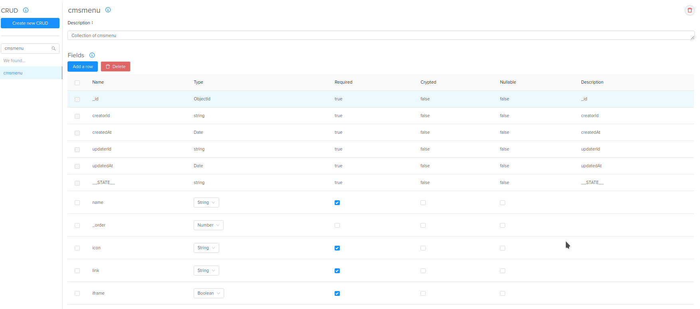
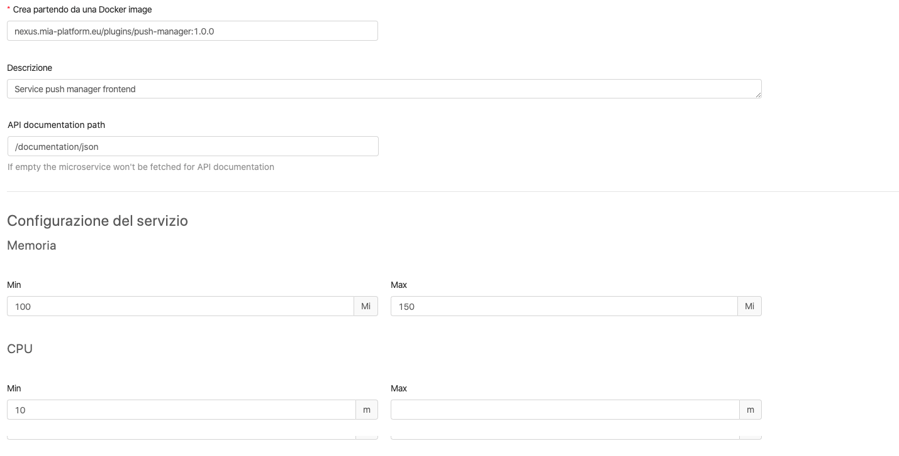
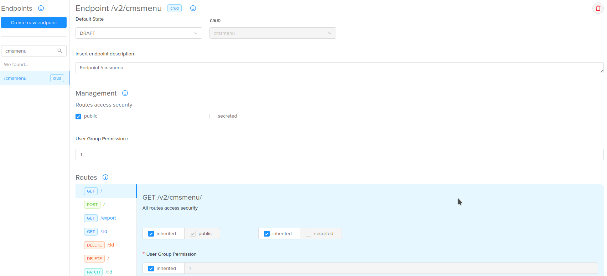
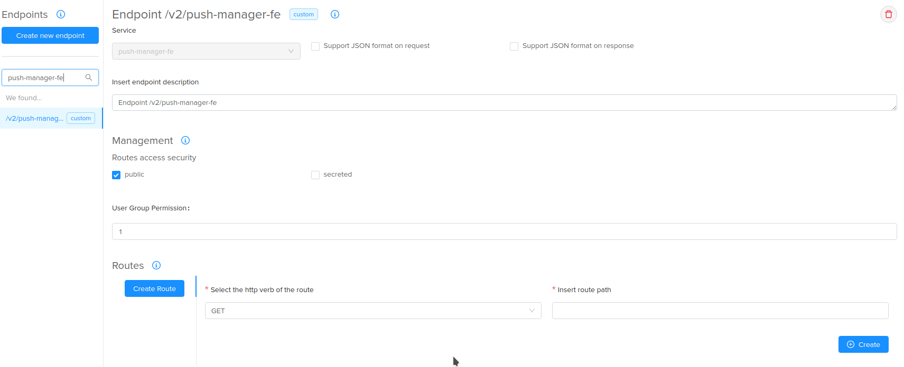
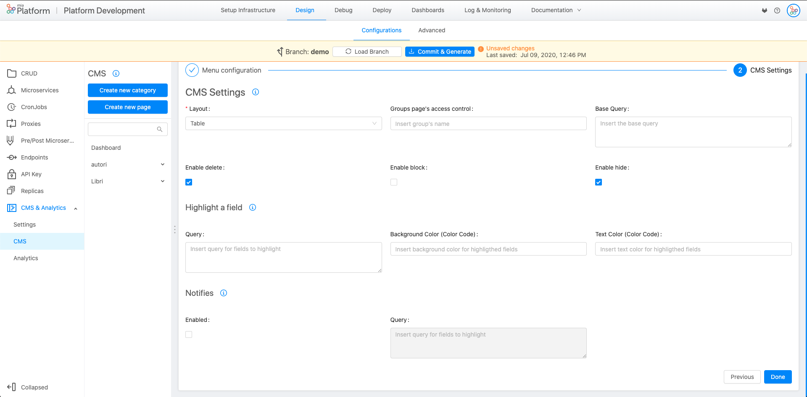
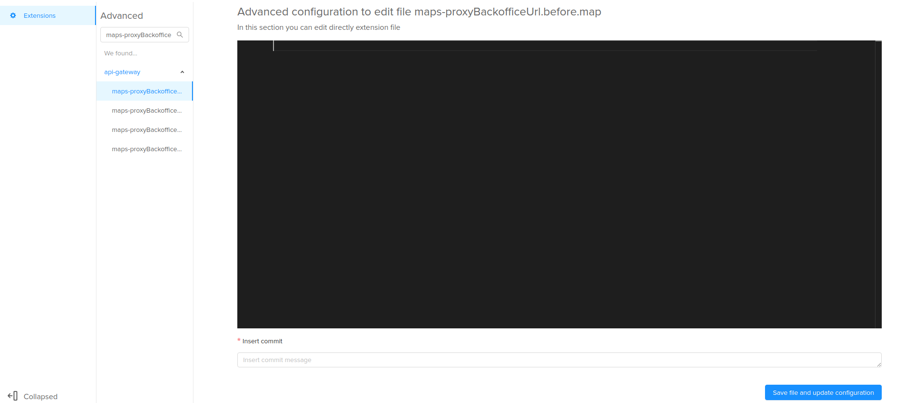
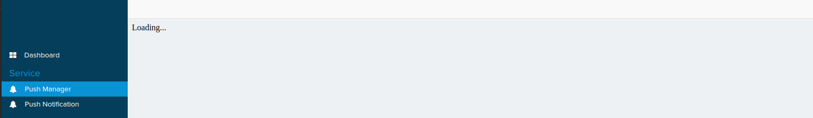

The CMS provides a way to dynamically integrate external custom frontends into a dedicated side menu option.

To integrate this functionality there are steps to follow, all through the API Console.

## Integration requirements

Following the requirements to integrate this  functionality:

* access to the API Console into the desired project;
* a custom frontend already Dockerized;
* basic knowledge about the Console [backoffice proxy name](/development_suite/api-console/advanced-section/api-gateway/how-to.md#request-from-the-frontend---port-8080) and [backoffice proxy url](/development_suite/api-console/advanced-section/api-gateway/how-to.md#how-to-forward-a-request-to-another-url) customizations.

Note that this guideline is base on the Console version 5 and CMS version 7.x.x

## Integration steps

Following the steps to integrate this functionality into the desired CMS.

> All the steps to do are on the Console

#### 1. CRUD - __cmsmenu__ creation

First of all you need a CRUD named __cmsmenu__ where you can store the menu options you want to create:

 1. Click on CRUD
 2. Click on __Create new CRUD__
 3. Create the CRUD with the following data:
    * **name**: cmsmenu
    * **description**: insert a custom description
    * **rows**:
      * `name`: String (Required)
      * `_order`: Number (Optional)
      * `icon`: String (Required)
      * `link`: String (Required)
      * `iframe`: Boolean (Required)
      * `groups`: Array (Required since Mia-Platform v5.6.1)  
      * `cmsProperties`: Object (Optional)
     

#### 2. Service - create the microservice for your frontends

You also need to add the  microservice of the frontends that you want to integrate into the CMS; note that
the microservice must be already Dockerized.

 1. Click on Services
 2. Click on __Create new service__
 3. Select __Create from an existing Docker image__
 4. Create the microservice with the following data:
    * **name**: the name of your microservice
    * **Docker image**: the url of your docker image
    * **description**: insert a custom description
    * the result will be something like this 

#### 3. Endpoints - create the endpoints

The CRUD and the microservice are not reachable until you create the corresponding endpoints through the
following steps:

* **cmsmenu endpoint**:
    1. Click on endpoints
    2. Click on __Create new endpoint__
    3. Create the endpoint with the following data:
        * **base path**: cmsmenu
        * **type**: CRUD
        * **description**: insert a custom description
        * the result will be something like this 

* **Microservice endpoint**:
    1. Click on endpoints
    2. Click on __Create new endpoint__
    3. Create the endpoint with the following data:
        * **base path**: /custom-service-path
        * **type**: Microservice
        * **description**: insert a custom description
        * **Remember to uncheck the two fields** `Support JSON format on request` **and** `Support JSON format on response`
        * the result will be something like this 

#### 4. CMS configurations (optional)

If you want to manage the custom menu configuration through the CMS you can create a page linked to the __cmsmenu__ CRUD.
This step is optional and not needed for the integration but useful to manage the configuration.

 1. Click on CMS and Analytics
 2. In the submenu, click on CMS
 3. Click on __Create new page__
 4. Create the page with the following data:
    * **name**: the label that you want to visualize
    * **endpoint**: /cmsmenu
    * **category**: the category in which you want the page
    * **icon**: insert the name of a [Fontawesom Icon](https://fontawesome.com/), **without** the __fa__ prefix (e.g. __bell__ for the notification bell)
 5. Click on the __Next__ button
 6. Select the __table__ Layout and eventually the group expression for the accesses
 7. Finish, the result will be like this 

#### 5. CRUD __cmsmenu__ - insert data

It's time to insert the menu data in the __cmsmenu__ CRUD to make the menu option visible.

`name`: the name you want to visualize in the menu

`_order`: the order of the page inside the category

`icon`: the name of the icon visible in the menu

`link`: the endpoint created for the microservice (and the path you want to reach in your frontend)

`iframe`: true if you want to open the frontend in the iFrame, false if you want to open in another tab

`groups`: you can set the required groups a user needs to be able to see the menu in the CMS

`cmsProperties`: is an optional property which allows you to set some additional experimental properties not yet added directly to the console interface:

- `category`: expects an object with the property `name:string` and allows you to define under which category to place the custom frontend.

:::caution
**NB**: the name you assign must be created, otherwise you'll have the custom frontend sorted under a category named `Undefined`
:::

To do this you have two ways:

* insert the data in the CMS in the __cmsmenu__ CRUD: insert a new object specifying the fields.

    Example of the __Push Manager__ microservice:

  - `name`: Push Manager
  - `_order`: 1
  - `icon`: bell
  - `link`: /v2/push-manager-fe/
  - `iframe`: true
  - `cmsProperties.category.name`: Push Manager

    In this case the frontend is called in the path `/`. If we wanted to reach the path home you need to put this path
    in the link: /v2/push-manager-fe/home.

    Publish your content  with the publish button.

* make a POST to the __cmsmenu__ endpoint with the following body:

    Example of the __Push Manager__ microservice):

    ```json
    {
        "name": "Push Manager",
        "_order": 1,
        "icon": "bell",
        "link": "/v2/push-manager-fe/",
        "iframe": true,
        "groups": ["admin"],
        "cmsProperties":{
            "category":{
                "name":"Push Manager"
            }
        },
        "__STATE__": "PUBLIC"
    }
    ```

#### 6. Backoffice proxy - Advanced configuration

The last step is to configure the route to go in the correct microservice. To do this you need to go in the advanced section
of the console and manage the Api Gateway backoffice files.
The extensions to customize are:

* __maps-proxyBackofficeName.before.map__ to map an endpoint to a microservice name.

    Example for the Push Manager microservice:

    ```
    "~^secreted-1-GET-/v2/push-manager-fe/" "push-manager-fe";
    "~^(secreted|unsecreted)-(0|1)-\w+-/v2/push-manager-fe/" "unauthorized";
    ```

* __maps-proxyBackofficeUrl.before.map__ to proxy an endpoint to another url.

    Example for the Push Manager microservice:

    ```bash
    "~^GET-/v2/push-manager-fe/(?<path>.*|$)$" "$path";
    ```

 According to your use case you can put the customization in both `before` or `after` file.

To customize these files:

 1. Click on Advanced
 2. Click on api-gateway
 3. Search __maps-proxyBackoffice__
 4. Customize the configurations
 5. Save and commit 

 It's time to deploy the configuration.

## Result

Once the configuration is deployed you will see the result in the CMS as follows 
