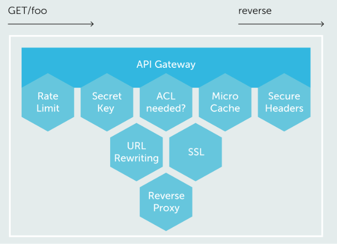

<!--
WARNING: this file was automatically generated by Mia-Platform Doc Aggregator.
DO NOT MODIFY IT BY HAND.
Instead, modify the source file and run the aggregator to regenerate this file.
-->

The API Gateway is the microservice responsible for:

- routing requests to the correct service inside Kubernetes;
- verify the need of authentication and orchestrate the conversation with Auth service.

Its main features are:

- URL Mapping
- Rate Limit with Burst
- Http Secure Headers
- Request Dispaching
- [API Key](../../development_suite/api-console/api-design/api_key.md) Management
- Http Utilities
- Proxy-Pass Plain
- URL Rewriting
- Microcache

The API Gateway works with an additional service, called _Dnsmasq_, which functionality is to resolve service names with its correct IP within our Kubernetes. The _Dnsmasq_ service will be added automatically as an additional container to the deployment and it does not need any configurations in order to work.

## Architecture

The service exposes two different ports for allowing differentiation between application and backoffice routing.
The application one will be exposed on port 8080, and the backoffice on port 8081: then through the DNS it will allow to have different urls for the two servers.

## Edge Router

Edge Router is part of the API Gateway module and protects the API Gateway guaranting:

- SSL termination;
- route dispatching.

### Certificate Management

The Edge Router manages the termination of the SSL certificates with auto-renew on Let's Encrypt.

:::info
Let's check the [configuration directories](./configuration#configuration-directories) and the [advanced configuration](../../development_suite/api-console/advanced-section/api-gateway/how-to) to more details.
:::
