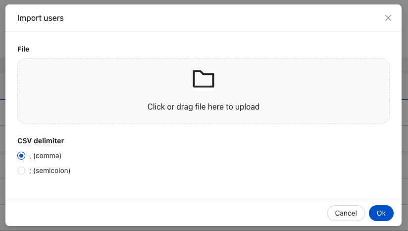

The `ck-import-users-modal` web component is used to import and activate a set of users from  a csv file.
The operation is done by importing the users's by creating a job on the [user-manager-service][user-manager-service] and waiting for its completion by polling the job status.



## Usage

In order to open the ck-import-users-modal in a Microfrontend Composer, a configuration is needed to configure a button to emit the custom event `import-users-modal-modal` with payload `{"open": true}` . 
An example configuration follows:

```
{
  "type": "element",
  "tag": "bk-button",
  "properties": {
    "iconId": "UploadOutlined",
    "content": "Import users"
  },
  "clickConfig": {
    "type": "event",
    "actionConfig": {
      "label": "import-users-modal",
      "payload": {
        "open": true
      }
    }
  }
},
{
  "type": "element",
  "url": "/mia-care-web-components/mia-care-web-components.esm.js",
  "tag": "ck-import-users-modal"
}
```

After the submission of the data, the modal will show a progressbar indicating the completion percentage of the operation.
When the operation completes. A feedback message will be shown indicating the result of the operation, or an error if the procedure failed.

## Properties & Attributes

| property                | type      | required | default | description                                                                                                                               |
|-------------------------|-----------|----------|---------|-------------------------------------------------------------------------------------------------------------------------------------------|
| `userManagerServiceUrl` | `string`  | false    | /ums    | Path the expose the UserManager Service. The path must not have the trailing slash.                                                       |
| `width`                 | `string`  | false    | 600px   | The width of the modal. It must a valid CSS value                                                                                         |
| `height`                | `string`  | false    | auto    | The minimum height of the modal. It must a valid CSS value.                                                                               |
| `pollMaxRetries`        | `number`  | false    | 5       | The maximum amount of retries the component will do while waiting for the job completion                                                  |
| `pollIntervalPeriod`    | `number`  | false    | 1000    | The period that will occur between two subsequents api call while polling the status of the job                                           |
| `jobUpsert`             | `boolean` | false    | -       | Add the upsert parameter to the job creation's API call. If set to false, it disables users update, allowing only the creation of new users |


## Listens to

| event                      | action | emits | on error |
|----------------------------|--------|-------|----------|
| reset-password-modal | Triggers the opening or the closing of the modal. | - | - |

## Emits

| event                | description                                                                                                                                     |
|----------------------|-------------------------------------------------------------------------------------------------------------------------------------------------|
| reset-password-modal | Custom event, the payload equals the current state of the modal (open and loading state, percentage completion, the operation result or error). |

[user-manager-service]: /runtime_suite/user-manager-service/10_overview.md
[events]: https://git.tools.mia-platform.eu/mia-care/platform/plugins/notification-manager/-/blob/master/docs/10_overview.md?plain=0#default-events
