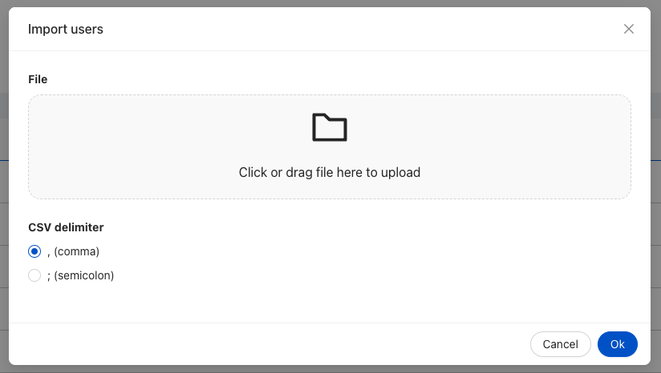

The `ck-notification-card` web component is used to import open the bulk [ck-reset-password-modal](/runtime_suite/care-kit/20_components/120_ck-reset-password-modal.md) after the selection of many users from the table.



## Usage

In order to use the ck-reset-password-button in a Microfrontend Composer, the only is needed is to insert its corresponding tag in your configuration. 
An example configuration follows:

```
{
  "type": "element",
  "url": "/mia-care-web-components/mia-care-web-components.esm.js",
  "tag": "ck-reset-password-button"
}
```

The button would not show until at least one record is selected from the table for the operation. When the button is then clicked, the corresponding event to open [ck-reset-password-modal](/runtime_suite/care-kit/20_components/120_ck-reset-password-modal.md), and the modal would show the progression of the operation.

## Properties & Attributes

| property                | type     | required | default | description                                                                                     |
|-------------------------|----------|----------|---------|-------------------------------------------------------------------------------------------------|

## Listens to

| event            | action                                                                                               | emits | on error |
|------------------|------------------------------------------------------------------------------------------------------|-------|----------|
| select-data-bulk | The event will be emitted at the selection of a table's row, showing the button and filling its sate |

## Emits

| event                      | description                                                                                                          |
|----------------------------|----------------------------------------------------------------------------------------------------------------------|
| reset-password-modal | The event will be emitted at the click of the button, showing the modal by passing it references to selected records |

[events]: https://git.tools.mia-platform.eu/mia-care/platform/plugins/notification-manager/-/blob/master/docs/10_overview.md?plain=0#default-events
