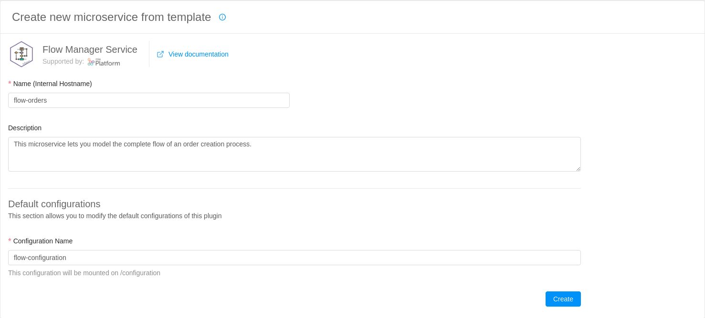
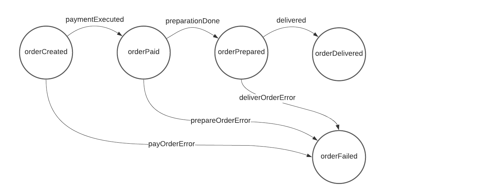
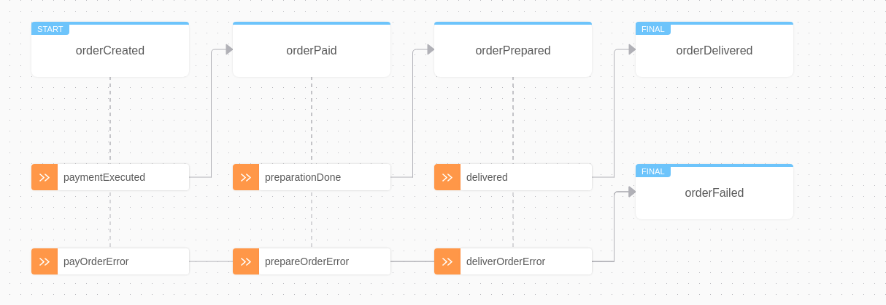
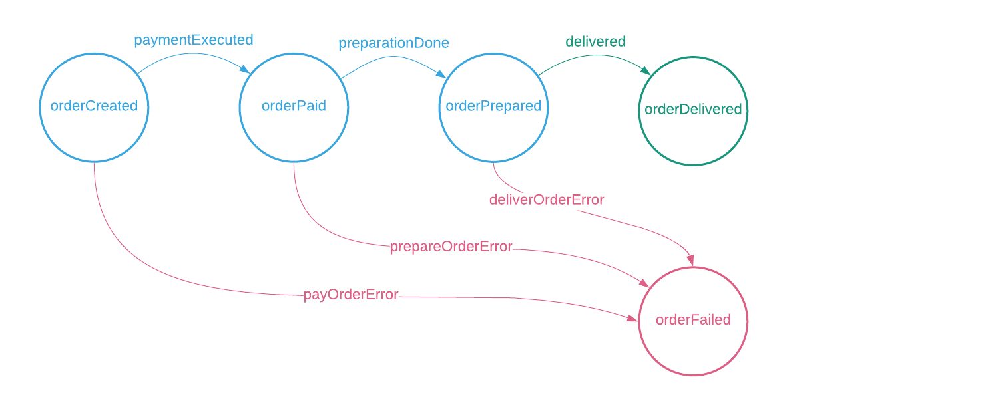
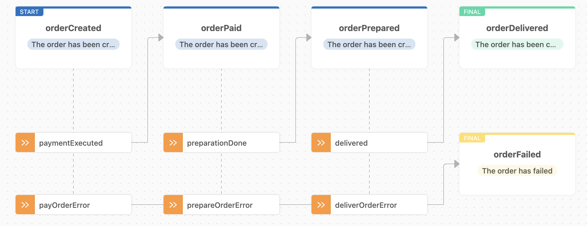
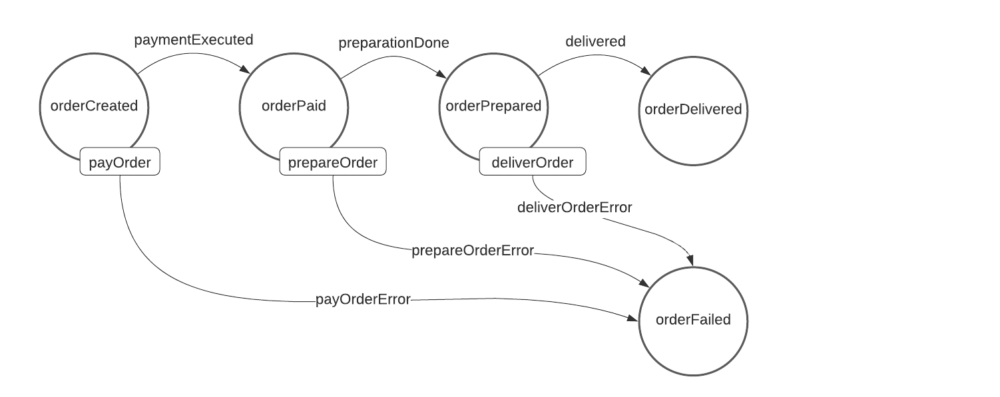
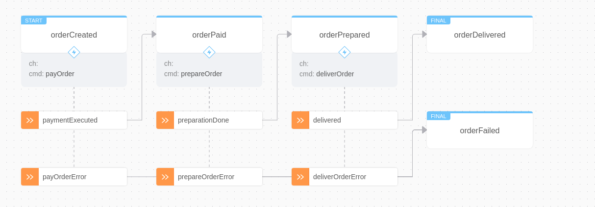

:::caution
The following guide is valid until Console version **12.2.x**. For higher versions it is recommended to use the [Flow Manager Configurator](/development_suite/api-console/api-design/flow-manager-configurator/overview.md).
:::

This guide will follow step by step the complete procedure of creating and configuring a microservice leveraging the Flow Manager plugin.

In particular, we will deepen into the already familiar **order creation scenario**. 

Please note that you have to complete all the configurations explained next before you can deploy your automated flow.

## Configure a Flow Manager Plugin

### Add Plugin from Marketplace

The first thing we need to do when creating a Flow Manager service is to go to the Marketplace section and select the **Flow Manager Service** plugin. 

This operation will let us have a base configuration for the microservice that will be used to model our flow.



We will be asked to select:

* **name**: The name of the microservice we want to create
* **description**: A short description describing the purpose of the microservice
* **configuration name**: This template comes with a preconfigured configmap when created. This field let us select the name of the already configured configmap

:::info 
In this guide, we choose **flow-orders** as our microservice name and **flow-configuration** as our default configmap name.

These are just naming conventions and you can choose the names you prefer.
:::

### Edit Environment Variables

Once we created our plugin from the marketplace, we can start configuring it.

Select flow-orders and move to the environment variables section.

* Edit `CONFIGURATIONS_FILE_PATH` and set the path of the configuration file. 

  In this case, we will set the one provided by the default configmap file: `/flow-configuration/saga.json`

* Edit `SAGA_ID_PREFIX` and set the prefix of the flow configuration. 

  In this case, we will set the same name of the microservice: `flow-orders`

## Model a new Flow 

Once we have finished configuring our plugin, we are ready to start modelling our flow. 

Move to the already present configmap card.

You will be able to see a `saga.json` file with three fields already specified: 

```json
{"machineDefinition": {}, "communicationProtocols": [], "persistencyManagement": {}}
```

In this guide we will go through each of these sections, analyzing their purpose and understanding how to configure them. 

We'll start from `machineDefinition`, where we can specify a **finite state machine** model representing our process (saga).

### Define a Finite State Machine

Let's start with the definition of our flow, modelling our process as a finite state machine.

The first thing we need to do is to identify **all the possible states** our flow can reach, the **events** that will trigger a change of state in our flow, and subsequently model which **commands** can be performed in a certain state to contact external processes or other parts of our application.

#### Configure states and initialState

Let's start defining the phases that the order creation process can encounter during its execution and map them to useful states.


The flow representing the lifecycle of an order will include the following **states**:

* **orderCreated**: a state representing an order that has just been placed on our application. This state will represent the starting point of our flow.
* **orderPaid**: a state representing an order that has been successfully paid by the customer.
* **orderPrepared**: a state representing an order that has been successfully prepared and is ready for shipping.
* **orderDelivered**: a state representing an order that has been successfully delivered to the customer. This state will represent the final state of our flow.
* **orderFailed**: a state representing an order that has encountered some problems along the entire order creation process.

Once we have a clear picture of the states defining our finite state machine, we can start adding them to our configuration.

Inside the editor, open `machineDefinition` and define two new fields: `initialState` and `states` . You can find a complete definition of state and initialState fields in the [configuration section](/runtime_suite/flow-manager-service/30_configuration.md#machine-definition). 

Insert each state specifying a unique **identifier**, a brief **description**, and **if it represents a final state** of our flow. 

By now, your configuration file should look like this:

```json {3-30}
{
  "machineDefinition": {
    "initialState": "orderCreated",
    "states": [
      {
        "id": "orderCreated",
        "description": "A new order has been created in our application",
        "isFinal": false
      },
      {
        "id": "orderPaid",
        "description": "The order has been paid by the customer",
        "isFinal": false
      },
      {
        "id": "orderPrepared",
        "description": "The order has been prepared and it's ready for shipping",
        "isFinal": false
      },
      {
        "id": "orderDelivered",
        "description": "The order has been successfully delivered to the customer",
        "isFinal": true
      },
       {
        "id": "orderFailed",
        "description": "The order has not been completed successfully",
        "isFinal": true
      }
    ]
  }, 
  "communicationProtocols": [], 
  "persistencyManagement": {}
}

```
<br />

By clicking the **View Flow Manager** option, you should be able to see the states we just created:


:::note
You can use the **Edit Configuration** button to rapidly move from the visualizer back to our configuration
:::

#### Configure events

Once we have identified every possible state representing our saga, we can define which **events** can be actuated on each state.

When a certain event is fired, and it has been correctly represented in the finite state machine, the Flow Manager plugin will trigger a change of state in our flow configuration.

:::note
Events identify specific conditions associated with external events or processes (**saga actors**) interacting with our flow. 
:::



Given the above, we can identify which **events** will allow our flow to move from one state to another:

* **paymentExecuted**: an event representing the customer has completed the payment transaction. 
* **payOrderError**: an event representing the customer could not complete the payment transaction.


* **preparationDone**: an event representing the items that have been prepared and are ready to be shipped.
* **preparateOrderError**: an event representing the items could not be prepared and will not be shipped.


* **delivered**: an event representing the items that have been successfully delivered to the customer.
* **deliverTheOrderError**: an event representing the items that could not be delivered to the customer.

We can now start adding events to our configuration. 

Events will be associated with a specific state property named `outgoingTransitions`. You can learn how to define an event inside a state field in the [configuration section](/runtime_suite/flow-manager-service/30_configuration.md#states-of-the-machine).

Specify an **input event** and a **target state** for each event. Here's how your configuration file should look like:

```json {9-18,24-33,39-48}
{
  "machineDefinition": {
    "initialState": "orderCreated",
    "states": [
      {
        "id": "orderCreated",
        "description": "A new order has been created in our application",
        "isFinal": false,
        "outgoingTransitions": [
          {
            "inputEvent": "paymentExecuted",
            "targetState": "orderPaid"
          },
          {
            "inputEvent": "payOrderError",
            "targetState": "orderFailed"
          }
        ]
      },
      {
        "id": "orderPaid",
        "description": "The order has been paid by the customer",
        "isFinal": false,
        "outgoingTransitions": [
          {
            "inputEvent": "preparationDone",
            "targetState": "orderPrepared"
          },
          {
            "inputEvent": "prepareOrderError",
            "targetState": "orderFailed"
          }
        ]
      },
      {
        "id": "orderPrepared",
        "description": "The order has been prepared and it's ready for shipping",
        "isFinal": false,
        "outgoingTransitions": [
          {
            "inputEvent": "delivered",
            "targetState": "orderDelivered"
          },
          {
            "inputEvent": "deliverOrderError",
            "targetState": "orderFailed"
          }
        ]
      },
      {
        "id": "orderDelivered",
        "description": "The order has been successfully delivered to the customer",
        "isFinal": true
      },
      {
        "id": "orderFailed",
        "description": "The order has not been completed successfully",
        "isFinal": true
      }
    ]
  }, 
  "communicationProtocols": [], 
  "persistencyManagement": {}
}
```
<br />

You should be able to see states linked together by the aforementioned events: 



:::note
You can use the highlight mode to show states and events related only to selected paths 
:::

#### Configure business states and business events

During the configuration of states and events, we defined all the possible situations and transitions our saga can reach during its execution. However, sometimes it can be useful to consider only a subset of these situations, to avoid technical details and focus only on those parts of the process that are interesting from a business point of view. 

Let's pretend our flow can only provide business value depending on the completion of the shipping process.



Thus, we can identify our business states:

- (**orderCreated**, **orderPaid**, **orderPrepared**) : states representing an order has been created but it still has not been completed
- **orderDelivered**: a state representing an order has been successfully delivered to the customer
- **orderFailed**: a state representing an order could not be completed

In the same way, we can also identify all the events that allow us to move from one business state to another:

- **delivered**: an event representing the customer has successfully received the items. 
- (**payOrderError**, **payOrderError**, **payOrderError**): events representing the customer could not complete the process correctly.

<br />

Let's add business logic to our configuration. 

We need to specify a `businessStateId` and a `businessEventId` for each node we would like to report inside `businessStates` and `businessEvents` fields:

```json {9,18,26,35,43,48,53,61,67,70-93}
{
  "machineDefinition": {
    "initialState": "orderCreated",
    "states": [
      {
        "id": "orderCreated",
        "description": "A new order has been created in our application",
        "isFinal": false,
        "businessStateId": 0,
        "outgoingTransitions": [
          {
            "inputEvent": "paymentExecuted",
            "targetState": "orderPaid"
          },
          {
            "inputEvent": "payOrderError",
            "targetState": "orderFailed",
            "businessEventId": 1
          }
        ]
      },
      {
        "id": "orderPaid",
        "description": "The order has been paid by the customer",
        "isFinal": false,
        "businessStateId": 0,
        "outgoingTransitions": [
          {
            "inputEvent": "preparationDone",
            "targetState": "orderPrepared"
          },
          {
            "inputEvent": "prepareOrderError",
            "targetState": "orderFailed",
            "businessEventId": 1
          }
        ]
      },
      {
        "id": "orderPrepared",
        "description": "The order has been prepared and it's ready for shipping",
        "isFinal": false,
        "businessStateId": 0,
        "outgoingTransitions": [
          {
            "inputEvent": "delivered",
            "targetState": "orderDelivered",
            "businessEventId": 0
          },
          {
            "inputEvent": "deliverOrderError",
            "targetState": "orderFailed",
            "businessEventId": 1
          }
        ]
      },
      {
        "id": "orderDelivered",
        "description": "The order has been successfully delivered to the customer",
        "isFinal": true,
        "businessStateId": 1
      },
      {
        "id": "orderFailed",
        "description": "The order has not been completed successfully",
        "isFinal": true,
        "businessStateId": 2
      }
    ],
    "businessStates": [
      {
        "id": 0,
        "description": "The order has been created"
      },
      {
        "id": 1,
        "description": "The order has been completed"
      },
      {
        "id": 2,
        "description": "The order has failed"
      }
    ],
    "businessEvents": [
      {
        "id": 0,
        "description": "Order completed"
      },
      {
        "id": 1,
        "description": "Order not completed"
      }
    ]
  },
  "communicationProtocols": [],
  "persistencyManagement": {}
}
```

The result should appear like in the image below:




#### Configure commands

Once we have identified every possible state and change of state describing our process, we can define which **commands** can be actuated to execute external services or other parts of our application. 

:::note
Commands are responsible for **starting the communication with other actors of the saga**, which in turn will respond by firing events. 
:::

This will help us define the type of reactions and automations to be actuated by the Flow Manager plugin. 

Let's start identifying the type of actions we can perform from a certain state.



More specifically we'll have:

- **payOrder**: a command representing the execution of the specific service of our application handling the payments 
- **prepareOrder**: a command representing the start of the process handling the order preparation
- **deliverOrder**: a command representing the start of the delivery process

We can now start adding commands to our configuration. As previously shown, commands will be associated only with specific states. You can learn how to define a command inside a state field in the [configuration section](/runtime_suite/flow-manager-service/30_configuration.md#states-of-the-machine).

Specify a **label** for each command inside an `outputCommand` field. Here's how our configuration file should look like:

```json {9-11,20-22,29-31}
{
  "machineDefinition": {
    "initialState": "orderCreated",
    "states": [
      {
        "id": "orderCreated",
        "description": "A new order has been created in our application",
        "isFinal": false,
        "outputCommand": {
          "label": "payOrder"
        },
        "businessStateId": 0,
        "outgoingTransitions": ["..."]
      },
      {
        "id": "orderPaid",
        "description": "The order has been paid by the customer",
        "isFinal": false,
        "businessStateId": 0,
        "outputCommand": {
          "label": "prepareOrder"
        },
        "outgoingTransitions": ["..."]
      },
      {
        "id": "orderPrepared",
        "description": "The order has been prepared and it's ready for shipping",
        "isFinal": false,
        "outputCommand": {
          "label": "deliverOrder"
        },
        "businessStateId": 0,
        "outgoingTransitions": ["..."]
      },
      {
        "id": "orderDelivered",
        "description": "The order has been successfully delivered to the customer",
        "isFinal": true,
        "businessStateId": 1
      },
      {
        "id": "orderFailed",
        "description": "The order has not been completed successfully",
        "isFinal": true,
        "businessStateId": 2
      }
    ],
    "businessStates": ["..."],
    "businessEvents": ["..."]
  },
  "communicationProtocols": [],
  "persistencyManagement": {}
}
```

<br />

:::note
By clicking the apposite button, you can expand states to show additional information. 
:::

In this case, you should be able to see the commands specified previously: 



:::info
As you may notice, the **channel** field is still empty, we will need to complete it by choosing a **communication protocol**.
:::

### Select Communication Protocols

By now, you should have a clear picture of the finite state machine model representing our order creation process. 

We can now move to the next field `communicationProtocols`, where we can specify how the Flow Manager will interact with external saga actors through commands and events.

For each command invoking a different actor or external process, we are going to define a new communication protocol and associate it using the `channel` field.

You can have further details regarding communication protocols in the [configuration section](/runtime_suite/flow-manager-service/30_configuration.md#communication-protocols)

:::note
There are two types of Flow Manager communication channels supported: **Kafka** and **Rest**. 

In this tutorial, we will focus on how to configure a flow leveraging Kafka.
:::

Let's define a new communication protocol named `myKafka`. 

This protocol will redirect Flow Manager commands publishing on the specified **outputTopics** and will select the appropriate events listening on **inputTopics**.

Imagine we want to connect to a Kafka broker on `http://my-kafka-broker` with port `9092` and we want to specify our consumer group `my-consumer-group`.

The configuration file will look like this:

```json {12,23,34,54-71}
{
    "machineDefinition": {
    "initialState": "orderCreated",
    "states": [
      {
        "id": "orderCreated",
        "description": "A new order has been created in our application",
        "isFinal": false,
        "businessStateId": 0,
        "outputCommand": {
          "label": "payOrder",
          "channel": "myKafka"
        },
        "outgoingTransitions": ["..."]
      },
      {
        "id": "orderPaid",
        "description": "The order has been paid by the customer",
        "isFinal": false,
        "businessStateId": 0,
        "outputCommand": {
          "label": "prepareOrder",
          "channel": "myKafka"
        },
        "outgoingTransitions": ["..."]
      },
      {
        "id": "orderPrepared",
        "description": "The order has been prepared and it's ready for shipping",
        "isFinal": false,
        "businessStateId": 0,
        "outputCommand": {
          "label": "deliverOrder",
          "channel": "myKafka"
        },
        "outgoingTransitions": ["..."]
      },
      {
        "id": "orderDelivered",
        "description": "The order has been successfully delivered to the customer",
        "isFinal": true,
        "businessStateId": 1
      },
      {
        "id": "orderFailed",
        "description": "The order has not been completed successfully",
        "isFinal": true,
        "businessStateId": 2
      }
    ],
    "businessStates": ["..."],
    "businessEvents": ["..."]
  }, 
  "communicationProtocols": [{
    "id": "myKafka",
    "type": "kafka",
    "configurations": {
      "brokers": [
        "http://my-kafka-broker:9092"
      ],
      "inputTopics": [
        "topic-to-subscribe"
      ],
      "outputTopics": [
        "topic-to-publish-on"
      ],
      "consumerGroup": "my-consumer-group"
    }
  }], 
  "persistencyManagement": {}
}
```

You should now be able to see the channels we just set:


### Add Persistency to your Flow

To store permanently the modification applied to a certain flow, or to retrieve an existing one, we must set a persistency manager configuration inside the `persistencyManagement` field.

You can have further details regarding the persistency management in the [configuration section](/runtime_suite/flow-manager-service/30_configuration.md#persistency-manager)

:::note
There are two strategies that can be used for adding persistency to the Flow Manager plugin: **Rest** and **MongoDB**. 

In this tutorial, we will focus on how to add persistency using MongoDB.
:::

We are going to define a new persistency manager that will save the modification applied by the Flow Manager directly on a database. We also need to specify a `creationEvent` inside the machineDefinition that will be used to trigger the flow creation.

Imagine we want to connect to a mongoDB server `myDB` on `localhost:27017` and we want to save our modifications on the collection `my-collection`.
 
The configuration file will look like this:

```json {3,10-16}
{
  "machineDefinition": {
    "creationEvent": "__created__",
    "initialState": "orderCreated",
    "states": ["..."],
    "businessStates": [".."],
    "businessEvents": [".."]
  }, 
  "communicationProtocols": ["..."], 
  "persistencyManagement":{
    "type": "mongo",
    "configurations": {
      "connectionUri": "mongodb://localhost:27017/myDB",
      "collectionName": "my-collection"
    }
  }
}
```

## Configure External Services

Once completed the configuration of the Flow Manager plugin, we still need to configure the other microservices invoked using our communication protocol. 

Those services will **consume commands**, and after having executed their task, will respond **firing certain events**.

:::note
This configuration refers only to the type of communication used by the microservice and it is agnostic to its functionality.

This section can be used to configure any microservice modelling the functionalities we first identified (payment, order preparation, and delivery).
:::

Here we show how to configure a microservice communicating through **Kafka**. 

More specifically, this section will help us configure the operations required by commands and events to correctly operate, **subscribing** or **publishing** to certain topics through the use of messages.

Let's start by creating a new microservice (you can start from any template available in the marketplace). 

### Configure Environment Variables

Move to the environment variables card of your newly created microservice. We will add a few variables related to our communication protocol configuration.

In particular, we can identify:

- **KAFKA_SAGA_ID**: the name of the chosen communication protocol, `myOrderFlow`.
- **KAFKA_BROKERS_LIST**: the list of Kafka brokers we want to connect to, `http://my-kafka-broker:9092`.
- **KAFKA_COMMANDS_TOPIC_NAME**: the name of the Flow Manager output topic, `topic-to-publish-on`.
- **KAFKA_EVENTS_TOPIC_NAME**: the name of the Flow Manager input topic, `topic-to-subscribe`.
- **KAFKA_GROUP_ID**: the name of the consumer group selected before, `my-consumer-group`.

:::caution
These variables will be publicly available once committed. 

If you need to keep this information confidential, you can interpolate these environment variables with double brackets (e.g. `{{KAFKA_BROKERS_LIST}}`) and set the corresponding value in the Envs section of the console.
:::

This configuration will be available inside our microservice later on. Each of these variables will be helpful during the implementation of a Kafka client and the creation of messages used to communicate with other saga actors.

### Send and Receive Messages 

In order for our microservice to communicate with the Flow Manager, we need to make sure all the Kafka connections are correctly configured. 

The Flow Manager handles the command-event communication pattern by publishing commands and listening for events. In particular, it will create:

- a Kafka producer for any different channel with `outputTopics` specified, publishing commands on those topics
- a Kafka consumer for any different channel with `inputTopics` specified, listening for events on those topics

You can find further details regarding the Flow Manager communication patterns in the [configuration section](/runtime_suite/flow-manager-service/30_configuration.md#kafka-communication-protocol). 

:::note
External microservices interacting with the Flow Manager should match the communication pattern proposed, implementing respectively:
- a consumer to listen for commands
- a producer to publish events
:::

#### Kafka Client

The first thing to do to be able to communicate with the flow manager is to instantiate a Kafka client. 

The client must be able to connect to the brokers specified in the **KAFKA_BROKERS_LIST** and use **KAFKA_GROUP_ID** to set the consumer policies.

After instantiating the client, we can use it to send and receive messages from other saga actors.

#### Receiving Commands

Our microservice will implement a message consumer to listen for commands and execute one of its functionalities depending on the type of message received.

When implementing this functionality, we should consider receiving an object including the following properties: 

- **topic**: a string containing the topic of the received command. It should match the variable `KAFKA_COMMANDS_TOPIC_NAME`
- **partition**: a number used to specify the Kafka partition. Partitions allow us to parallelize a topic by splitting data across multiple brokers.
- **message**: an object containing the command specifications. In particular, it will be divided into:

  - **key**: a string containing the saga identifier. It should always match the environment variable `KAFKA_SAGA_ID`
  - **value**: an object containing the message specifications:
    - **messageLabel**: a string containing the command identifier. It can be used to determine which part of our microservice needs to be executed
    - **messagePayload**: an object containing the command payload. It can be used to specify any information that can be useful when executing a specific command.

  - **offset**: a number used in combination with partition to correctly identify the message

The consumer then should use this information to dispatch specific functionalities. 

Depending on the command received, the microservice should be able to automatically execute a certain function and to return a specific output.

Here's an example of a command message:

```json
{
  "topic": "topic-to-publish-on",
  "partition": 0,
  "message": {
    "key": "myKafka",
    "value": {
      "messageLabel": "payOrder",
      "messagePayload": {
        "orderId": "myOrder",
        "cost": 50
      }
    },
    "offset": 35
  }
}
```

We can now publish a message and return a specifc event to the Flow Manager.


#### Sending Events

Our microservice will implement a message producer to send an event after the execution of a microservice functionality terminates with a certain output.

When implementing this functionality, we should consider creating an object including the following properties: 

- **topic**: a string containing the topic of the event to be sent. It should match the variable `KAFKA_EVENTS_TOPIC_NAME`
- **message**: an object containing the event specifications. It will be divided into:

  - **key**: a string containing the saga identifier. It should always match the environment variable `KAFKA_SAGA_ID`
  - **value**: an object containing the message specifications:
    - **messageLabel**: a string containing the event identifier. It can be used to determine which event the Flow Manager will receive
    - **messagePayload**: an object containing the event payload. It can be used to specify any information that can be useful to the Flow Manager to interpret an event

Whenever a specific part of the microservice finishes its execution, the producer should be invoked and use the output produced to determine the corresponding event to be returned.

Here's an example of an event message:

```json
{
  "topic": "topic-to-subscribe",
  "message": {
    "key": "myKafka",
    "value": {
      "messageLabel": "orderPaid",
      "messagePayload": {
        "orderId": "myOrder",
        "cost": 50
      }
    }
  }
}
```

## Deploy 

At this point, we should have completed all the configurations necessary for the correct execution of the Flow Manager service. 

Deploy and you should be able to see your automated flow in action!
