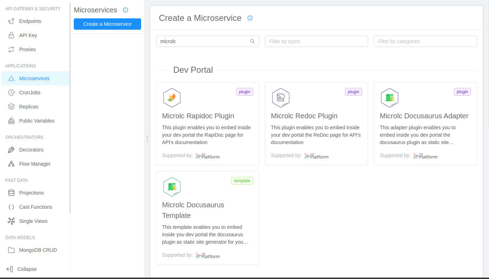
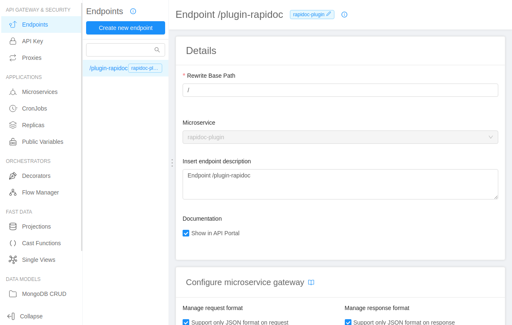
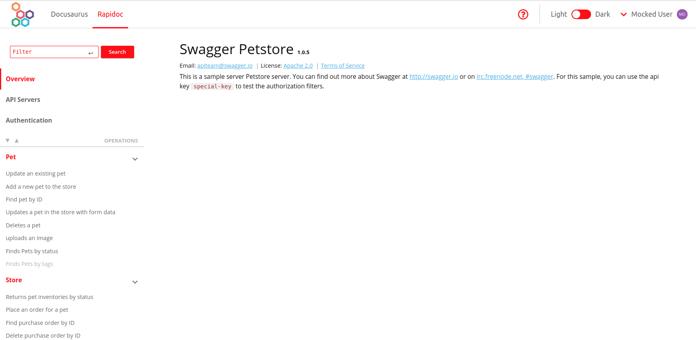

[RapiDoc](https://mrin9.github.io/RapiDoc/) is an OpenAPI-genereted API reference documentation generator that can be used to produce documentation for your APIs quickly.

In the dev portal, `RapiDoc` can be used to create the API documentations just setting up the link to your OpenAPI specification.

## Microservice creation for `RapiDoc`

To create an instance of `RapiDoc`:

1. Go to the `Microservices` section;
2. Create a new microservice using the `Microlc RapiDoc Plugin` in the `Dev Portal` category of the marketplace;
   
3. Configure the microservice with a custom name and description;
4. Complete the creation to deploy an instance of `RapiDoc`.

## RapiDoc endpoint configuration

1. Create a new endpoint;
2. Define the `Base path` where you want to expose `RapiDoc` (e.g. `/plugin-rapidoc`);
3. As type, use `Microservice`;
4. Select the microservice name used for `RapiDoc`;
5. Complete the creation.

After that, the situation should be similar to the following:



## RapiDoc configuration

Like all the plugins of `micro-lc` you should refer to the [core configuration section](https://microlc.io/documentation/docs/micro-lc/core_configuration#plugins)
for the setup and to correctly configure RapiDoc you **must** set one `props`:

- _openApiSpecUrl_ : the url to your `Swagger` or `OpenApi` specification in `json` format.

Here follows a full configuration example:

```json {10}
{
  "id": "rapidoc-plugin",
  "label": "RapiDoc",
  "icon": "fas fa-link",
  "order": 4,
  "integrationMode": "qiankun",
  "pluginRoute": "/rapidoc/",
  "pluginUrl": "https://plugin-url.com",
  "props": {
    "openApiSpecUrl": "http://petstore.swagger.io/v2/swagger.json"
  }
}
```

## Result

After a deployment, your new Dev Portal should be exposed at the `/` path of your host (e.g. `https://your-host-com/`),
and should be similar to the following:



:::caution
We suggest to use RapiDoc to set up the Dev Portal, but in case of `small (<~300kb)` OpenApi specification file you can consider to use Redoc; for this plugin, we highly suggest to read the [ReDoc Documentation](../../runtime_suite/microlc-redoc-plugin/overview.md)
:::
