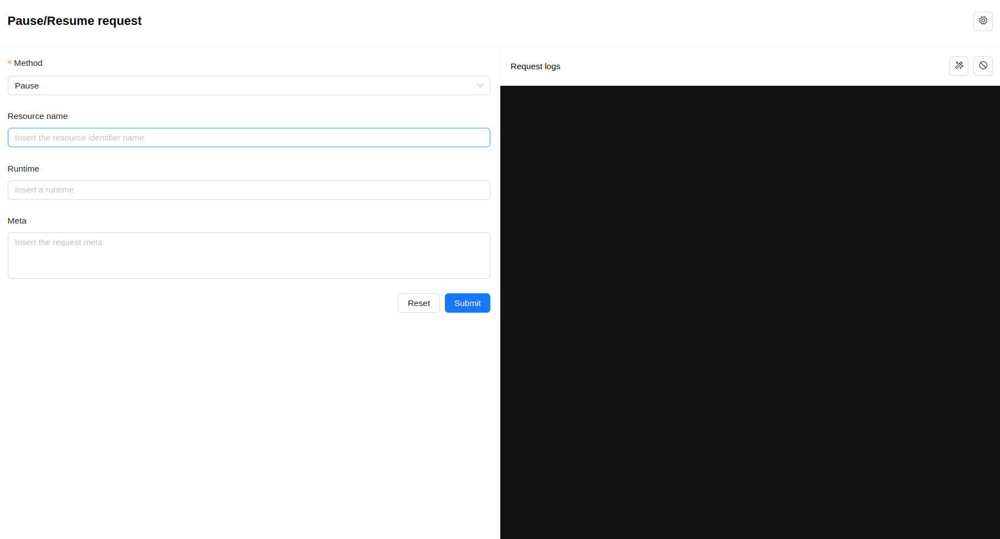

_Control Plane_ is a specialized microservice designed to manage the runtime deployment of Fast Data within a Kubernetes environment.
Its core functionality includes the ability to alter, store, and reset the runtime state of microservices that constitute Mia-Platform Fast Data solution.
For this reason, it is a crucial component of the Fast Data [Runtime Management](../../fast_data/runtime_management.mdx) suite.

Instantiating the application from the Marketplace will create a deployment of Control Plane in your current namespace.
It will also create an endpoint which allows you to access the application's frontend (see the image below).

From the frontend page, you can select the resource you want to manage and the desired state you want to achieve.
The backend will take care of the request and dispatch it to the messaging system, which will then be consumed by the interested microservices.
When dispatching a new command request, the Control Plane will also store the current state of the resource in a database.
This allows the application to keep track of the current state of the resource. 

This separation of responsibilities ensures effective communication and control over the state of microservices,
providing a robust and adaptable solution for runtime management within a Kubernetes environment.

:::tip
Check out the [Runtime Management](../../fast_data/runtime_management.mdx) documentation for more information on its features and how to use the Control Plane frontend.
:::

:::note

Check the [Configuration](./20_configuration.mdx) section for more information on how to configure the Control Plane application.

:::
